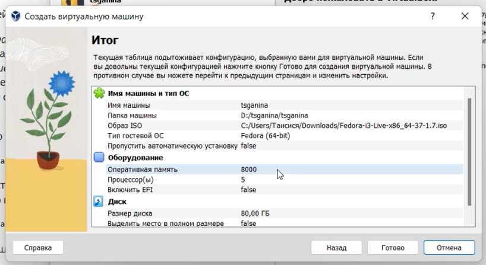
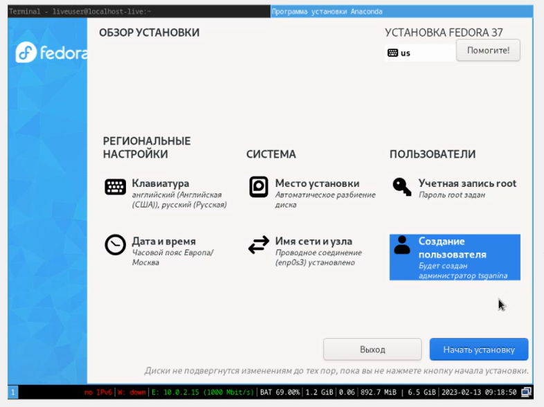
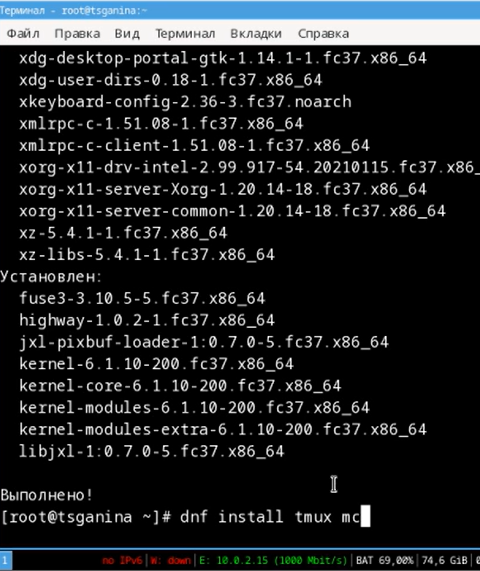
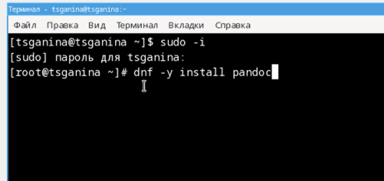
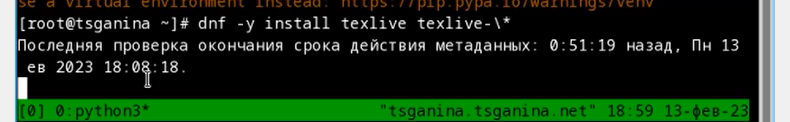

---
## Front matter
lang: ru-RU
title: "Лабораторная работа №1. Установка ОС Linux"
subtitle: "Дисциплина: Операционные системы"
author:
  - Ганина Т. С.
institute:
  - Группа НКАбд-01-22
  - Российский университет дружбы народов, Москва, Россия
date: 18 февраля 2023

## i18n babel
babel-lang: russian
babel-otherlangs: english

## Formatting pdf
toc: false
toc-title: Содержание
slide_level: 2
aspectratio: 169
section-titles: true
theme: metropolis
header-includes:
 - \metroset{progressbar=frametitle,sectionpage=progressbar,numbering=fraction}
 - '\makeatletter'
 - '\beamer@ignorenonframefalse'
 - '\makeatother'
---

# Информация

## Докладчик

:::::::::::::: {.columns align=center}
::: {.column width="70%"}

  * Ганина Таисия Сергеевна
  * Студентка 1го курса, группа НКАбд-01-22
  * Компьютерные и информационные науки
  * Российский университет дружбы народов
  * [Ссылка на репозиторий гитхаба tsganina](https://github.com/tsganina/study_2022-2023_os-intro)

:::
::: {.column width="30%"}

:::
::::::::::::::

# Вводная часть

## Актуальность

- Умение работать с разными операционными системами необходимо для хорошего специалиста.
- ОС Linux является одной из самых известных операционных систем, умение установить систему и пользоваться ей может пригодиться в жизни и в работе.
- Навык настройки виртуальной машины позволит научиться работать с разными операционными системами, протестировать их, а так же оценить функционал каждой.

## Объект и предмет исследования

- Программа VirtualBox;
- ОС Linux;

## Цели и задачи

- Приобретение практических навыков установки операционной системы на виртуальную машину;
- Навык настройки минимально необходимых для дальнейшей работы сервисов;

# Настройка виртуальной машины

## Скачивание и настройка

{#fig:001 width=70%}

## Установка Linux

{#fig:002 width=50%}

## Обновления

{#fig:003 width=40%}

## Программы для работы с документацией. Pandoc.

{#fig:004 width=70%}

## Программы для работы с документацией. Texlive.

{#fig:005 width=70%}

# Результаты

## Установленные компоненты и произведенные настройки:

- Автоматическое обновление
- Драйвера
- Настройка клавиатуры
- Установка pandoc
- Установка texlive

