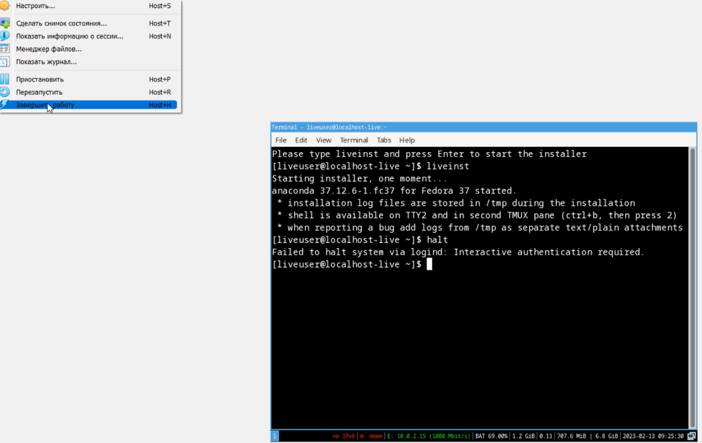

---
## Front matter
title: "Отчёт по лабораторной работе №1"
subtitle: "Дисциплина: Операционные системы"
author: "Ганина Таисия Сергеевна, НКАбд-01-22"

## Generic otions
lang: ru-RU
toc-title: "Содержание"

## Bibliography
bibliography: bib/cite.bib
csl: pandoc/csl/gost-r-7-0-5-2008-numeric.csl

## Pdf output format
toc: true # Table of contents
toc-depth: 2
lof: true # List of figures
lot: true # List of tables
fontsize: 12pt
linestretch: 1.5
papersize: a4
documentclass: scrreprt
## I18n polyglossia
polyglossia-lang:
  name: russian
  options:
	- spelling=modern
	- babelshorthands=true
polyglossia-otherlangs:
  name: english
## I18n babel
babel-lang: russian
babel-otherlangs: english
## Fonts
mainfont: PT Serif
romanfont: PT Serif
sansfont: PT Sans
monofont: PT Mono
mainfontoptions: Ligatures=TeX
romanfontoptions: Ligatures=TeX
sansfontoptions: Ligatures=TeX,Scale=MatchLowercase
monofontoptions: Scale=MatchLowercase,Scale=0.9
## Biblatex
biblatex: true
biblio-style: "gost-numeric"
biblatexoptions:
  - parentracker=true
  - backend=biber
  - hyperref=auto
  - language=auto
  - autolang=other*
  - citestyle=gost-numeric
## Pandoc-crossref LaTeX customization
figureTitle: "Рис."
tableTitle: "Таблица"
listingTitle: "Листинг"
lofTitle: "Список иллюстраций"
lotTitle: "Список таблиц"
lolTitle: "Листинги"
## Misc options
indent: true
header-includes:
  - \usepackage{indentfirst}
  - \usepackage{float} # keep figures where there are in the text
  - \floatplacement{figure}{H} # keep figures where there are in the text
---

# Цель работы

Целью данной работы является приобретение практических навыков установки операционной системы на виртуальную машину, настройки минимально необходимых для дальнейшей работы сервисов.

# Задание

1. Установить VirtualBox. Установить новую виртуальную машину. Загрузить образ.
2. Установить операционную систему и произвести первичные настройки.
3. Обновить все пакеты.
4. Установить программы для удобства работы в консоли.
5. Настроить автоматическое обновление.
6. Отключить SELinux.
7. Установить драйверы для VirtualBox.
8. Настроить клавиатуру.
9. Установка pandoc.
10. Установка texlive.
11. Домашнее задание.
12. Контрольные вопросы.

# Выполнение лабораторной работы

1. Я скачала VirtualBox и произвела настройку новой виртуальной машины (рис. @fig:001, @fig:002, @fig:003, @fig:004, @fig:005, @fig:006, @fig:007).

{#fig:001 width=70%}

{#fig:002 width=70%}

{#fig:003 width=70%}

{#fig:004 width=70%}

{#fig:005 width=70%}

{#fig:006 width=70%}

{#fig:007 width=70%}

2. Я установила операционную систему и произвела первичные настройки (рис. @fig:008, @fig:009, @fig:010, @fig:011, @fig:012, @fig:013, @fig:014, @fig:015).

{#fig:008 width=70%}

{#fig:009 width=70%}

{#fig:010 width=70%}

{#fig:011 width=70%}

{#fig:012 width=70%}

{#fig:013 width=70%}

{#fig:014 width=70%}

{#fig:015 width=70%}

3. Обновление пакетов (рис. @fig:016).

{#fig:016 width=70%}

4. Я установила программы для удобства работы в консоли (рис. @fig:017).

{#fig:017 width=70%}

5. Настройка автоматического обновления (рис. @fig:018, @fig:019).

{#fig:018 width=70%}

{#fig:019 width=70%}

6. Отключение SELinux (рис. @fig:020,  @fig:021).

{#fig:020 width=70%}

{#fig:021 width=70%}

7. Установка драйверов для VirtualBox (рис. @fig:022, @fig:023, @fig:024, @fig:025, @fig:026).

{#fig:022 width=70%}

{#fig:023 width=70%}

{#fig:024 width=70%}

{#fig:025 width=70%}

{#fig:026 width=70%}

8. Настраиваю клавиатуру (рис. @fig:027,  @fig:028, @fig:029).

{#fig:027 width=70%}

{#fig:028 width=70%}

{#fig:029 width=70%}

9. Установка pandoc (рис. @fig:030,  @fig:031).

{#fig:030 width=70%}

{#fig:031 width=70%}

10. Установка texlive (рис. @fig:032).

{#fig:032 width=70%}

11. Домашнее задание (рис. @fig:033,  @fig:034).

{#fig:033 width=70%}

{#fig:034 width=70%}

12. Контрольные вопросы.

1) Какую информацию содержит учётная запись пользователя?
Учетная запись пользователя содержит информацию по авторизации - учётные данные. Это индетификатор для подключения к системе. То есть, это:
    - Системное имя - должно быть уникальным, содержит только латинские знаки.
    - Уникальных идентификатор пользователя в системе, содержит число.
    - Полное имя - ФИО пользователя.

2) Укажите команды терминала и приведите примеры:
    - для получения справки по команде = --help;
    - для перемещения по файловой системе = cd;
    - для просмотра содержимого каталога = ls;
    - для определения объёма каталога = du + имя каталога;
    - для создания / удаления каталогов = mkdir/rmdir;
    - для создания / удаления файлов  = touch/rm;
    - для задания определённых прав на файл / каталог = chmod;
    - для просмотра истории команд = history;

3) Что такое файловая система? Приведите примеры с краткой характеристикой.
Это способ хранения, организации и именования данных на различных носителях. 
Примеры:
    - FAT32 - файловая система, в которой пространство разделено на три части: область служебных структур, указатели в виде таблиц и область хранения файлов;
    - ext4 - система, которая используется в основном в ОС на Linux. Журналируемая файловая система, в послдней версии максимальный размер файла - 16Гб.

4) Как посмотреть, какие файловые системы подмонтированы в ОС?
Для этого нужно ввести в терминал команду df - это покажет список всех файловых систем по номерам устройств, размеры и данные о памяти. Но при этом можно посмотреть в свойствах папок все эти данные вручную.

5) Как удалить зависший процесс?
    - killall - остановит все процессы, которые есть в данный момент.
    - kill + id-процесса. Это поможет удалить один конкретный процесс. (Чтобы узнать id нужно написать в терминале команду ps).

# Выводы

В ходе данной работы я приобрела практические навыки установки операционной системы на виртуальную машину, настройки минимально необходимых для дальнейшей работы сервисов.

# Список литературы{.unnumbered}

1. [Руководство к лабораторной работе](https://esystem.rudn.ru/mod/page/view.php?id=970816#orgae96686)

::: {#refs}
:::
