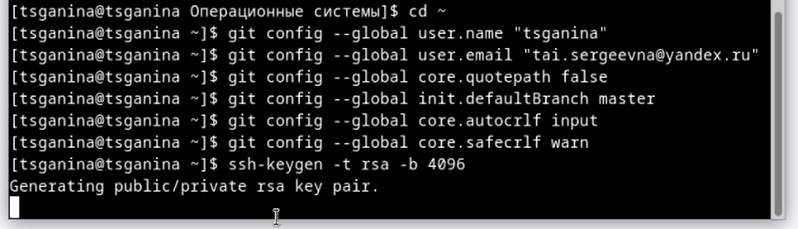
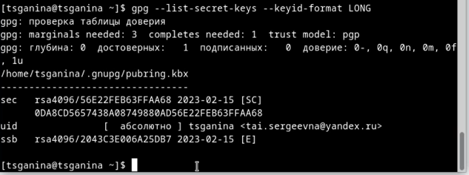
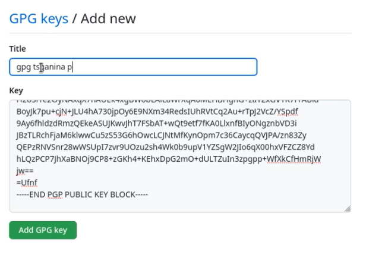
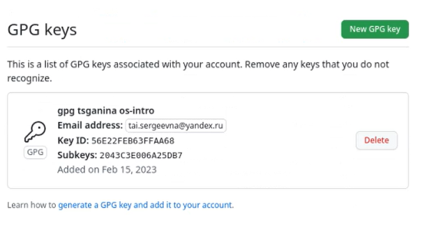
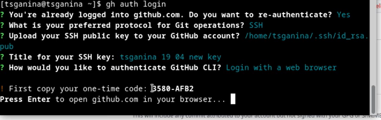
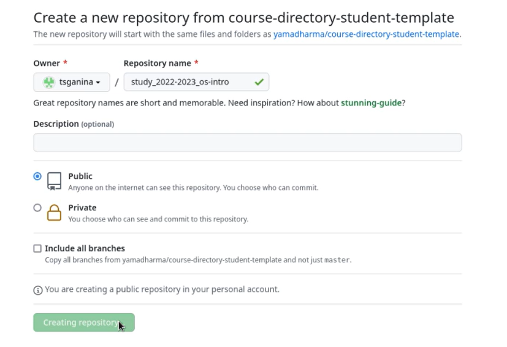
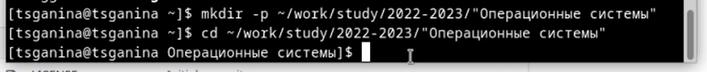
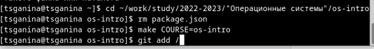
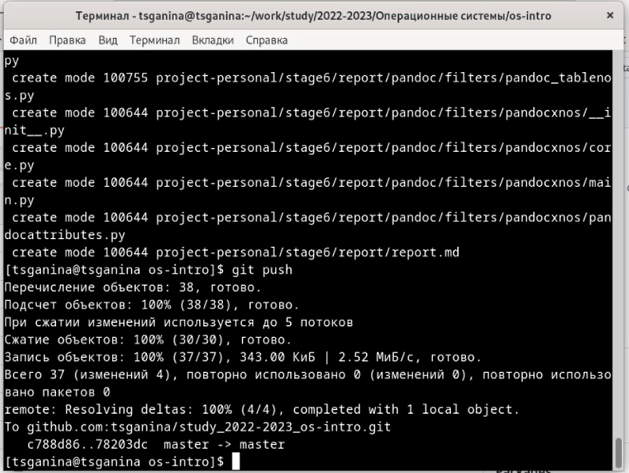

---
## Front matter
lang: ru-RU
title: "Лабораторная работа №2. Первоначальна настройка git"
subtitle: "Дисциплина: Операционные системы"
author:
  - Ганина Т. С.
institute:
  - Группа НКАбд-01-22
  - Российский университет дружбы народов, Москва, Россия
date: 18 февраля 2023

## i18n babel
babel-lang: russian
babel-otherlangs: english

## Formatting pdf
toc: false
toc-title: Содержание
slide_level: 2
aspectratio: 169
section-titles: true
theme: metropolis
header-includes:
 - \metroset{progressbar=frametitle,sectionpage=progressbar,numbering=fraction}
 - '\makeatletter'
 - '\beamer@ignorenonframefalse'
 - '\makeatother'
---

# Информация

## Докладчик

:::::::::::::: {.columns align=center}
::: {.column width="70%"}

  * Ганина Таисия Сергеевна
  * Студентка 1го курса, группа НКАбд-01-22
  * Компьютерные и информационные науки
  * Российский университет дружбы народов
  * [Ссылка на репозиторий гитхаба tsganina](https://github.com/tsganina/study_2022-2023_os-intro)

:::
::: {.column width="30%"}

:::
::::::::::::::

# Вводная часть

## Актуальность

- Умение работать с системами контроля версий существенно облегчает командную работу и открывает новые возможности в работе над проектами.

## Объект и предмет исследования

- Система контроля версий Git.

## Цели и задачи

- Изучить идеологию и применение средств контроля версий.
- Освоить умения по работе с git.

# Git

## Базовая настройка Git

{#fig:001 width=70%}

## Генерация PGP ключа

{#fig:002 width=70%}

## Генерация PGP ключа

{#fig:003 width=60%}

## Генерация PGP ключа

{#fig:004 width=70%}

## Настройка gh

{#fig:005 width=70%}

## Создание репозитория на основе шаблона

{#fig:006 width=70%}

## Создание репозитория на основе шаблона

{#fig:007 width=70%}

## Настройка каталога курса

{#fig:008 width=70%}

## Настройка каталога курса

{#fig:009 width=50%}

# Результаты

## Установленные компоненты и произведенные настройки:

Я создала локальный репозиторий и подключила его к серверу. Теперь я могу сохранять там различные файлы моих работ, получать к ним доступ с других устройств, удалённо хранить информацию и делиться ею с другими.

