---
## Front matter
title: "Отчёт по лабораторной работе №2"
subtitle: "Первоначальна настройка git"
author: "Ганина Таисия Сергеевна"

## Generic otions
lang: ru-RU
toc-title: "Содержание"

## Bibliography
bibliography: bib/cite.bib
csl: pandoc/csl/gost-r-7-0-5-2008-numeric.csl

## Pdf output formatпу
toc: true # Table of contents
toc-depth: 2
lof: true # List of figures
lot: true # List of tables
fontsize: 12pt
linestretch: 1.5
papersize: a4
documentclass: scrreprt
## I18n polyglossia
polyglossia-lang:
  name: russian
  options:
	- spelling=modern
	- babelshorthands=true
polyglossia-otherlangs:
  name: english
## I18n babel
babel-lang: russian
babel-otherlangs: english
## Fonts
mainfont: PT Serif
romanfont: PT Serif
sansfont: PT Sans
monofont: PT Mono
mainfontoptions: Ligatures=TeX
romanfontoptions: Ligatures=TeX
sansfontoptions: Ligatures=TeX,Scale=MatchLowercase
monofontoptions: Scale=MatchLowercase,Scale=0.9
## Biblatex
biblatex: true
biblio-style: "gost-numeric"
biblatexoptions:
  - parentracker=true
  - backend=biber
  - hyperref=auto
  - language=auto
  - autolang=other*
  - citestyle=gost-numeric
## Pandoc-crossref LaTeX customization
figureTitle: "Рис."
tableTitle: "Таблица"
listingTitle: "Листинг"
lofTitle: "Список иллюстраций"
lotTitle: "Список таблиц"
lolTitle: "Листинги"
## Misc options
indent: true
header-includes:
  - \usepackage{indentfirst}
  - \usepackage{float} # keep figures where there are in the text
  - \floatplacement{figure}{H} # keep figures where there are in the text
---

# Цель работы

- Изучить идеологию и применение средств контроля версий.
- Освоить умения по работе с git.

# Задание

1. Базовая настройка git.
2. Создание SSH ключа.
3. Создание PGP ключа.
4. Добавление PGP ключа в GitHub.
5. Настройка автоматических подписей коммитов git.
6. Настройка gh.
7. Шаблон для рабочего пространства.
8. Создание локального репозитория курса на основе шаблона.
9. Настройка каталога курса.
10. Контрольные вопросы.

# Теоретическое введение

## Системы контроля версий. Общие понятия

Системы контроля версий (Version Control System, VCS) применяются при работе нескольких человек над одним проектом. Обычно основное дерево проекта хранится в локальном или удалённом репозитории, к которому настроен доступ для участников проекта. При внесении изменений в содержание проекта система контроля версий позволяет их фиксировать, совмещать изменения, произведённые разными участниками проекта, производить откат к любой более ранней версии проекта, если это требуется.

В классических системах контроля версий используется централизованная модель, предполагающая наличие единого репозитория для хранения файлов. Выполнение большинства функций по управлению версиями осуществляется специальным сервером. Участник проекта (пользователь) перед началом работы посредством определённых команд получает нужную ему версию файлов. После внесения изменений, пользователь размещает новую версию в хранилище. При этом предыдущие версии не удаляются из центрального хранилища и к ним можно вернуться в любой момент. Сервер может сохранять не полную версию изменённых файлов, а производить так называемую дельта-компрессию — сохранять только изменения между последовательными версиями, что позволяет уменьшить объём хранимых данных.

Системы контроля версий поддерживают возможность отслеживания и разрешения конфликтов, которые могут возникнуть при работе нескольких человек над одним файлом. Можно объединить (слить) изменения, сделанные разными участниками (автоматически или вручную), вручную выбрать нужную версию, отменить изменения вовсе или заблокировать файлы для изменения. В зависимости от настроек блокировка не позволяет другим пользователям получить рабочую копию или препятствует изменению рабочей копии файла средствами файловой системы ОС, обеспечивая таким образом, привилегированный доступ только одному пользователю, работающему с файлом.

Системы контроля версий также могут обеспечивать дополнительные, более гибкие функциональные возможности. Например, они могут поддерживать работу с несколькими версиями одного файла, сохраняя общую историю изменений до точки ветвления версий и собственные истории изменений каждой ветви. Кроме того, обычно доступна информация о том, кто из участников, когда и какие изменения вносил. Обычно такого рода информация хранится в журнале изменений, доступ к которому можно ограничить.

В отличие от классических, в распределённых системах контроля версий центральный репозиторий не является обязательным.

Среди классических VCS наиболее известны CVS, Subversion, а среди распределённых — Git, Bazaar, Mercurial. Принципы их работы схожи, отличаются они в основном синтаксисом используемых в работе команд.

Примеры использования git

- Система контроля версий Git представляет собой набор программ командной строки. Доступ к ним можно получить из терминала посредством ввода команды git с различными опциями.
- Благодаря тому, что Git является распределённой системой контроля версий, резервную копию локального хранилища можно сделать простым копированием или архивацией.

Например, в табл. @tbl:std-dir приведено описание основных команд системы git.

: Описание основных команд системы git {#tbl:std-dir}

| Команда | Действие                                                                                                          |
|--------------|----------------------------------------------------------------------------------------------------------------------------|
| `git init`          | Создание основного дерева репозитория                                                                               |
| `git pull`      | Получение обновлений (изменений) текущего дерева из центрального репозитория     |
| `git push`       | Отправка всех произведённых изменений локального дерева в центральный репозиторий                                           |
| `git status`      | Просмотр списка изменённых файлов в текущей директории |
| `git diff`     | Просмотр текущих изменений                                                                                   |
| `git add . / git add <имя файла> / git rm <имя файла>`      | Сохранение текущих изменений                                                                                   |
| `git commit / git commit -am "описание коммита"`       | Сохранение добавленных изменений                                                                                                            |
| `git checkout -b имя_ветки`       | Создание новой ветки, базирующейся на текущей                                                                                 |
| `git checkout имя_ветки`       | Переключение на некоторую ветку                                                                                 |
| `git push origin имя_ветки`       | Отправка изменений конкретной ветки в центральный репозиторий                                                                                 |
| `git merge --no-ff имя_ветки`       | Слияние ветки с текущим деревом                                                                                 |
| `git branch -d имя_ветки`       | Удаление локальной уже слитой с основным деревом ветки                                                                                 |
| `git branch -D имя_ветки`       | Принудительное удаление локальной ветки                                                                                 |
| `git push origin :имя_ветки`       | Удаление ветки с центрального репозитория                                                                                 |

# Выполнение лабораторной работы

1. Базовая настройка git (рис. @fig:001).

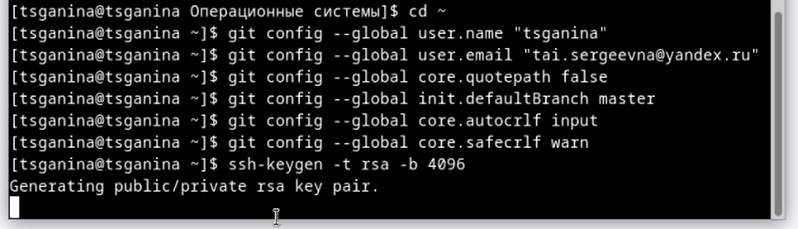{#fig:001 width=70%}

2. Создание SSH ключа (рис. @fig:002, @fig:003).

{#fig:002 width=70%}

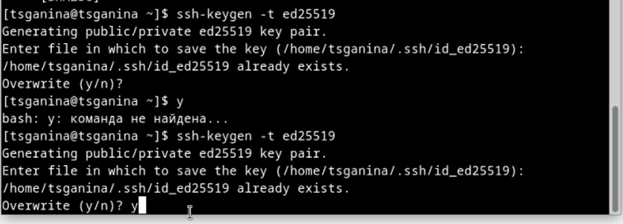{#fig:003 width=70%}

3. Создание PGP ключа (рис. @fig:004, @fig:005, @fig:006, @fig:007, @fig:008, @fig:009).

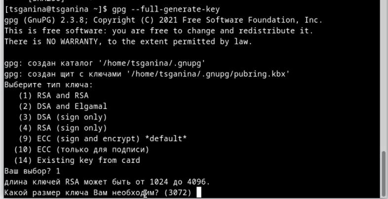{#fig:004 width=70%}

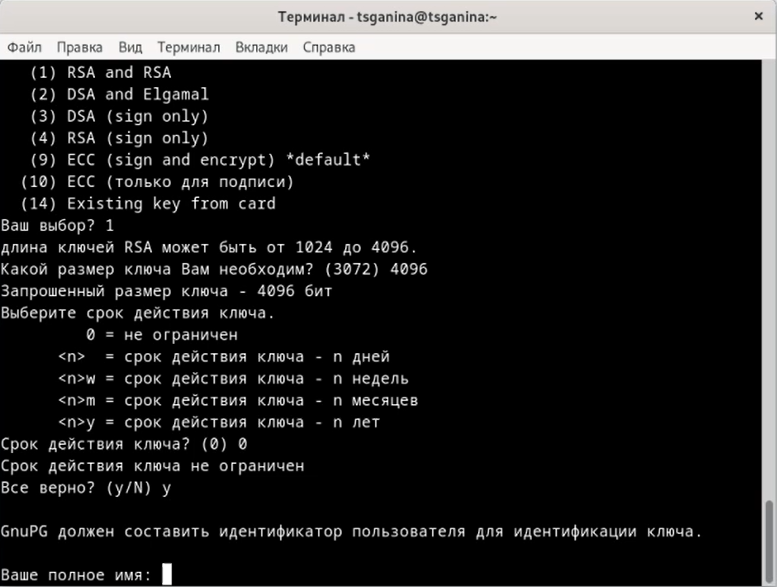{#fig:005 width=70%}

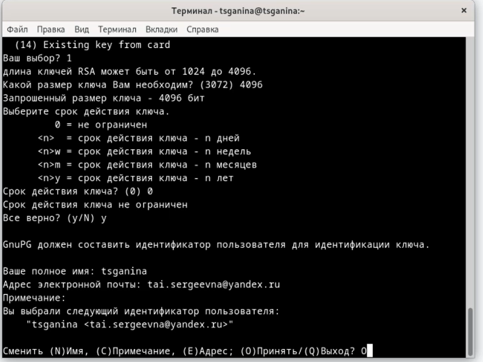{#fig:006 width=70%}

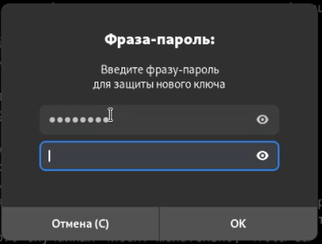{#fig:007 width=70%}

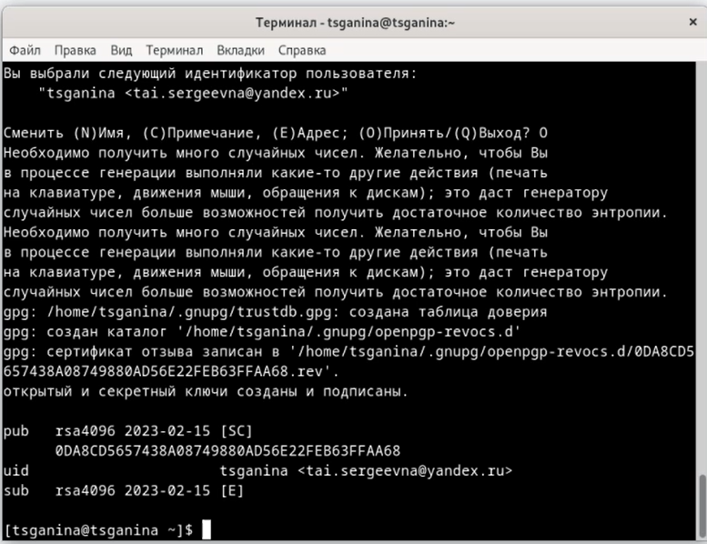{#fig:008 width=70%}

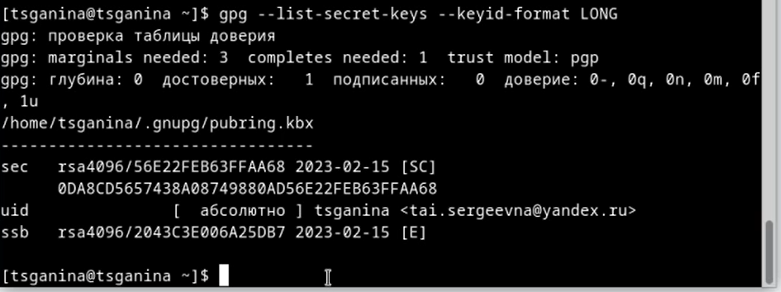{#fig:009 width=70%}

4. Добавление PGP ключа в GitHub (рис. @fig:010, @fig:011, @fig:012).

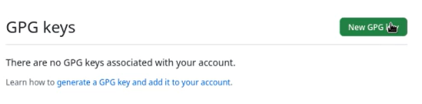{#fig:010 width=70%}

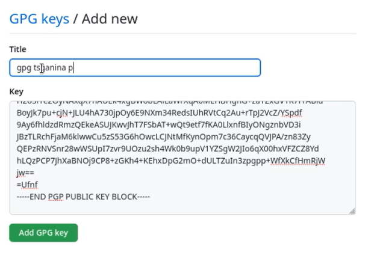{#fig:011 width=70%}

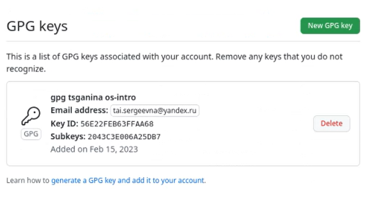{#fig:012 width=70%}

5. Настройка автоматических подписей коммитов git (рис. @fig:013).

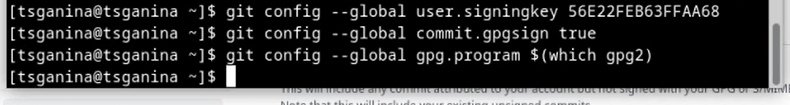{#fig:013 width=70%}

6. Настройка gh (рис. @fig:014, @fig:015, @fig:016).

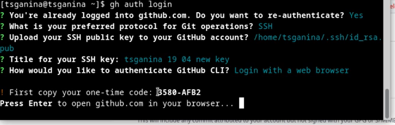{#fig:014 width=70%}

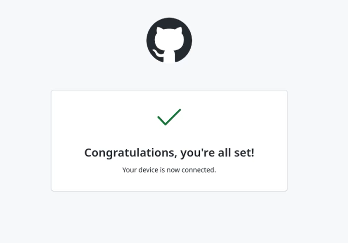{#fig:015 width=70%}

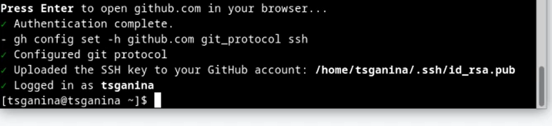{#fig:016 width=70%}

7. Шаблон для рабочего пространства (рис. @fig:017, @fig:018).

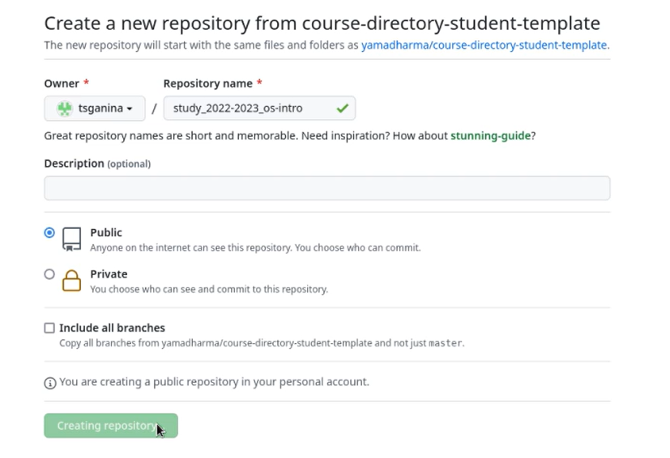{#fig:017 width=70%}

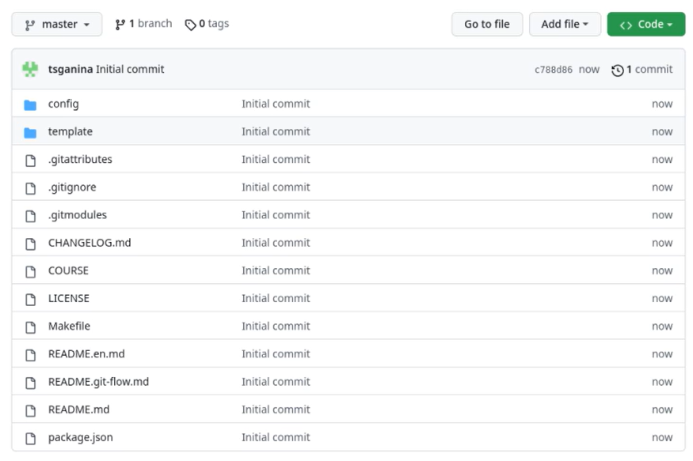{#fig:018 width=70%}

8. Создание локального репозитория курса на основе шаблона (рис. @fig:019, @fig:020, @fig:021).

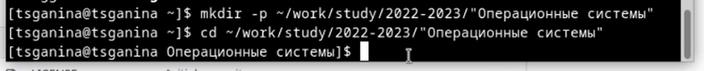{#fig:019 width=70%}

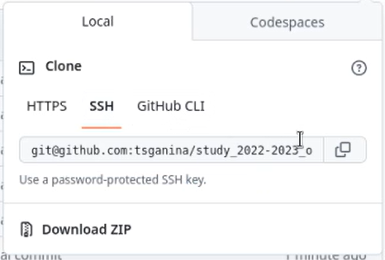{#fig:020 width=70%}

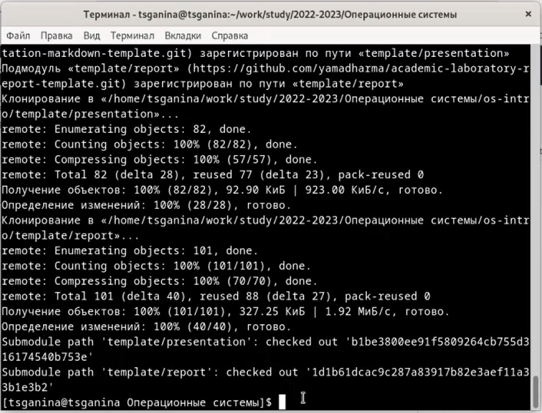{#fig:021 width=70%}

9. Настройка каталога курса (рис. @fig:022, @fig:023, @fig:024, @fig:025).

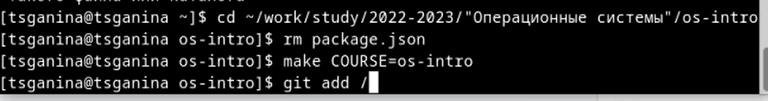{#fig:022 width=70%}

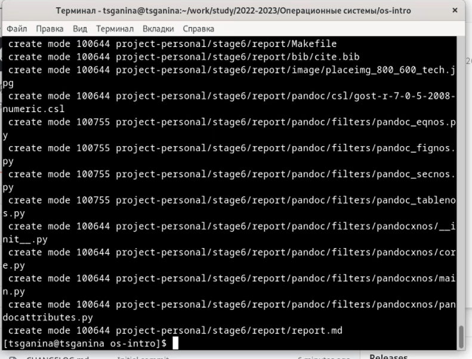{#fig:023 width=70%}

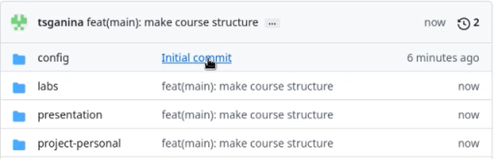{#fig:024 width=70%}

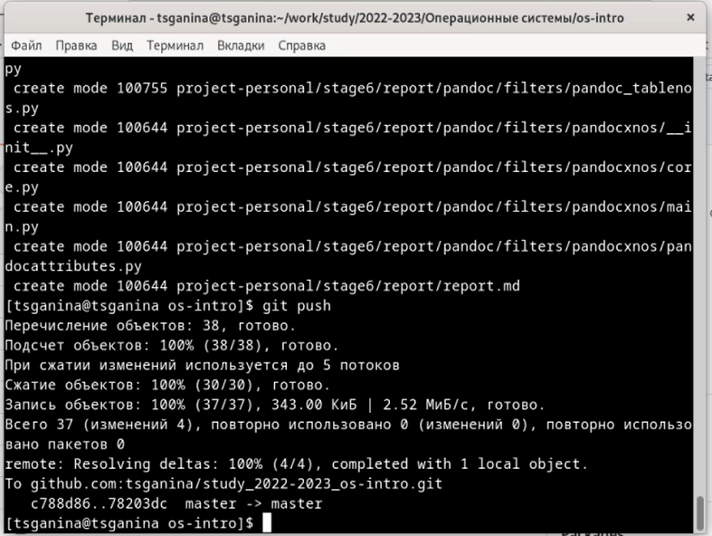{#fig:025 width=70%}

10. Контрольные вопросы.

1. Что такое системы контроля версий (VCS) и для решения каких задач они предназначаются?

Система контроля версий - программное обеспечение для облегчения работы с изменяющейся информацией. 

Системы контроля версий (Version Control System, VCS) применяются при работе нескольких человек над одним проектом. Обычно основное дерево проекта хранится в локальном или удалённом репозитории, к которому настроен доступ для участников проекта. При внесении изменений в содержание проекта система контроля версий позволяет их фиксировать, совмещать изменения, произведённые разными участниками проекта, производить откат к любой более ранней версии проекта, если это требуется.

2. Объясните следующие понятия VCS и их отношения: хранилище, commit, история, рабочая копия.
- Хранилище - репозиторий, хранилище версий, в нем хранятся все документы вместе с их историей, и другой служебной информацией.
- Commit - отслеживание изменений, сохранение разницы в рабочих изменениях.
- История - сохранение всех изменений в проекте и при необходимости возможность обратиться к старым данным.
- Рабочая копия - копия проекта, связанная с репозиторием, текущее состояние файлов проекта, основанное на их последней версии из хранилища.

3. Что представляют собой и чем отличаются централизованные и децентрализованные VCS? Приведите примеры VCS каждого вида.

- Централизованные VCS -  одно основное хранилище всего проекта, каждый пользователь копирует себе необходимые файлы из репозитория и изменяет их, а потом может добавить обратно. Примеры:
        - Subversion;
        - CVS;
        - TFS;
        - VAULT;
        - AccuRev;
        
- Децентрализованные VCS - У каждого пользователя свой вариант репозитория, есть возможность добавлять и забирать версии из любого репозитория. Например:
        - Git;
        - Mercurial;
        - Bazaar;
        
Обычно используются централизованные системы контроля версий, с одним общим репозиторием.

4. Опишите действия с VCS при единоличной работе с хранилищем.
Сначала нужно создать удалённый репозиторий, после - подключить его. Затем по мере того, как проект будет выполняться, нужно отправлять данные на сервер.

5. Опишите порядок работы с общим хранилищем VCS.
В начале при помощи последовательности команд пользователь получает нужную ему версию данных. Потом он работает с ними, вносит некоторые изменения, и уже после этого он может разместить новую версию в хранилище. При этом предыдущие версии не удаляются из хранилища, что является очень удобным - к ним можно вернуться в любой момент.

6. Каковы основные задачи, решаемые инструментальным средством git?
- Хранить информацию обо всех изменениях, производимых в проекте.
- Обеспечить командную работу.

7. Назовите и дайте краткую характеристику командам git.

`git init` - Создание основного дерева репозитория

`git pull` - Получение обновлений (изменений) текущего дерева из центрального репозитория

`git push` - Отправка всех произведённых изменений локального дерева в центральный репозиторий

`git status` - Просмотр списка изменённых файлов в текущей директории изменений

`git add . / git add <имя файла> / git rm <имя файла>` - Сохранение текущих изменений

`git commit / git commit -am "описание коммита"` - Сохранение добавленных изменений

`git checkout -b имя_ветки` - Создание новой ветки, базирующейся на текущей

`git checkout имя_ветки` - Переключение на некоторую ветку

`git push origin имя_ветки` - Отправка изменений конкретной ветки в центральный репозиторий

`git merge --no-ff имя_ветки` - Слияние ветки с текущим деревом

`git branch -d имя_ветки` - Удаление локальной уже слитой с основным деревом ветки

`git branch -D имя_ветки` - Принудительное удаление локальной ветки 

`git push origin :имя_ветки` - Удаление ветки с центрального репозитория.

8. Приведите примеры использования при работе с локальным и удалённым репозиториями.
git push -all (push origin master/любой branch)

9. Что такое и зачем могут быть нужны ветви (branches)?
Ветвь - один из параллельных участков истории проекта в одном хранилище. Все ветви исходят из одной версии - точки ветвления. Обычно ветви делятся на master и trunk. Между ветками возможно и слияние.
Ветки нужны для разработки новых функций.

10. Как и зачем можно игнорировать некоторые файлы при commit?
Игнорировать некоторые файлы можно прописав шаблон .gitignore специально для игнорируемых файлов. Зачем это нужно? Чтобы в репозиторий не попали "лишние" файлы, которые неминуемо будут возникать при работе над проектом. Это могут быть временные файлы, объектные файлы.

# Выводы

- Я изучила идеологию и применение средств контроля версий.
- Освоила умения по работе с git.

# Список литературы{.unnumbered}

1. [Руководство к выполнению лабораторной работы №2](https://esystem.rudn.ru/mod/page/view.php?id=970819#org853ec93)
2. [Solving “Fatal: Not A Git Repository” (Or Any Of The Parent Directories) Error](https://komodor.com/blog/solving-fatal-not-a-git-repository-error/)

::: {#refs}
:::
