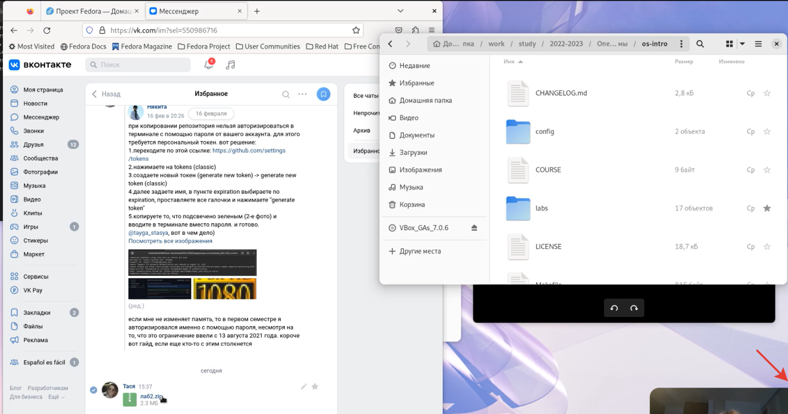
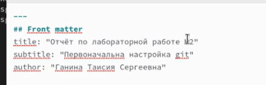
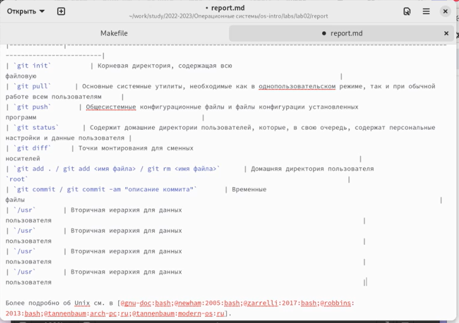
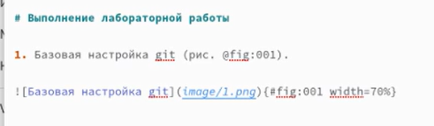
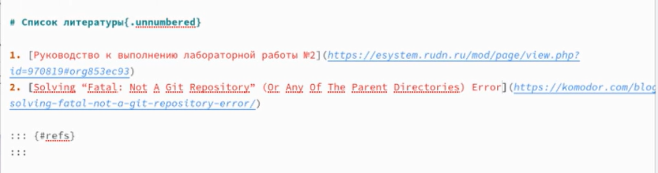
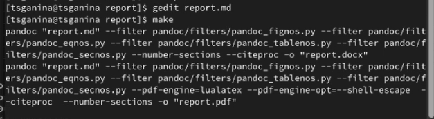

---
## Front matter
lang: ru-RU
title: "Лабораторная работа №3. Markdown"
subtitle: "Дисциплина: Операционные системы"
author:
  - Ганина Т. С.
institute:
  - Группа НКАбд-01-22
  - Российский университет дружбы народов, Москва, Россия
date: 22 февраля 2023

## i18n babel
babel-lang: russian
babel-otherlangs: english

## Formatting pdf
toc: false
toc-title: Содержание
slide_level: 2
aspectratio: 169
section-titles: true
theme: metropolis
header-includes:
 - \metroset{progressbar=frametitle,sectionpage=progressbar,numbering=fraction}
 - '\makeatletter'
 - '\beamer@ignorenonframefalse'
 - '\makeatother'
---

# Информация

## Докладчик

:::::::::::::: {.columns align=center}
::: {.column width="70%"}

  * Ганина Таисия Сергеевна
  * Студентка 1го курса, группа НКАбд-01-22
  * Компьютерные и информационные науки
  * Российский университет дружбы народов
  * [Ссылка на репозиторий гитхаба tsganina](https://github.com/tsganina/study_2022-2023_os-intro)

:::
::: {.column width="30%"}

:::
::::::::::::::

# Вводная часть

## Актуальность

- Умение работать с файлами в формате Markdown может существенно сократить время, необходимое на оформление отчёта или презентации, так как исчезает необходимость в ручном форматировании, остаётся лишь основная задача - наполнение. Также это позволяет разработать разные шаблоны, по которым будет легче вести документацию.

## Объект и предмет исследования

- Легковесный язык разметки Markdown.

## Цели и задачи

- Научиться оформлять отчёты с помощью легковесного языка разметки Markdown.

# Markdown и отчёт.

## Импорт изображений

{#fig:001 width=70%}

## Заполнение шапки

{#fig:002 width=70%}

## Заполнение таблицы для теоретического введения

{#fig:004 width=70%}

## Работа с изображениями

{#fig:005 width=70%}

## Оформление списка литературы

{#fig:007 width=70%}

## Gedit и компиляция отчёта

{#fig:009 width=70%}

# Результаты

## Вывод:

В ходе этой лабораторной я разобралась, как работать с легковесным языком разметки Markdown и выполнила при его помощи отчёт, ощутив, насколько это экономит время.

