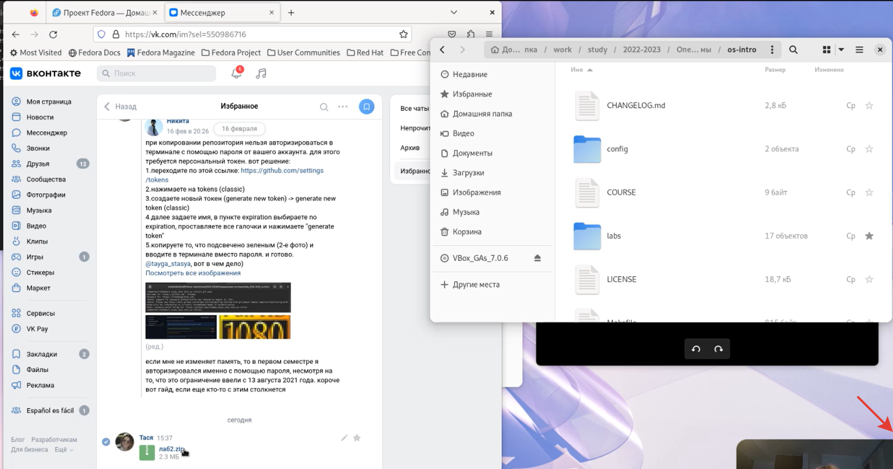
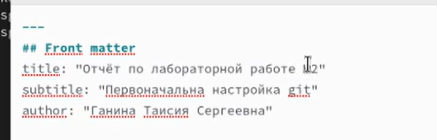
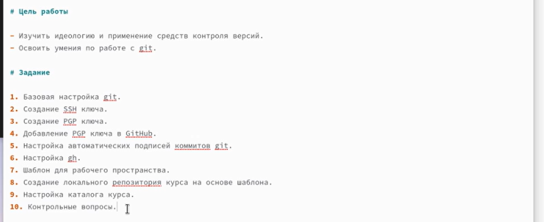
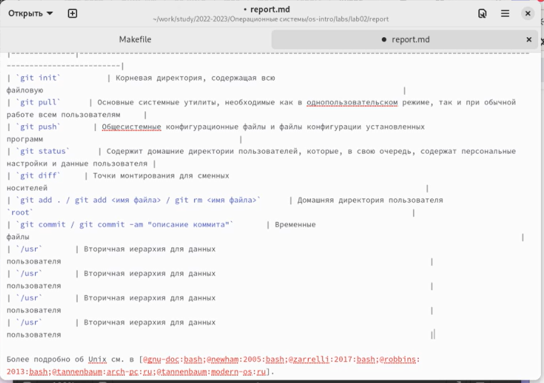
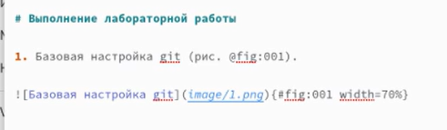
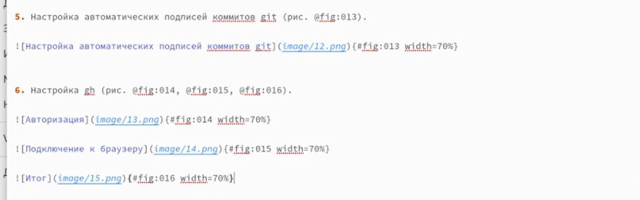
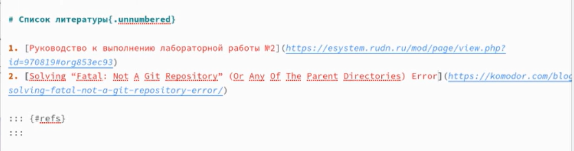
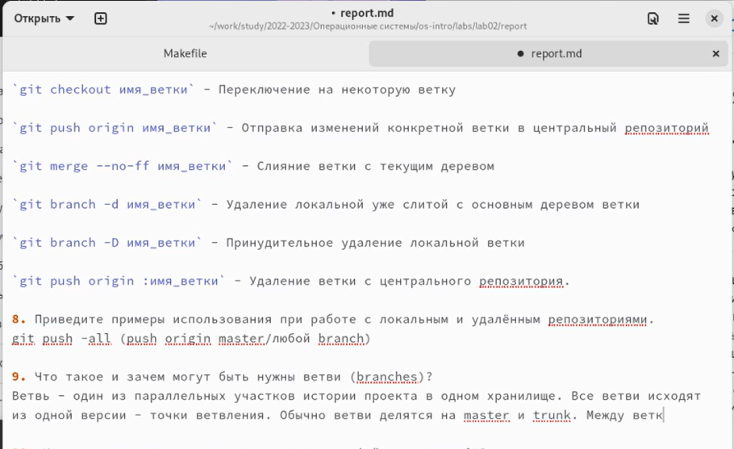
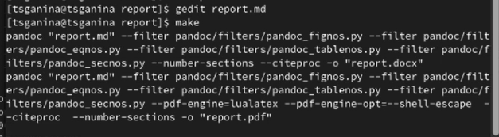

---
## Front matter
title: "Отчёт по лабораторной работе №3"
subtitle: "Markdown"
author: "Ганина Таисия Сергеевна, НКАбд-01-22"

## Generic otions
lang: ru-RU
toc-title: "Содержание"

## Bibliography
bibliography: bib/cite.bib
csl: pandoc/csl/gost-r-7-0-5-2008-numeric.csl

## Pdf output format
toc: true # Table of contents
toc-depth: 2
lof: true # List of figures
lot: true # List of tables
fontsize: 12pt
linestretch: 1.5
papersize: a4
documentclass: scrreprt
## I18n polyglossia
polyglossia-lang:
  name: russian
  options:
	- spelling=modern
	- babelshorthands=true
polyglossia-otherlangs:
  name: english
## I18n babel
babel-lang: russian
babel-otherlangs: english
## Fonts
mainfont: PT Serif
romanfont: PT Serif
sansfont: PT Sans
monofont: PT Mono
mainfontoptions: Ligatures=TeX
romanfontoptions: Ligatures=TeX
sansfontoptions: Ligatures=TeX,Scale=MatchLowercase
monofontoptions: Scale=MatchLowercase,Scale=0.9
## Biblatex
biblatex: true
biblio-style: "gost-numeric"
biblatexoptions:
  - parentracker=true
  - backend=biber
  - hyperref=auto
  - language=auto
  - autolang=other*
  - citestyle=gost-numeric
## Pandoc-crossref LaTeX customization
figureTitle: "Рис."
tableTitle: "Таблица"
listingTitle: "Листинг"
lofTitle: "Список иллюстраций"
lotTitle: "Список таблиц"
lolTitle: "Листинги"
## Misc options
indent: true
header-includes:
  - \usepackage{indentfirst}
  - \usepackage{float} # keep figures where there are in the text
  - \floatplacement{figure}{H} # keep figures where there are in the text
---

# Цель работы

Научиться оформлять отчёты с помощью легковесного языка разметки Markdown. 

# Задание

1. Выполнить отчёт по лабораторной работе №2.
2. Скомпилировать файлы PDF и DOCX из Markdown.
3. Загрузить все файлы на гитхаб.

# Теоретическое введение

1. Заголовки:

    `# This is heading 1`
    `## This is heading 2`
    `### This is heading 3`
    `#### This is heading 4`

2. Выделение:

This text is `**bold**`

This text is `*italic*`

This is text is both `***bold and italic***`

3. Списки:

`>This is the block of quotes`

`- List`

`* List too`

`- List of`
    `-Lists`
    `-Lists`

`1. First step`
`2. Second step...`

4. Изображения и ссылки:

`[link text](file-name.md)`

`{#fig:001 width=70%}`

# Выполнение лабораторной работы

1. Импорт изображений (рис. @fig:001).

{#fig:001 width=70%}

2. Заполнение шапки (рис. @fig:002).

{#fig:002 width=70%}

3. Цель и задания (рис. @fig:003).

{#fig:003 width=70%}

4. Заполнение таблицы для теоретического введения (рис. @fig:004).

{#fig:004 width=70%}

5. Описание хода лабортаторной, работа с изображениями (рис. @fig:005).

{#fig:005 width=70%}

6. Дальнейшее выполнение отчёта (рис. @fig:006).

{#fig:006 width=70%}

7. Оформление списка литературы (рис. @fig:007).

{#fig:007 width=70%}

8. Ответы на контрольные вопросы (рис. @fig:008).

{#fig:008 width=70%}

9. Gedit и компиляция отчёта (рис. @fig:009).

Работать с отчётом в формате Markdown можно и через приложение gedit, запустить которое можно сразу из терминала. Однако я предпочитаю стандартный редактор по умолчанию. Компиляция отчёта происходит при помощи команды make.

{#fig:009 width=70%}

# Выводы

Я научилась работать с файлами в формате Markdown, оформлять документацию в этом формате.

# Список литературы{.unnumbered}

1. [Руководство к выполнению лабораторной](https://esystem.rudn.ru/pluginfile.php/1975764/mod_resource/content/3/003-lab_markdown.pdf)

::: {#refs}
:::
