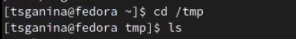
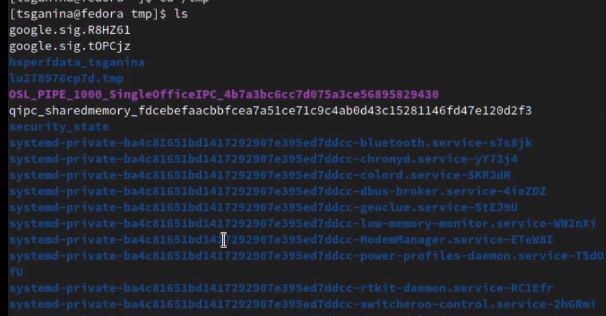
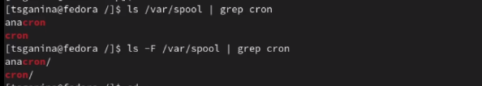
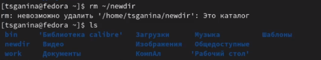
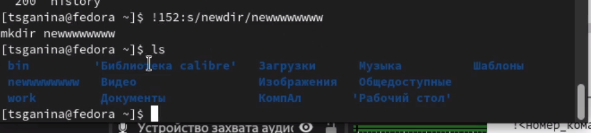

---
## Front matter
lang: ru-RU
title: "Лабораторная работа №4. Работа с командной строкой"
subtitle: "Дисциплина: Операционные системы"
author:
  - Ганина Т. С.
institute:
  - Группа НКАбд-01-22
  - Российский университет дружбы народов, Москва, Россия
date: 4 марта 2023

## i18n babel
babel-lang: russian
babel-otherlangs: english

## Formatting pdf
toc: false
toc-title: Содержание
slide_level: 2
aspectratio: 169
section-titles: true
theme: metropolis
header-includes:
 - \metroset{progressbar=frametitle,sectionpage=progressbar,numbering=fraction}
 - '\makeatletter'
 - '\beamer@ignorenonframefalse'
 - '\makeatother'
---

# Информация

## Докладчик

:::::::::::::: {.columns align=center}
::: {.column width="70%"}

  * Ганина Таисия Сергеевна
  * Студентка 1го курса, группа НКАбд-01-22
  * Компьютерные и информационные науки
  * Российский университет дружбы народов
  * [Ссылка на репозиторий гитхаба tsganina](https://github.com/tsganina/study_2022-2023_os-intro)

:::
::: {.column width="30%"}

:::
::::::::::::::

# Вводная часть

## Актуальность

- Умение работать с командной строкой - одна из основных задач при освоении ОС Linux. Это экономит время, позволяет облегчить настройку системы и установку пакетов.

## Объект и предмет исследования

- Система Unix на уровне командной строки.

## Цели и задачи

- Научиться работать с системой Unix на уровне командной строки

# Выполнение заданий.

## Определить полное имя домашнего каталога

{#fig:001 width=50%}

## Перейти в каталог /tmp

{#fig:002 width=70%}

## Вывести на экран содержимое каталога /tmp

{#fig:003 width=60%}

##  Определить, есть ли в каталоге /var/spool подкаталог с именем cron?

{#fig:008 width=70%}

## В домашнем каталоге создать новый каталог с именем newdir

{#fig:010 width=70%}

## В домашнем каталоге создать одной командой три новых каталога с именами letters, memos, misk. Затем удалить эти каталоги одной командой

{#fig:012 width=70%}

## В домашнем каталоге создать одной командой три новых каталога с именами letters, memos, misk. Затем удалить эти каталоги одной командой

{#fig:013 width=70%}

## Попробовать удалить ранее созданный каталог ~/newdir командой rm. Проверить, был ли каталог удалён

Командой rm нельзя удалить не пустой каталог. Поэтому я удалила всё командой rm -r. Но так как в следующем шаге мне снова потребуются эти каталоги, я их создала заново.

{#fig:014 width=70%}

## Попробовать удалить ранее созданный каталог ~/newdir командой rm. Проверить, был ли каталог удалён

{#fig:015 width=70%}

## С помощью команды man определить, какую опцию команды ls нужно использовать для просмотра содержимого не только указанного каталога, но и подкаталогов, входящих в него

{#fig:018 width=70%}

## С помощью команды man определить, какую опцию команды ls нужно использовать для просмотра содержимого не только указанного каталога, но и подкаталогов, входящих в него

{#fig:019 width=70%}

## С помощью команды man определить, какую опцию команды ls нужно использовать для просмотра содержимого не только указанного каталога, но и подкаталогов, входящих в него

{#fig:020 width=30%}

## Используя информацию, полученную при помощи команды history, выполнить модификацию и исполнение нескольких команд из буфера команд

{#fig:027 width=70%}

## Используя информацию, полученную при помощи команды history, выполнить модификацию и исполнение нескольких команд из буфера команд

{#fig:028 width=70%}

# Результаты

## Вывод:

В ходе этой лабораторной я разобралась, как работать с командной строкой, увидев разницу в работе через терминал и через графический интерфейс.

