---
## Front matter
title: "Отчёт по лабораторной работе №4"
subtitle: "Работа с командной строкой"
author: "Ганина Таисия Сергеевна, НКАбд-01-22"

## Generic otions
lang: ru-RU
toc-title: "Содержание"

## Bibliography
bibliography: bib/cite.bib
csl: pandoc/csl/gost-r-7-0-5-2008-numeric.csl

## Pdf output format
toc: true # Table of contents
toc-depth: 2
lof: true # List of figures
lot: true # List of tables
fontsize: 12pt
linestretch: 1.5
papersize: a4
documentclass: scrreprt
## I18n polyglossia
polyglossia-lang:
  name: russian
  options:
	- spelling=modern
	- babelshorthands=true
polyglossia-otherlangs:
  name: english
## I18n babel
babel-lang: russian
babel-otherlangs: english
## Fonts
mainfont: PT Serif
romanfont: PT Serif
sansfont: PT Sans
monofont: PT Mono
mainfontoptions: Ligatures=TeX
romanfontoptions: Ligatures=TeX
sansfontoptions: Ligatures=TeX,Scale=MatchLowercase
monofontoptions: Scale=MatchLowercase,Scale=0.9
## Biblatex
biblatex: true
biblio-style: "gost-numeric"
biblatexoptions:
  - parentracker=true
  - backend=biber
  - hyperref=auto
  - language=auto
  - autolang=other*
  - citestyle=gost-numeric
## Pandoc-crossref LaTeX customization
figureTitle: "Рис."
tableTitle: "Таблица"
listingTitle: "Листинг"
lofTitle: "Список иллюстраций"
lotTitle: "Список таблиц"
lolTitle: "Листинги"
## Misc options
indent: true
header-includes:
  - \usepackage{indentfirst}
  - \usepackage{float} # keep figures where there are in the text
  - \floatplacement{figure}{H} # keep figures where there are in the text
---

# Цель работы

Приобретение практических навыков взаимодействия пользователя с системой посредством командной строки.

# Задание

1. Определить полное имя вашего домашнего каталога. Далее относительно этого каталога будут выполняться последующие упражнения.

2. Выполнить следующие действия:
2.1. Перейти в каталог /tmp.
2.2. Вывести на экран содержимое каталога /tmp. Использовать команду ls с различными опциями. Пояснить разницу в выводимой на экран информации.
2.3. Определить, есть ли в каталоге /var/spool подкаталог с именем cron?
2.4. Перейти в домашний каталог и вывести на экран его содержимое. Определить, кто является владельцем файлов и подкаталогов.

3. Выполнить следующие действия:
3.1. В домашнем каталоге создать новый каталог с именем newdir.
3.2. В каталоге ~/newdir создать новый каталог с именем morefun.
3.3. В домашнем каталоге создать одной командой три новых каталога с именами letters, memos, misk. Затем удалить эти каталоги одной командой.
3.4. Попробовать удалить ранее созданный каталог ~/newdir командой rm. Проверить, был ли каталог удалён.
3.5. Удалить каталог ~/newdir/morefun из домашнего каталога. Проверить, был ли каталог удалён.

4. С помощью команды man определить, какую опцию команды ls нужно использовать для просмотра содержимого не только указанного каталога, но и подкаталогов, входящих в него.

5. С помощью команды man определить набор опций команды ls, позволяющий отсортировать по времени последнего изменения выводимый список содержимого каталога с развёрнутым описанием файлов.

6. Использовать команду man для просмотра описания следующих команд: cd, pwd, mkdir, rmdir, rm. Пояснить основные опции этих команд.

7. Используя информацию, полученную при помощи команды history, выполнить модификацию и исполнение нескольких команд из буфера команд.

# Теоретическое введение

В операционной системе типа Linux взаимодействие пользователя с системой обычно осуществляется с помощью командной строки посредством построчного ввода команд. При этом обычно используется командные интерпретаторы языка shell: /bin/sh; /bin/csh; /bin/ksh.

Формат команды. Командой в операционной системе называется записанный по специальным правилам текст (возможно с аргументами), представляющий собой указание на выполнение какой-либо функций (или действий) в операционной системе.

Обычно первым словом идёт имя команды, остальной текст — аргументы или опции, конкретизирующие действие.

Общий формат команд можно представить следующим образом: <имя_команды><разделитель><аргументы>

**Команда man.**

Команда man используется для просмотра (оперативная помощь) в диалоговом режиме руководства (manual) по основным командам операционной системы типа Linux.

**Команда cd.** 

Команда cd используется для перемещения по файловой системе операционной системы типа Linux.

**Команда pwd.** 

Для определения абсолютного пути к текущему каталогу используется команда pwd (print working directory).

**Команда ls.**

Команда ls используется для просмотра содержимого каталога.

**Команда mkdir.**

Команда mkdir используется для создания каталогов.

**Команда rm.**

Команда rm используется для удаления файлов и/или каталогов.

**Команда history.**

Для вывода на экран списка ранее выполненных команд используется команда history. Выводимые на экран команды в списке нумеруются. К любой команде из выведенного на экран списка можно обратиться по её номеру в списке, воспользовавшись конструкцией !<номер_команды>.

# Выполнение лабораторной работы

1. Определить полное имя вашего домашнего каталога. Далее относительно этого каталога будут выполняться последующие упражнения (рис. @fig:001)

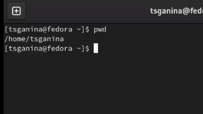{#fig:001 width=70%}

2. Выполнить следующие действия:

2.1. Перейти в каталог /tmp (рис. @fig:002).

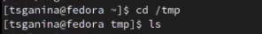{#fig:002 width=70%}

2.2. Вывести на экран содержимое каталога /tmp. Использовать команду ls с различными опциями. Пояснить разницу в выводимой на экран информации (рис. @fig:003, @fig:004, @fig:005, @fig:006, @fig:007)

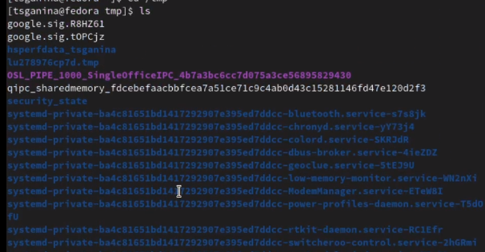{#fig:003 width=70%}

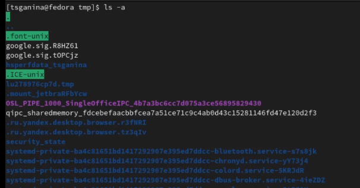{#fig:004 width=70%}

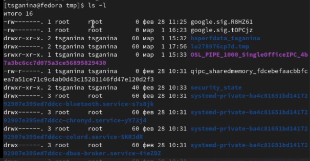{#fig:005 width=70%}

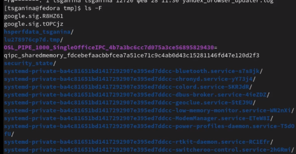{#fig:006 width=70%}

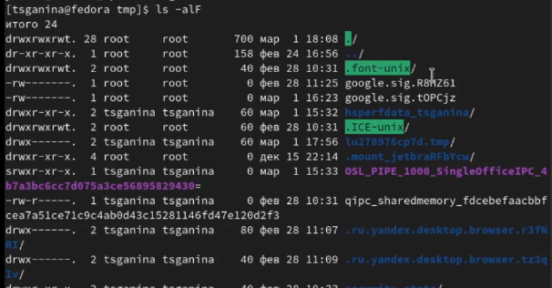{#fig:007 width=70%}

2.3. Определить, есть ли в каталоге /var/spool подкаталог с именем cron? (рис. @fig:008)

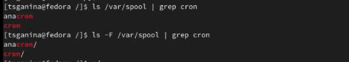{#fig:008 width=70%}

2.4. Перейти в домашний каталог и вывести на экран его содержимое. Определить, кто является владельцем файлов и подкаталогов (рис. @fig:009).

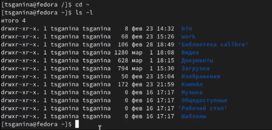{#fig:009 width=70%}

3. Выполнить следующие действия:

3.1. В домашнем каталоге создать новый каталог с именем newdir (рис. @fig:010).

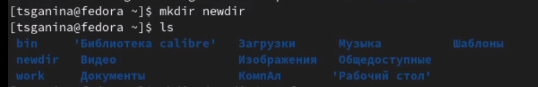{#fig:010 width=70%}

3.2. В каталоге ~/newdir создать новый каталог с именем morefun (рис. @fig:011).

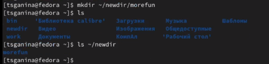{#fig:011 width=70%}

3.3. В домашнем каталоге создать одной командой три новых каталога с именами letters, memos, misk. Затем удалить эти каталоги одной командой (рис. @fig:012, @fig:013).

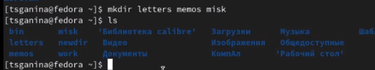{#fig:012 width=70%}

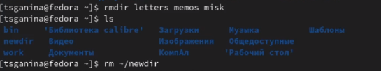{#fig:013 width=70%}

3.4. Попробовать удалить ранее созданный каталог ~/newdir командой rm. Проверить, был ли каталог удалён (рис. @fig:014, @fig:015).

Командой rm нельзя удалить не пустой каталог. Поэтому я удалила всё командой rm -r. Но так как в следующем шаге мне снова потребуются эти каталоги, я их создала заново.

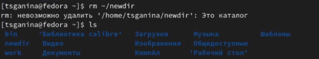{#fig:014 width=70%}

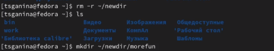{#fig:015 width=70%}

3.5. Удалить каталог ~/newdir/morefun из домашнего каталога. Проверить, был ли каталог удалён (рис. @fig:016, @fig:017).

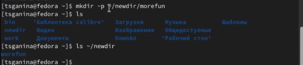{#fig:016 width=70%}

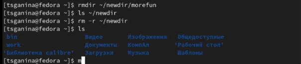{#fig:017 width=70%}

4. С помощью команды man определить, какую опцию команды ls нужно использовать для просмотра содержимого не только указанного каталога, но и подкаталогов, входящих в него (рис. @fig:018, @fig:019, @fig:020).

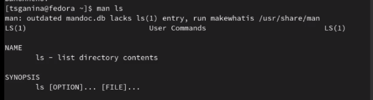{#fig:018 width=70%}

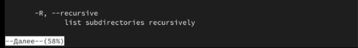{#fig:019 width=70%}

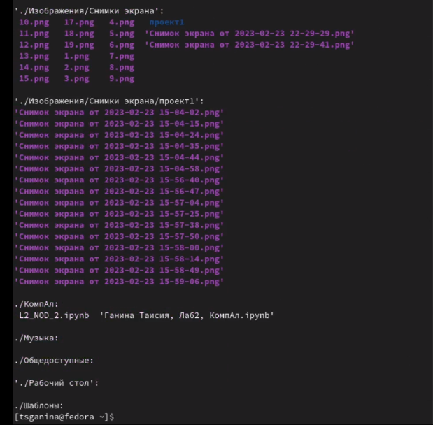{#fig:020 width=70%}

5. С помощью команды man определить набор опций команды ls, позволяющий отсортировать по времени последнего изменения выводимый список содержимого каталога с развёрнутым описанием файлов (рис. @fig:021).

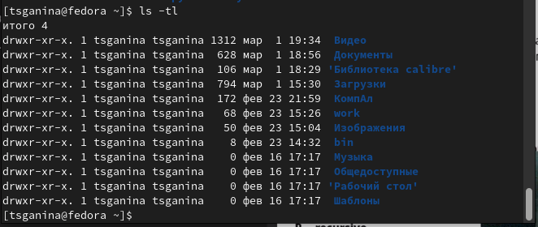{#fig:021 width=70%}

6. Использовать команду man для просмотра описания следующих команд: cd, pwd, mkdir, rmdir, rm. Пояснить основные опции этих команд (рис. @fig:022, @fig:023, @fig:024, @fig:025, @fig:026).

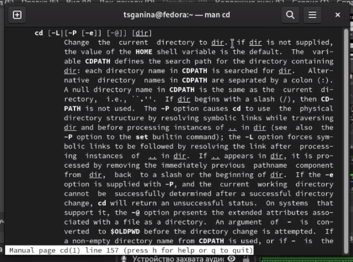{#fig:022 width=70%}

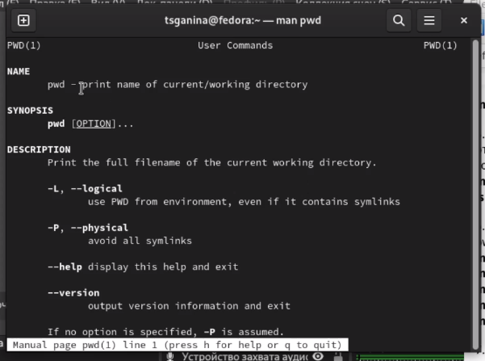{#fig:023 width=70%}

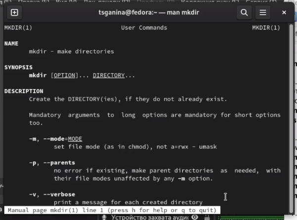{#fig:024 width=70%}

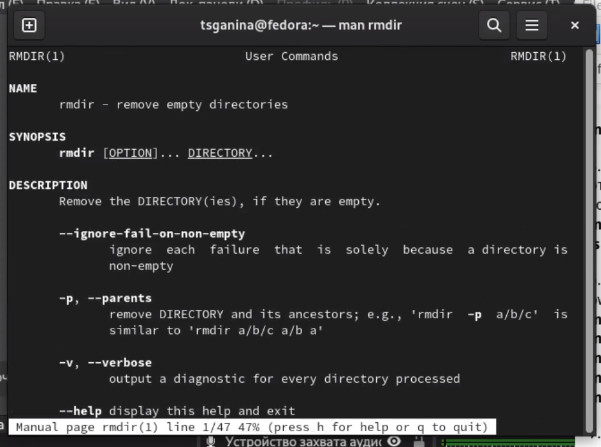{#fig:025 width=70%}

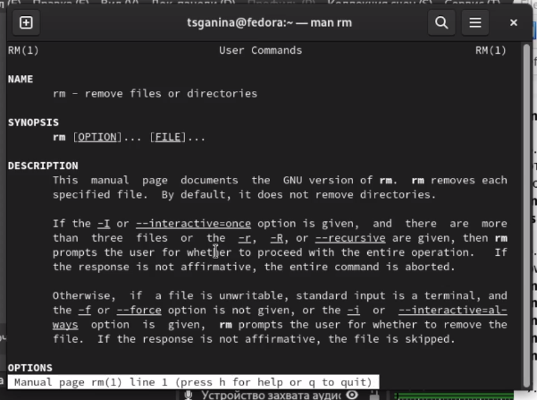{#fig:026 width=70%}    

7. Используя информацию, полученную при помощи команды history, выполнить модификацию и исполнение нескольких команд из буфера команд (рис. @fig:027, @fig:028, @fig:029).

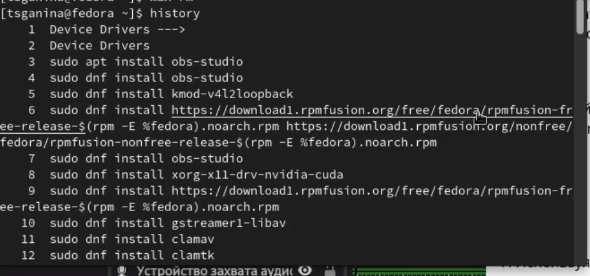{#fig:027 width=70%}

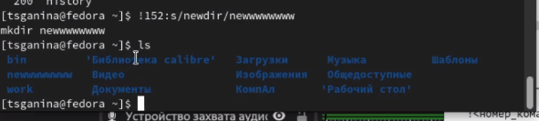{#fig:028 width=70%}

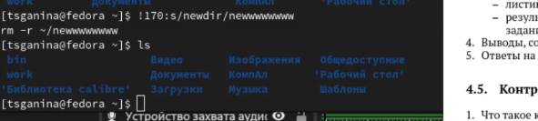{#fig:029 width=70%}

# Ответы на контрольные вопросы

1. Что такое командная строка?

Командная строка - это текстовый интерфейс взаимодействия человека и компьютера, в котором компьютеру даются некоторые инструкции, путём их ввода с клавиатуры. Интерфейс командной строки противопоставляется управлению командами на основе меню и при помощи графического интерфейса.

2. При помощи какой команды можно определить абсолютный путь текущего каталога? Приведите пример.

Абсолютный путь текущего каталога можно определить при помощи команды `pwd`. Например, Чтобы определить абсолютный путь каталога в котором мы находимся нужно написать в командной строке:

-> `pwd`

`/home/tsganina`

3. При помощи какой команды и каких опций можно определить только тип файлов и их имена в текущем каталоге? Приведите примеры.

При помощи команды `ls -F`.

-> `ls -F`

bin/                   Видео/       Изображения/   Общедоступные/

work/                  Документы/   КомпАл/       'Рабочий стол'/

'Библиотека calibre'/   Загрузки/    Музыка/        Шаблоны/

4. Каким образом отобразить информацию о скрытых файлах? Приведите примеры.

При помощи команды `ls -a`.

ls -a
.                   .clamtk              .local                Видео

..                  .config              .mozilla              Документы

.asy                .dotnet              .pki                  Загрузки

.atom               .FBReader            .profile              Изображения

.bash_history       .gitconfig           .sage                 КомпАл

.bash_logout        .gnupg               .ssh                  Музыка

.bash_profile       .ipynb_checkpoints   .texlive2021          Общедоступные

.bash_profile.bak   .ipython             .vscode              'Рабочий стол'

.bashrc             .java                .wget-hsts            Шаблоны

bin                 .jmol                work

.cache              .jupyter             .yandex

.cgnstools          .lesshst            'Библиотека calibre'

5. При помощи каких команд можно удалить файл и каталог? Можно ли это сделать одной и той же командой? Приведите примеры.

Удалить файл или каталог можно при помощи команды rm, rmdir - только пустой каталог, rm -r - любой файл или непустой каталог.

{#fig:030 width=70%}

6. Каким образом можно вывести информацию о последних выполненных пользователем командах? работы?

При помощи команды history.

7. Как воспользоваться историей команд для их модифицированного выполнения? Приведите примеры.

Нужно написать следующую конструкцию:

`!<Номер команды>:s/<ЧТО меняем>/<НА что меняем>`

{#fig:031 width=70%}

{#fig:032 width=70%}

8. Приведите примеры запуска нескольких команд в одной строке.

Когда требуется выполнить несколько команд в одной строке, пишем символ ; (точка с запятой)

`tsganina@fedora ~ $ cd work; ls`

`blog_ganina  study  tsganina.github.io`

`tsganina@fedora work $`

9. Дайте определение и приведите примера символов экранирования.

Если в заданном контексте встречаются символы (".", "/", "*" и т.д.), то перед ними нудно поставить кавычки как символ экранирования. Также они ставятся, когда текст - просто текст, а не команда.

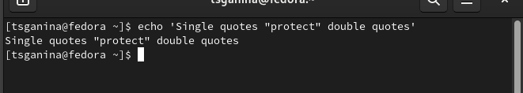{#fig:033 width=70%}

10. Охарактеризуйте вывод информации на экран после выполнения команды ls с опцией l.

Чтобы вывести на экран подробную информацию о файлах и каталогах, нужно использовать команду ls с опцией l. При этом о каждом файле и каталоге будет выведена следующая информация: тип файла, право доступа, число ссылок, владелец, размер, дата последней ревизии, имя файла или каталога.

11. Что такое относительный путь к файлу? Приведите примеры использования относительного и абсолютного пути при выполнении какой-либо команды.

Относительный путь - это ссылка, указывающая, на другие каталоги, относительно каталога, в котором мы находимся. Допустим, я сейчас нахожусь в каталоге report, который содержит каталог images. Тогда, чтобы перейти в каталог images мне достаточно написать команду `cd images`. А вот если я хочу попасть в каталог, например, "Видео", который находится в домашнем каталоге, то писать нужно будет абсолютный путь: `cd /home/tsganina/"Видео"`.

12. Как получить информацию об интересующей вас команде?

Чтобы получить информацию об интересующей меня команде есть два пути: команда help или команда man.

13. Какая клавиша или комбинация клавиш служит для автоматического дополнения
вводимых команд?

Клавиша `Tab`.

# Выводы

В ходе этой лабораторной работы я приобрела практические навыки взаимодействия с системой посредством командной строки.

# Список литературы{.unnumbered}

1. [Инструкция к выполнению лабораторной работы №4](https://esystem.rudn.ru/mod/resource/view.php?id=970823)
2. [Экранирование символов в Linux (оболочка Bash)](https://oracle-patches.com/os/ekranirovanie-simvolah-v-komandah-linux-obolochka-bash)

::: {#refs}
:::
