---
## Front matter
lang: ru-RU
title: "Лабораторная работа №5. Анализ файловой системы Linux. Команды для работы с файлами и каталогами"
subtitle: "Дисциплина: Операционные системы"
author:
  - Ганина Т. С.
institute:
  - Группа НКАбд-01-22
  - Российский университет дружбы народов, Москва, Россия
date: 8 марта 2023

## i18n babel
babel-lang: russian
babel-otherlangs: english

## Formatting pdf
toc: false
toc-title: Содержание
slide_level: 2
aspectratio: 169
section-titles: true
theme: metropolis
header-includes:
 - \metroset{progressbar=frametitle,sectionpage=progressbar,numbering=fraction}
 - '\makeatletter'
 - '\beamer@ignorenonframefalse'
 - '\makeatother'
---

# Информация

## Докладчик

:::::::::::::: {.columns align=center}
::: {.column width="70%"}

  * Ганина Таисия Сергеевна
  * Студентка 1го курса, группа НКАбд-01-22
  * Компьютерные и информационные науки
  * Российский университет дружбы народов
  * [Ссылка на репозиторий гитхаба tsganina](https://github.com/tsganina/study_2022-2023_os-intro)

:::
::: {.column width="30%"}

:::
::::::::::::::

# Вводная часть

## Актуальность

- Умение работать с файловой системой - одна из основных задач при освоении ОС Linux. Это экономит время, позволяет облегчить настройку системы.

## Объект и предмет исследования

- Команды для работы с файлами и каталогами.

## Цели и задачи

- Ознакомление с файловой системой Linux, её структурой, именами и содержанием
каталогов. Приобретение практических навыков по применению команд для работы
с файлами и каталогами, по управлению процессами (и работами), по проверке исполь-
зования диска и обслуживанию файловой системы.

# Выполнение заданий.

## Скопировать файл /usr/include/sys/io.h в домашний каталог и назвать его equipment

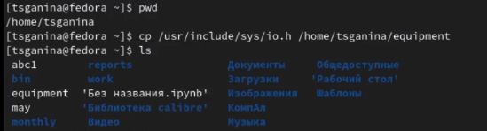{#fig:001 width=70%}

## Переместить файл equipment в каталог ~/ski.plases

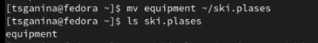{#fig:002 width=70%}

## Переименовать файл ~/ski.plases/equipment в ~/ski.plases/equiplist

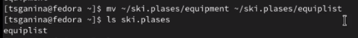{#fig:003 width=70%}

## Создать каталог с именем equipment в каталоге ~/ski.plases

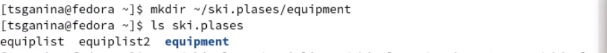{#fig:004 width=70%}

## Определить опции команды chmod, необходимые для того, чтобы присвоить перечисленным ниже файлам выделенные права доступа

{#fig:005 width=70%}

## Определить опции команды chmod, необходимые для того, чтобы присвоить перечисленным ниже файлам выделенные права доступа

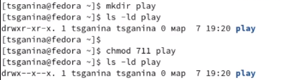{#fig:006 width=70%}

## Определить опции команды chmod, необходимые для того, чтобы присвоить перечисленным ниже файлам выделенные права доступа

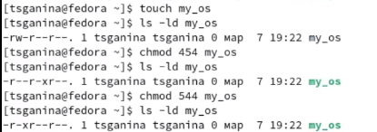{#fig:007 width=70%}

## Определить опции команды chmod, необходимые для того, чтобы присвоить перечисленным ниже файлам выделенные права доступа

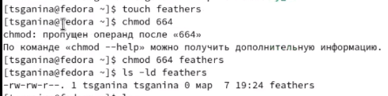{#fig:008 width=70%}

## Просмотреть содержимое файла /etc/password

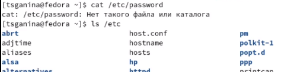{#fig:009 width=70%}

## Просмотреть содержимое файла /etc/password

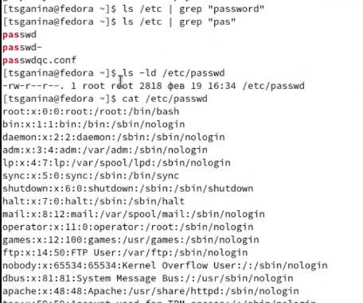{#fig:010 width=50%}

## Лишить владельца файла ~/feathers права на чтение. Что произойдёт, если попытаться просмотреть файл ~/feathers командой cat? Что произойдёт, если попытаться скопировать файл ~/feathers? Дать владельцу файла ~/feathers право на чтение

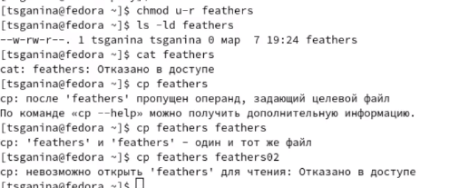{#fig:011 width=50%}

## После лишения владельца прав на чтение файла не получится ни просмотреть его, ни скопировать

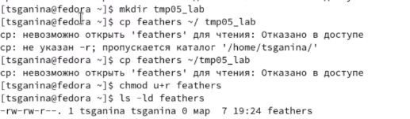{#fig:012 width=70%}

## Лишить владельца каталога ~/play права на выполнение. Перейти в каталог ~/play. Что произошло? Дать владельцу каталога ~/play право на выполнение

{#fig:013 width=70%}

## Если лишить владельца каталога права на выполнение, то не получится больше перейти в этот каталог.

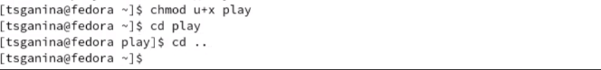{#fig:014 width=70%}

# Результаты

## Вывод:

В ходе этой лабораторной я разобралась, как работать с файловой системой Linux.

