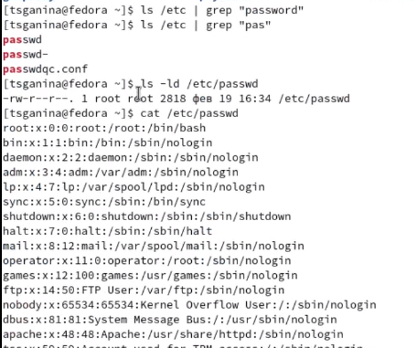

---
## Front matter
title: "Отчёт по лабораторной работе №5. Анализ файловой системы Linux. Команды для работы с файлами и каталогами"
subtitle: "Дисциплина: Операционные системы"
author: "Ганина Таисия Сергеевна, НКАбд-01-22"

## Generic otions
lang: ru-RU
toc-title: "Содержание"

## Bibliography
bibliography: bib/cite.bib
csl: pandoc/csl/gost-r-7-0-5-2008-numeric.csl

## Pdf output format
toc: true # Table of contents
toc-depth: 2
lof: true # List of figures
lot: true # List of tables
fontsize: 12pt
linestretch: 1.5
papersize: a4
documentclass: scrreprt
## I18n polyglossia
polyglossia-lang:
  name: russian
  options:
	- spelling=modern
	- babelshorthands=true
polyglossia-otherlangs:
  name: english
## I18n babel
babel-lang: russian
babel-otherlangs: english
## Fonts
mainfont: PT Serif
romanfont: PT Serif
sansfont: PT Sans
monofont: PT Mono
mainfontoptions: Ligatures=TeX
romanfontoptions: Ligatures=TeX
sansfontoptions: Ligatures=TeX,Scale=MatchLowercase
monofontoptions: Scale=MatchLowercase,Scale=0.9
## Biblatex
biblatex: true
biblio-style: "gost-numeric"
biblatexoptions:
  - parentracker=true
  - backend=biber
  - hyperref=auto
  - language=auto
  - autolang=other*
  - citestyle=gost-numeric
## Pandoc-crossref LaTeX customization
figureTitle: "Рис."
tableTitle: "Таблица"
listingTitle: "Листинг"
lofTitle: "Список иллюстраций"
lotTitle: "Список таблиц"
lolTitle: "Листинги"
## Misc options
indent: true
header-includes:
  - \usepackage{indentfirst}
  - \usepackage{float} # keep figures where there are in the text
  - \floatplacement{figure}{H} # keep figures where there are in the text
---

# Цель работы

Ознакомление с файловой системой Linux, её структурой, именами и содержанием
каталогов. Приобретение практических навыков по применению команд для работы
с файлами и каталогами, по управлению процессами (и работами), по проверке исполь-
зования диска и обслуживанию файловой системы.

# Задание

1. Выполните все примеры, приведённые в первой части описания лабораторной работы.
2. Скопируйте файл /usr/include/sys/io.h в домашний каталог и назовите его
equipment. Если файла io.h нет, то используйте любой другой файл в каталоге
/usr/include/sys/ вместо него.
3. В домашнем каталоге создайте директорию ~/ski.plases.
4. Переместите файл equipment в каталог ~/ski.plases.
5. Переименуйте файл ~/ski.plases/equipment в ~/ski.plases/equiplist.
6. Создайте в домашнем каталоге файл abc1 и скопируйте его в каталог ~/ski.plases, назовите его equiplist2.
7. Создайте каталог с именем equipment в каталоге ~/ski.plases.
8. Переместите файлы ~/ski.plases/equiplist и equiplist2 в каталог ~/ski.plases/equipment.
9. Создайте и переместите каталог ~/newdir в каталог ~/ski.plases и назовите его plans.
10. Определите опции команды chmod, необходимые для того, чтобы присвоить перечис-
ленным ниже файлам выделенные права доступа, считая, что в начале таких прав
нет:

drwxr--r--...australia

drwx--x--x...play

-r-xr--r--...my_os

-rw-rw-r--...feathers

При необходимости создайте нужные файлы.

11. Просмотрите содержимое файла /etc/password.
12. Скопируйте файл ~/feathers в файл ~/file.old.
13. Переместите файл ~/file.old в каталог ~/play.
14. Скопируйте каталог ~/play в каталог ~/fun.
15. Переместите каталог ~/fun в каталог ~/play и назовите его games.
16. Лишите владельца файла ~/feathers права на чтение. Что произойдёт, если вы попытаетесь просмотреть файл ~/feathers командой cat? Что произойдёт, если вы попытаетесь скопировать файл ~/feathers? Дайте владельцу файла ~/feathers право на чтение.
17. Лишите владельца каталога ~/play права на выполнение.
18. Перейдите в каталог ~/play. Что произошло?
19. Дайте владельцу каталога ~/play право на выполнение.
20. Прочитайте man по командам mount, fsck, mkfs, kill и кратко их охарактеризуйте, приведя примеры.

# Теоретическое введение

**Для создания текстового файла** можно использовать команду touch.
Формат команды:

- touch имя-файла

Для **просмотра файлов небольшого размера** можно использовать команду cat.
Формат команды:

- cat имя-файла

Для **просмотра файлов** постранично удобнее использовать команду less.
Формат команды:

- less имя-файла

**Команда cp** используется для копирования файлов и каталогов.
Формат команды:

- cp [-опции] исходный_файл целевой_файл

Команды **mv и mvdir** предназначены для перемещения и переименования файлов и каталогов.
Формат команды mv:

- mv [-опции] старый_файл новый_файл (рис. @fig:001).

{#fig:001 width=70%}

**Права доступа к файлу или каталогу можно изменить**, воспользовавшись командой chmod. Сделать это может владелец файла (или каталога) или пользователь с правами
администратора.
Формат команды:

- chmod режим имя_файла

**Файловая система** в Linux состоит из фалов и каталогов. Каждому физическому носителю соответствует своя файловая система. Существует несколько типов файловых систем. Перечислим наиболее часто встречающиеся типы:

- ext2fs (second extended filesystem);
- ext2fs (third extended file system);
- ext4 (fourth extended file system);
- ReiserFS;
- xfs;
- fat (file allocation table);
- ntfs (new technology file system).

# Выполнение лабораторной работы

1. Выполнить все примеры, приведённые в первой части описания лабораторной работы (рис. @fig:002, @fig:003, @fig:004, @fig:005, @fig:006, @fig:007, @fig:008, @fig:009, @fig:010, @fig:011, @fig:012, @fig:013, @fig:014, @fig:015, @fig:016).

{#fig:002 width=70%}

{#fig:003 width=70%}

{#fig:004 width=70%}

{#fig:005 width=70%}

{#fig:006 width=70%}

{#fig:007 width=70%}

{#fig:008 width=70%}

{#fig:009 width=70%}

{#fig:010 width=70%}

{#fig:011 width=70%}

{#fig:012 width=70%}

{#fig:013 width=70%}

{#fig:014 width=70%}

{#fig:015 width=70%}

{#fig:016 width=70%}

2. Скопировать файл /usr/include/sys/io.h в домашний каталог и назвать его equipment (рис. @fig:017).

{#fig:017 width=70%}

3. В домашнем каталоге создать директорию ~/ski.plases (рис. @fig:018).

{#fig:018 width=70%}

4. Переместить файл equipment в каталог ~/ski.plases (рис. @fig:019).

{#fig:019 width=70%}

5. Переименовать файл ~/ski.plases/equipment в ~/ski.plases/equiplist (рис. @fig:020).

{#fig:020 width=70%}

6. Создать в домашнем каталоге файл abc1 и скопировать его в каталог ~/ski.plases, назвать его equiplist2 (рис. @fig:021, @fig:022).

{#fig:021 width=70%}

{#fig:022 width=70%}

7. Создать каталог с именем equipment в каталоге ~/ski.plases (рис. @fig:023).

{#fig:023 width=70%}

8. Переместить файлы ~/ski.plases/equiplist и equiplist2 в каталог ~/ski.plases/equipment (рис. @fig:024).

{#fig:024 width=70%}

9. Создать и переместить каталог ~/newdir в каталог ~/ski.plases и назвать его plans (рис. @fig:025).

{#fig:025 width=70%}

10. Определить опции команды chmod, необходимые для того, чтобы присвоить перечисленным ниже файлам выделенные права доступа, считая, что в начале таких прав нет:

drwxr--r--...australia

drwx--x--x...play

-r-xr--r--...my_os

-rw-rw-r--...feathers

При необходимости создать нужные файлы (рис. @fig:026, @fig:027, @fig:028, @fig:029).

{#fig:026 width=70%}

{#fig:027 width=70%}

{#fig:028 width=70%}

{#fig:029 width=70%}

11. Просмотреть содержимое файла /etc/password (рис. @fig:030, @fig:031).

{#fig:030 width=70%}

{#fig:031 width=70%}

12. Скопировать файл ~/feathers в файл ~/file.old (рис. @fig:032).

{#fig:032 width=70%}

13. Переместить файл ~/file.old в каталог ~/play (рис. @fig:033).

{#fig:033 width=70%}

14. Скопировать каталог ~/play в каталог ~/fun (рис. @fig:034).

{#fig:034 width=70%}

15. Переместить каталог ~/fun в каталог ~/play и назвать его games (рис. @fig:035, @fig:036).

{#fig:035 width=70%}

{#fig:036 width=70%}

16. Лишить владельца файла ~/feathers права на чтение. Что произойдёт, если попытаться просмотреть файл ~/feathers командой cat? Что произойдёт, если попытаться скопировать файл ~/feathers? Дать владельцу файла ~/feathers право на чтение (рис. @fig:037, @fig:038).

{#fig:037 width=70%}

После лишения владельца прав на чтение файла не получится ни просмотреть его, ни скопировать.

{#fig:038 width=70%}

17. Лишить владельца каталога ~/play права на выполнение. Перейти в каталог ~/play. Что произошло? Дать владельцу каталога ~/play право на выполнение (рис. @fig:039, @fig:040).

{#fig:039 width=70%}

Если лишить владельца каталога права на выполнение, то не получится больше перейти в этот каталог.

{#fig:040 width=70%}

20. Прочитать man по командам mount, fsck, mkfs, kill и кратко их охарактеризовать, приведя примеры (рис. @fig:041, @fig:042, @fig:043, @fig:044, @fig:045).

{#fig:041 width=70%}

{#fig:042 width=70%}

{#fig:043 width=70%}

{#fig:044 width=70%}

{#fig:045 width=70%}

# Контрольные вопросы

1. Дайте характеристику каждой файловой системе, существующей на жёстком диске
компьютера, на котором вы выполняли лабораторную работу (рис. @fig:046).

{#fig:046 width=70%}

- `proc`. Файловая система proc является важным источником информации о вашей Linux-системе, который попросту нельзя игнорировать. Вообще, proc является псевдо- или виртуальной файловой системой, которая предоставляет пользователям доступ к внутренним структурам ядра Linux. Другими словами, proc не является реальной файловой системой в обычном смысле; она располагается исключительно в оперативной памяти, а не на диске. При этом она автоматически монтируется системой.

- `Sysfs` - отправляет данные в пространство пользователя с помощью виртуальных файлов. Эти данные содержат данные о различных подсистемах ядра, аппаратных устройствах и связанных с ними драйверах устройств.

- `tmpfs и devtmpfs` - они относятся к энергозависимой памяти.

- `devpts` - обеспечивает доступ к терминалам pseudo (PTY).

- `cgroup2` - Неверно ведущий себя процесс может создавать тонны процессов через ветвления, запуская некую бомбу ветвлений и сокрушая своё ядро. Это означает, что нам требуется ввести некий способ контроля ресурсов для процессов в пределах заданного пространства имён. Это достигается через механизм, носящий название групп контроля (control groups), обычно именуемых cgroups. cgroups работают под понятием контроллеров cgroup и представляются в файловой системе с названием cgroupfs в самом ядре Linux. В настоящее время применяется cgroup v2 версия cgroups. 

- `pstore` - был введен в Linux для записи информации (например, dmesg tail) при выключении. Pstore не зависит от kdump и может запускаться до него. В определенных сценариях (например, хосты/гости с корневыми файловыми системами на NFS/iSCSI, где произошел сбой сетевого программного и/или аппаратного обеспечения), pstore может содержать информацию, доступную для посмертной отладки, которая не может быть получена иным образом.

- `bpf` - это псевдо-файловая система, существующая только в памяти, которая позволяет создавать файлы, ссылающиеся на объекты BPF.

- `btrfs` - файловая система для Linux, основанная на структурах B-деревьев и работающая по принципу «копирование при записи» (copy-on-write). Опубликована корпорацией Oracle в 2007 году под лицензией GNU General Public License.

- `selinux` - Как и файловая система /proc, /selinux является псевдофайловой системой. Новая реализация SE Linux использует расширенные атрибуты для хранения контекста безопасности.

- `tracefs` - файловая система для задач трассировки Linux

- `debugfs` - DebugFS является самой известной утилитой, предназначенной для работы с файловыми системами EXT2FS и EXT3FS.

- `hugetlb` - использует страницы большого размера, что позволяет кэшировать больше адресов за раз.

- `mqueue` - обеспечивает необходимую поддержку ядра для библиотеки пользовательского пространства, которая реализует интерфейсы очереди сообщений POSIX.

- `fusectl` - это простой интерфейс для программ пользовательского пространства для экспорта виртуальной файловой системы в ядро Linux.

- `configf` - Виртуальная файловая система, представляющая состояние ядра операционной системы и запущенных процессов в виде файлов.

- `ext4` - журналируемая файловая система, используемая преимущественно в операционных системах с ядром Linux, созданная на базе ext3 в 2006 году.

- `fuse.gv`, `fuse.po`, `fuse.je` - FUSE (файловая система в пользовательском пространстве) — это интерфейс для программ пользовательского пространства для экспорта файловой системы в ядро ​​Linux.

2. Приведите общую структуру файловой системы и дайте характеристику каждой ди-
ректории первого уровня этой структуры.

/ — root каталог. Содержит в себе всю иерархию системы;

/bin — здесь находятся двоичные исполняемые файлы. Основные общие команды, хранящиеся отдельно от других программ в системе (прим.: pwd, ls, cat, ps);

/boot — тут расположены файлы, используемые для загрузки системы (образ initrd, ядро vmlinuz);

/dev — в данной директории располагаются файлы устройств (драйверов). С помощью этих файлов можно взаимодействовать с устройствами. К примеру, если это жесткий диск, можно подключить его к файловой системе. В файл принтера же можно написать напрямую и отправить задание на печать;

/etc — в этой директории находятся файлы конфигураций программ. Эти файлы позволяют настраивать системы, сервисы, скрипты системных демонов;

/home — каталог, аналогичный каталогу Users в Windows. Содержит домашние каталоги учетных записей пользователей (кроме root). При создании нового пользователя здесь создается одноименный каталог с аналогичным именем и хранит личные файлы этого пользователя;

/lib — содержит системные библиотеки, с которыми работают программы и модули ядра;

/lost+found — содержит файлы, восстановленные после сбоя работы системы. Система проведет проверку после сбоя и найденные файлы можно будет посмотреть в данном каталоге;

/media — точка монтирования внешних носителей. Например, когда вы вставляете диск в дисковод, он будет автоматически смонтирован в директорию /media/cdrom;

/mnt — точка временного монтирования. Файловые системы подключаемых устройств обычно монтируются в этот каталог для временного использования;

/opt — тут расположены дополнительные (необязательные) приложения. Такие программы обычно не подчиняются принятой иерархии и хранят свои файлы в одном подкаталоге (бинарные, библиотеки, конфигурации);

/proc — содержит файлы, хранящие информацию о запущенных процессах и о состоянии ядра ОС;

/root — директория, которая содержит файлы и личные настройки суперпользователя;

/run — содержит файлы состояния приложений. Например, PID-файлы или UNIX-сокеты;

/sbin — аналогично /bin содержит бинарные файлы. Утилиты нужны для настройки и администрирования системы суперпользователем;

/srv — содержит файлы сервисов, предоставляемых сервером (прим. FTP или Apache HTTP);

/sys — содержит данные непосредственно о системе. Тут можно узнать информацию о ядре, драйверах и устройствах;

/tmp — содержит временные файлы. Данные файлы доступны всем пользователям на чтение и запись. Стоит отметить, что данный каталог очищается при перезагрузке;

/usr — содержит пользовательские приложения и утилиты второго уровня, используемые пользователями, а не системой. Содержимое доступно только для чтения (кроме root). Каталог имеет вторичную иерархию и похож на корневой;

/var — содержит переменные файлы. Имеет подкаталоги, отвечающие за отдельные переменные. Например, логи будут храниться в /var/log, кэш в /var/cache, очереди заданий в /var/spool/ и так далее.

3. Какая операция должна быть выполнена, чтобы содержимое некоторой файловой
системы было доступно операционной системе?

Монтирование тома.

4. Назовите основные причины нарушения целостности файловой системы. Как устранить повреждения файловой системы?

Отсутствие синхронизации между образом файловой системы в памяти и ее данными на диске в случае аварийного останова может привести к появлению следующих ошибок:

        1. Один блок адресуется несколькими mode (принадлежит нескольким файлам).

        2. Блок помечен как свободный, но в то же время занят (на него ссылается onode).

        3. Блок помечен как занятый, но в то же время свободен (ни один inode на него не ссылается).

        4. Неправильное число ссылок в inode (недостаток или избыток ссылающихся записей в каталогах).

        5. Несовпадение между размером файла и суммарным размером адресуемых inode блоков.

        6. Недопустимые адресуемые блоки (например, расположенные за пределами файловой системы).

        7. "Потерянные" файлы (правильные inode, на которые не ссылаются записи каталогов).

        8. Недопустимые или неразмещенные номера inode в записях каталогов.

5. Как создаётся файловая система?

- `mkfs` - позволяет создать файловую систему Linux.

Создать файловую систему linux, семейства ext, на устройстве можно с помощью команды mkfs. Ее синтаксис выглядит следующим образом:

`sudo mkfs -t тип устройство`

Доступны дополнительные параметры:

- с - проверить устройство на наличие битых секторов
- b - размер блока файловой системы
- j - использовать журналирование для ext3
- L - задать метку раздела
- v - показать подробную информацию о процессе работы
- V - версия программы

6. Дайте характеристику командам для просмотра текстовых файлов.

- `cat <имя_файла>` - Это самая простая и, пожалуй, самая популярная команда для просмотра файла в Linux. Cat просто печатает содержимое файла на стандартном экране, т.е. на экране. В основном используется для небольших файлов.

- `Less <имя_файла>`. Команда Less просматривает файл по одной странице за раз.

- `Head <имя_файла>`. Команда Head — это еще один способ просмотра текстового файла, но с небольшой разницей. Команда head отображает первые 10 строк текстового файла по умолчанию. Вы можете изменить это поведение, используя опции с командой head, но основной принцип остается тем же: команда head начинает работать с заголовка (начала) файла.

- `Tail <имя_файла>`. Команда Tail в Linux аналогична и все же противоположна команде head. В то время как команда head отображает файл с начала, команда tail отображает файл с конца. По умолчанию команда tail отображает последние 10 строк файла. Команды Head и Tail могут быть объединены для отображения выбранных строк из файла. Вы также можете использовать команду tail для просмотра изменений, внесенных в файл в режиме реального времени.

7. Приведите основные возможности команды cp в Linux.

Это сокращение от copy, и она делает именно то, что предполагает ее название: она копирует. cp используется для копирования файлов из одного местоположения в другое. cp также можно использовать для копирования всех каталогов в новое место. Можно использовать эту команду для копирования нескольких файлов и каталогов.

8. Приведите основные возможности команды mv в Linux.

Команда mv используется для перемещения файлов из одного каталога в другой. Также команда mv используется для переименования файла в системах Linux.

9. Что такое права доступа? Как они могут быть изменены?

Права доступа определяют, какие действия конкретный пользователь может или не может совершать с определенным файлами и каталогами.

Каждый файл можно изменять по трём параметра доступа. Вот они:

- Чтение - разрешает получать содержимое файла, но на запись нет. Для каталога позволяет получить список файлов и каталогов, расположенных в нем;

- Запись - разрешает записывать новые данные в файл или изменять существующие, а также позволяет создавать и изменять файлы и каталоги;

- Выполнение - вы не можете выполнить программу, если у нее нет флага выполнения. Этот атрибут устанавливается для всех программ и скриптов, именно с помощью него система может понять, что этот файл нужно запускать как программу.

Чтобы получить доступ к файлам в Linux, используются разрешения. Эти разрешения назначаются трем объектам: файлу, группе и другому объекту (то есть всем остальным). Изменить права доступа можно при помощи команды **chmod**:

`chmod <параметры изменения> <имя_файла/каталога>`

# Выводы

В ходе выполнения этой лабораторной я ознакомилась с файловой системой Linux, её структурой, именами и содержанием каталогов. Приобрела практические навыки по применению команд для работы с файлами и каталогами, по управлению процессами (и работами), по проверке использования диска и обслуживанию файловой системы.

# Список литературы{.unnumbered}

1. [Руководство к выполнению лабораторной работы №5](https://esystem.rudn.ru/pluginfile.php/1975769/mod_resource/content/4/005-lab_files.pdf)

2. [Статья "Chmod (777, 755, 444) — настройка прав доступа к файлам и папкам"](https://goldbusinessnet.com/dvizhok-wordpress/chmod-prava-dostupa-k-fajlam/)

::: {#refs}
:::
