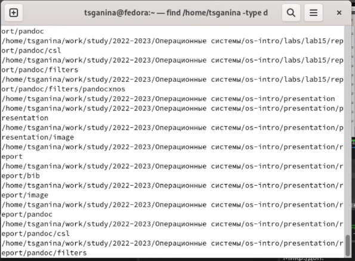

---
## Front matter
lang: ru-RU
title: "Лабораторная работа №6. Поиск файлов. Перенаправление ввода-вывода. Просмотр запущенных процессов"
subtitle: "Дисциплина: Операционные системы"
author:
  - Ганина Т. С.
institute:
  - Группа НКАбд-01-22
  - Российский университет дружбы народов, Москва, Россия
date: 16 марта 2023

## i18n babel
babel-lang: russian
babel-otherlangs: english

## Formatting pdf
toc: false
toc-title: Содержание
slide_level: 2
aspectratio: 169
section-titles: true
theme: metropolis
header-includes:
 - \metroset{progressbar=frametitle,sectionpage=progressbar,numbering=fraction}
 - '\makeatletter'
 - '\beamer@ignorenonframefalse'
 - '\makeatother'
---

# Информация

## Докладчик

:::::::::::::: {.columns align=center}
::: {.column width="70%"}

  * Ганина Таисия Сергеевна
  * Студентка 1-го курса, группа НКАбд-01-22
  * Компьютерные и информационные науки
  * Российский университет дружбы народов
  * [Ссылка на репозиторий гитхаба tsganina](https://github.com/tsganina/study_2022-2023_os-intro)

:::
::: {.column width="30%"}

:::
::::::::::::::

# Вводная часть

## Актуальность

- Умение работать с данными - залог успеха. Иногда нужно быстро отфильтровать или найти необходимую информацию и в этом приходят на помощь алгоритмы поиска файлов и данных. Это существенно экономит время, которое тратится на анализ файлов.

## Объект и предмет исследования

- Команды для работы с инструментами поиска файлов и фильтрации текстовых данных.

## Цели и задачи

- Ознакомление с инструментами поиска файлов и фильтрации текстовых данных.
Приобретение практических навыков: по управлению процессами (и заданиями), по
проверке использования диска и обслуживанию файловых систем.

# Выполнение заданий.

## Запишите в файл file.txt названия файлов, содержащихся в каталоге /etc

{#fig:001 width=70%}

## Выведите имена всех файлов из file.txt, имеющих расширение .conf

{#fig:003 width=70%}

## Определите, какие файлы в вашем домашнем каталоге имеют имена, начинавшиеся с символа c?

{#fig:005 width=70%}

## Результат поиска

{#fig:006 width=70%}

## Запустите в фоновом режиме процесс, который будет записывать в файл ~/logfile файлы, имена которых начинаются с log

{#fig:009 width=70%}

## Запустите в фоновом режиме процесс, который будет записывать в файл ~/logfile файлы, имена которых начинаются с log

{#fig:010 width=70%}

## Запустите из консоли в фоновом режиме редактор gedit. Определите идентификатор процесса gedit, используя команду ps, конвейер и фильтр grep. Как ещё можно определить идентификатор процесса?

{#fig:012 width=70%}

## Используйте kill для завершения процесса gedit

{#fig:014 width=70%}

## Выполните команду du

{#fig:019 width=70%}

## Воспользовавшись find, выведите имена всех директорий, имеющихся в вашем домашнем каталоге

{#fig:021 width=70%}

## find

{#fig:022 width=70%}

# Результаты

## Вывод:

В ходе этой лабораторной я разобралась, как работать с поиском и анализом данных в файловой системе Linux.

