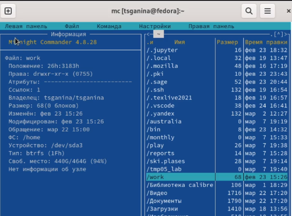

---
## Front matter
lang: ru-RU
title: "Лабораторная работа №7. Командная оболочка Midnight Commander"
subtitle: "Дисциплина: Операционные системы"
author:
  - Ганина Т. С.
institute:
  - Группа НКАбд-01-22
  - Российский университет дружбы народов, Москва, Россия
date: 22 марта 2023

## i18n babel
babel-lang: russian
babel-otherlangs: english

## Formatting pdf
toc: false
toc-title: Содержание
slide_level: 2
aspectratio: 169
section-titles: true
theme: metropolis
header-includes:
 - \metroset{progressbar=frametitle,sectionpage=progressbar,numbering=fraction}
 - '\makeatletter'
 - '\beamer@ignorenonframefalse'
 - '\makeatother'
---

# Информация

## Докладчик

:::::::::::::: {.columns align=center}
::: {.column width="70%"}

  * Ганина Таисия Сергеевна
  * Студентка 1-го курса, группа НКАбд-01-22
  * Компьютерные и информационные науки
  * Российский университет дружбы народов
  * [Ссылка на репозиторий гитхаба tsganina](https://github.com/tsganina/study_2022-2023_os-intro)

:::
::: {.column width="30%"}

:::
::::::::::::::

# Вводная часть

## Актуальность

- Умение работать с данными - залог успеха. Псевдографическая система Midnight Commander и облегчает работу с каталогами и файлами через терминал..

## Объект и предмет исследования

- Команды для работы с командной оболочкой Midnight Commander

## Цели и задачи

- Освоение основных возможностей командной оболочки Midnight Commander.
Приобретение навыков практической работы по просмотру каталогов и файлов;
манипуляций с ними.

# Выполнение заданий.

## Запуск mc, изучение его структуры и меню

{#fig:002 width=60%}

## Информация о каталоге

{#fig:004 width=60%}

## Дерево каталогов

{#fig:005 width=40%}

## Просмотр содержимого 

{#fig:006 width=40%}

## Создание нового каталога

{#fig:008 width=70%}

## Копирование файла

{#fig:009 width=70%}

## Работа с текстовым файлом

- Ctrl-y удалить строку
- Ctrl-u отмена последней операции
- Ins вставка/замена
- F7 поиск (можно использовать регулярные выражения)
- F7 повтор последней операции поиска
- F4 замена
- F3 первое нажатие — начало выделения, второе — окончание
выделения
- F5 копировать выделенный фрагмент
- F6 переместить выделенный фрагмент
- F8 удалить выделенный фрагмент
- F2 записать изменения в файл
- F10 выйти из редактора

## Файл С++

{#fig:020 width=40%}

# Результаты

## Вывод:

В процессе выполнения лабораторной работы я освоила работу с командной
оболочкой mc. Приобрела практические навыки работы по просмотру каталогов
и файлов и по манипуляции с ними.
