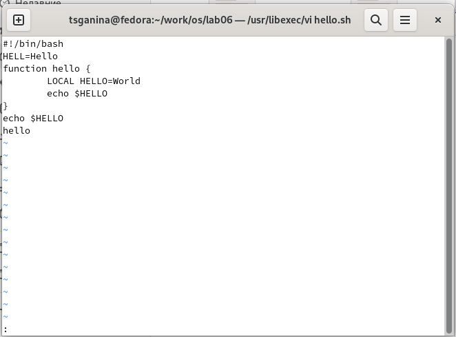
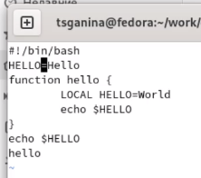
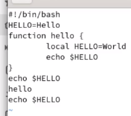
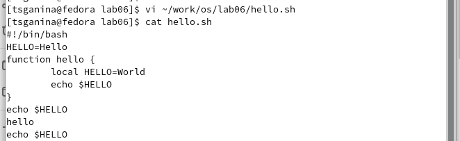

---
## Front matter
lang: ru-RU
title: "Лабораторная работа №8. Текстовый редактор vi"
subtitle: "Дисциплина: Операционные системы"
author:
  - Ганина Т. С.
institute:
  - Группа НКАбд-01-22
  - Российский университет дружбы народов, Москва, Россия
date: 29 марта 2023

## i18n babel
babel-lang: russian
babel-otherlangs: english

## Formatting pdf
toc: false
toc-title: Содержание
slide_level: 2
aspectratio: 169
section-titles: true
theme: metropolis
header-includes:
 - \metroset{progressbar=frametitle,sectionpage=progressbar,numbering=fraction}
 - '\makeatletter'
 - '\beamer@ignorenonframefalse'
 - '\makeatother'
---

# Информация

## Докладчик

:::::::::::::: {.columns align=center}
::: {.column width="70%"}

  * Ганина Таисия Сергеевна
  * Студентка 1-го курса, группа НКАбд-01-22
  * Компьютерные и информационные науки
  * Российский университет дружбы народов
  * [Ссылка на репозиторий гитхаба tsganina](https://github.com/tsganina/study_2022-2023_os-intro)

:::
::: {.column width="30%"}

:::
::::::::::::::

# Вводная часть

## Актуальность

- Быстро отредактировать текст, будь то отчёт, или программа - важная задача. Работа с текстовым редактором vi упростит этот процесс.

## Объект и предмет исследования

- Текстовый редактор vi

## Цели и задачи

- Познакомиться с операционной системой Linux. Получить практические навы-
ки работы с редактором vi, установленным по умолчанию практически во всех
дистрибутивах.

# Выполнение заданий.

## Вызовите vi и создайте файл hello.sh, нажмите клавишу i и вводите следующий текст

`vi hello.sh`

{#fig:001 width=50%}

## Нажмите клавишу Esc для перехода в командный режим после завершения ввода текста. Нажмите : для перехода в режим последней строки и внизу вашего экрана появится приглашение в виде двоеточия

{#fig:002 width=50%}

## Нажмите w (записать) и q (выйти), а затем нажмите клавишу Enter для сохранения вашего текста и завершения работы

{#fig:003 width=70%}

## Перейдите в режим вставки и замените на HELLO. Нажмите Esc для возврата в командный режим

{#fig:004 width=50%}

## Установите курсор на последней строке файла. Вставьте после неё строку, содержащую следующий текст: `echo $HELLO`

{#fig:005 width=50%}

## Введите команду отмены изменений u для отмены последней команды. Введите символ : для перехода в режим последней строки. Запишите произведённые изменения и выйдите из vi

{#fig:006 width=50%}

# Результаты

## Вывод:

В процессе выполнения лабораторной работы я познакомилась с операционной системой Linux. Получила практические навыки работы с редактором vi,
установленным по умолчанию практически во всех дистрибутивах.
