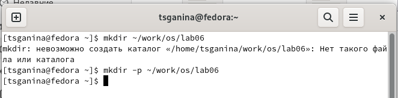
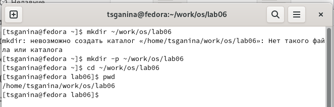
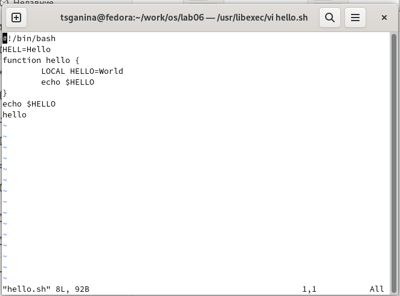
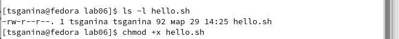
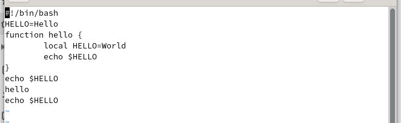
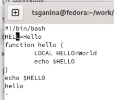
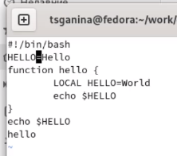
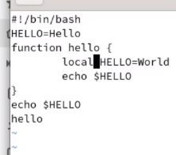

---
## Front matter
title: "Лабораторная работа №8"
subtitle: "Текстовый редактор vi"
author: "Ганина Таисия Сергеевна, НКАбд-01-22"

## Generic otions
lang: ru-RU
toc-title: "Содержание"

## Bibliography
bibliography: bib/cite.bib
csl: pandoc/csl/gost-r-7-0-5-2008-numeric.csl

## Pdf output format
toc: true # Table of contents
toc-depth: 2
lof: true # List of figures
lot: true # List of tables
fontsize: 12pt
linestretch: 1.5
papersize: a4
documentclass: scrreprt
## I18n polyglossia
polyglossia-lang:
  name: russian
  options:
	- spelling=modern
	- babelshorthands=true
polyglossia-otherlangs:
  name: english
## I18n babel
babel-lang: russian
babel-otherlangs: english
## Fonts
mainfont: PT Serif
romanfont: PT Serif
sansfont: PT Sans
monofont: PT Mono
mainfontoptions: Ligatures=TeX
romanfontoptions: Ligatures=TeX
sansfontoptions: Ligatures=TeX,Scale=MatchLowercase
monofontoptions: Scale=MatchLowercase,Scale=0.9
## Biblatex
biblatex: true
biblio-style: "gost-numeric"
biblatexoptions:
  - parentracker=true
  - backend=biber
  - hyperref=auto
  - language=auto
  - autolang=other*
  - citestyle=gost-numeric
## Pandoc-crossref LaTeX customization
figureTitle: "Рис."
tableTitle: "Таблица"
listingTitle: "Листинг"
lofTitle: "Список иллюстраций"
lotTitle: "Список таблиц"
lolTitle: "Листинги"
## Misc options
indent: true
header-includes:
  - \usepackage{indentfirst}
  - \usepackage{float} # keep figures where there are in the text
  - \floatplacement{figure}{H} # keep figures where there are in the text
---

# Цель работы

Познакомиться с операционной системой Linux. Получить практические навы-
ки работы с редактором vi, установленным по умолчанию практически во всех
дистрибутивах.

# Задание

1. Ознакомиться с теоретическим материалом.
2. Ознакомиться с редактором vi.
3. Выполнить упражнения, используя команды vi.

#Задание 1. Создание нового файла с использованием vi

1. Создайте каталог с именем ~/work/os/lab06.
2. Перейдите во вновь созданный каталог.
3. Вызовите vi и создайте файл hello.sh. Нажмите клавишу i и вводите следующий текст.

`vi hello.sh`

`#!/bin/bash`

`HELL=Hello`

`function hello {`

`LOCAL HELLO=World`

`echo $HELLO`

`}`

`echo $HELLO`

`hello`

4. Нажмите клавишу Esc для перехода в командный режим после завершения ввода
текста. Нажмите : для перехода в режим последней строки и внизу вашего экрана появится приглашение в виде двоеточия.
5. Нажмите w (записать) и q (выйти), а затем нажмите клавишу Enter для сохранения
вашего текста и завершения работы.
6. Сделайте файл исполняемым

`chmod +x hello.sh`

#Задание 2. Редактирование существующего файла

1. Вызовите vi на редактирование файла

`vi ~/work/os/lab06/hello.sh`

2. Установите курсор в конец слова HELL второй строки.
3. Перейдите в режим вставки и замените на HELLO. Нажмите Esc для возврата в командный режим.
4. Установите курсор на четвертую строку и сотрите слово LOCAL.
5. Перейдите в режим вставки и наберите следующий текст: local, нажмите Esc для
возврата в командный режим.
6. Установите курсор на последней строке файла. Вставьте после неё строку, содержащую следующий текст: `echo $HELLO`.
7. Нажмите Esc для перехода в командный режим. Удалите последнюю строку.
8. Введите команду отмены изменений u для отмены последней команды. Введите символ : для перехода в режим последней строки. Запишите произведённые изменения и выйдите из vi.

# Теоретическое введение

В большинстве дистрибутивов Linux в качестве текстового редактора по умолча-
нию устанавливается интерактивный экранный редактор vi (Visual display editor).

Редактор vi имеет три режима работы: - командный режим — предназначен для
ввода команд редактирования и навигации по редактируемому файлу; - режим
вставки — предназначен для ввода содержания редактируемого файла; - режим
последней (или командной) строки — используется для записи изменений в файл
и выхода из редактора. Для вызова редактора vi необходимо указать команду vi и
имя редактируемого файла: vi При этом в случае отсутствия файла с указанным
именем будет создан такой файл. Переход в командный режим осуществляется
нажатием клавиши Esc . Для выхода из редактора vi необходимо перейти в режим
последней строки: находясь в командном режиме, нажать Shift-; (по сути символ
: — двоеточие), затем: - набрать символы wq, если перед выходом из редактора
требуется записать изменения в файл; - набрать символ q (или q!), если требуется
выйти из редактора без сохранения.

# Выполнение лабораторной работы. 1 часть

1. Создайте каталог с именем ~/work/os/lab06 (рис. @fig:001).

{#fig:001 width=70%}

2. Перейдите во вновь созданный каталог (рис. @fig:002).

{#fig:002 width=70%}

3. Вызовите vi и создайте файл hello.sh, нажмите клавишу i и вводите следующий текст (рис. @fig:003).

`vi hello.sh`

`#!/bin/bash`

`HELL=Hello`

`function hello {`

    `LOCAL HELLO=World`

    `echo $HELLO`

`}`

`echo $HELLO`

`hello`

{#fig:003 width=70%}

4. Нажмите клавишу Esc для перехода в командный режим после завершения ввода
текста. Нажмите : для перехода в режим последней строки и внизу вашего экрана появится приглашение в виде двоеточия (рис. @fig:004).

{#fig:004 width=70%}

5. Нажмите w (записать) и q (выйти), а затем нажмите клавишу Enter для сохранения
вашего текста и завершения работы (рис. @fig:005).

{#fig:005 width=70%}

6. Сделайте файл исполняемым (рис. @fig:006).

`chmod +x hello.sh`

{#fig:006 width=70%}

#Выполнение лабораторной работы. Часть 2

1. Вызовите vi на редактирование файла (рис. @fig:007).

`vi ~/work/os/lab06/hello.sh`

{#fig:007 width=70%}

2. Установите курсор в конец слова HELL второй строки (рис. @fig:008).

{#fig:008 width=70%}

3. Перейдите в режим вставки и замените на HELLO. Нажмите Esc для возврата в командный режим (рис. @fig:009).

{#fig:009 width=70%}

4. Установите курсор на четвертую строку и сотрите слово LOCAL (рис. @fig:010).

{#fig:010 width=70%}

5. Перейдите в режим вставки и наберите следующий текст: local, нажмите Esc для
возврата в командный режим (рис. @fig:011).

{#fig:011 width=70%}

6. Установите курсор на последней строке файла. Вставьте после неё строку, содержащую следующий текст: `echo $HELLO` (рис. @fig:012).

{#fig:012 width=70%}

7. Нажмите Esc для перехода в командный режим. Удалите последнюю строку (рис. @fig:013).

{#fig:013 width=70%}

8. Введите команду отмены изменений u для отмены последней команды. Введите символ : для перехода в режим последней строки. Запишите произведённые изменения и выйдите из vi (рис. @fig:014).

{#fig:014 width=70%}

# Контрольные вопросы

1. Дайте краткую характеристику режимам работы редактора vi.

- командный режим — предназначен для ввода команд редактирования и
навигации по редактируемому файлу;
- режим вставки — предназначен для ввода содержания редактируемого
файла;
- режим последней (или командной) строки — используется для записи из-
менений в файл и выхода из редактора.

2. Как выйти из редактора, не сохраняя произведённые изменения?

Можно нажимать символ q (или q!), если требуется выйти из редактора без
сохранения.

3. Назовите и дайте краткую характеристику командам позиционирования.

- 0 (ноль) — переход в начало строки;
- $ — переход в конец строки;
- G — переход в конец файла;
- n G — переход на строку с номером n.

4. Что для редактора vi является словом?

Редактор vi предполагает, что слово - это строка символов, которая может
включать в себя буквы, цифры и символы подчеркивания.

5. Каким образом из любого места редактируемого файла перейти в начало
(конец) файла?

С помощью G — переход в конец файла

6. Назовите и дайте краткую характеристику основным группам команд ре-
дактирования.

- Вставка текста – а — вставить текст после курсора; – А — вставить текст в
конец строки; – i — вставить текст перед курсором; – n i — вставить текст n
раз; – I — вставить текст в начало строки.
- Вставка строки – о — вставить строку под курсором; – О — вставить строку
над курсором.
- Удаление текста – x — удалить один символ в буфер; – d w — удалить одно
слово в буфер; – d $ — удалить в буфер текст от курсора до конца строки; –
d 0 — удалить в буфер текст от начала строки до позиции курсора; – d d —
удалить в буфер одну строку; – n d d — удалить в буфер n строк.
- Отмена и повтор произведённых изменений – u — отменить последнее
изменение; – . — повторить последнее изменение.
- Копирование текста в буфер – Y — скопировать строку в буфер; – n Y —
скопировать n строк в буфер; – y w — скопировать слово в буфер.
- Вставка текста из буфера – p — вставить текст из буфера после курсора; – P
— вставить текст из буфера перед курсором.
- Замена текста – c w — заменить слово; – n c w — заменить n слов; – c $ —
заменить текст от курсора до конца строки; – r — заменить слово; – R —
заменить текст.
- Поиск текста – / текст — произвести поиск вперёд по тексту указанной стро-
ки символов текст; – ? текст — произвести поиск назад по тексту указанной
строки символов текст.

7. Необходимо заполнить строку символами $. Каковы ваши действия?

Перейти в режим вставки.

8. Как отменить некорректное действие, связанное с процессом редактирова-
ния?

С помощью u — отменить последнее изменение

9. Назовите и дайте характеристику основным группам команд режима по-
следней строки.

Режим последней строки — используется для записи изменений в файл и вы-
хода из редактора.

10. Как определить, не перемещая курсора, позицию, в которой заканчивается
строка?

$ — переход в конец строки

11. Выполните анализ опций редактора vi (сколько их, как узнать их назначение
и т.д.).

Опции редактора vi позволяют настроить рабочую среду. Для задания опций
используется команда set (в режиме последней строки): – : set all — вывести
полный список опций; – : set nu — вывести номера строк; – : set list — вывести
невидимые символы; – : set ic — не учитывать при поиске, является ли символ
прописным или строчным.

12. Как определить режим работы редактора vi?

В редакторе vi есть два основных режима: командный режим и режим встав-
ки. По умолчанию работа начинается в командном режиме. В режиме вставки
клавиатура используется для набора текста. Для выхода в командный режим
используется клавиша Esc или комбинация Ctrl + c.

# Выводы

В процессе выполнения лабораторной работы я познакомилась с операционной системой Linux. Получила практические навыки работы с редактором vi,
установленным по умолчанию практически во всех дистрибутивах.

# Список литературы{.unnumbered}

1. [Руководство к выполнению лабораторной](https://esystem.rudn.ru/pluginfile.php/1975775/mod_resource/content/4/008-lab_vi.pdf)

::: {#refs}
:::
