---
## Front matter
lang: ru-RU
title: "Лабораторная работа №9. Текстовой редактор emacs"
subtitle: "Дисциплина: Операционные системы"
author:
  - Ганина Т. С.
institute:
  - Группа НКАбд-01-22
  - Российский университет дружбы народов, Москва, Россия
date: 29 марта 2023

## i18n babel
babel-lang: russian
babel-otherlangs: english

## Formatting pdf
toc: false
toc-title: Содержание
slide_level: 2
aspectratio: 169
section-titles: true
theme: metropolis
header-includes:
 - \metroset{progressbar=frametitle,sectionpage=progressbar,numbering=fraction}
 - '\makeatletter'
 - '\beamer@ignorenonframefalse'
 - '\makeatother'
---

# Информация

## Докладчик

:::::::::::::: {.columns align=center}
::: {.column width="70%"}

  * Ганина Таисия Сергеевна
  * Студентка 1-го курса, группа НКАбд-01-22
  * Компьютерные и информационные науки
  * Российский университет дружбы народов
  * [Ссылка на репозиторий гитхаба tsganina](https://github.com/tsganina/study_2022-2023_os-intro)

:::
::: {.column width="30%"}

:::
::::::::::::::

# Вводная часть

## Актуальность

- Быстро отредактировать текст, будь то отчёт, или программа - важная задача. Работа с текстовым редактором emac упростит этот процесс.

## Объект и предмет исследования

- Текстовый редактор emac

## Цели и задачи

- Познакомиться с операционной системой Linux. Получить практические навы-
ки работы с редактором Emacs.

# Выполнение заданий.

## Открыть emacs

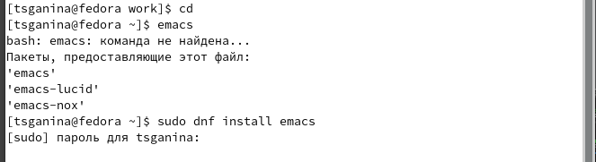{#fig:001 width=70%}

## Создать файл lab07.sh с помощью комбинации Ctrl-x Ctrl-f (C-x C-f)

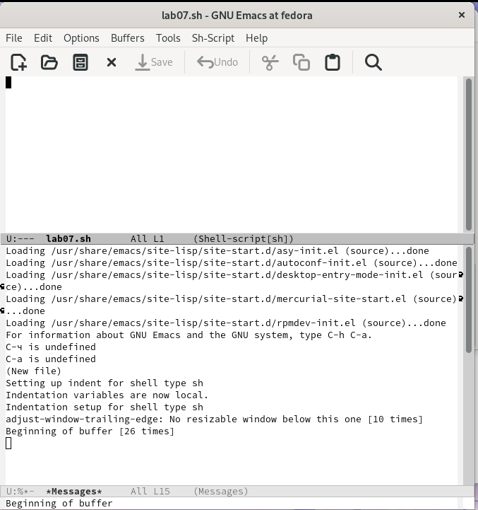{#fig:002 width=30%}

## Сохранить файл с помощью комбинации Ctrl-x Ctrl-s (C-x C-s)

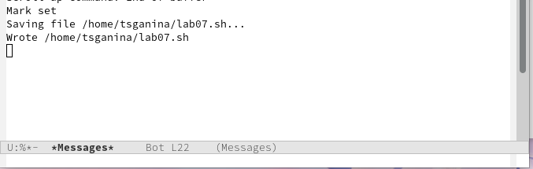{#fig:003 width=70%}

## Вырезать одной командой целую строку (С-k)

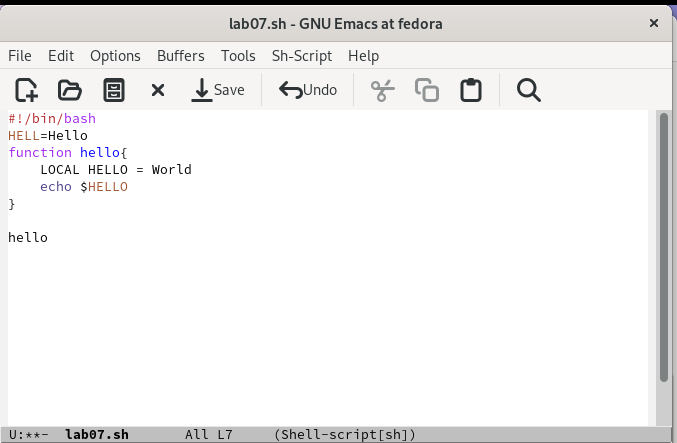{#fig:004 width=60%}

## Вставить эту строку (C-y)

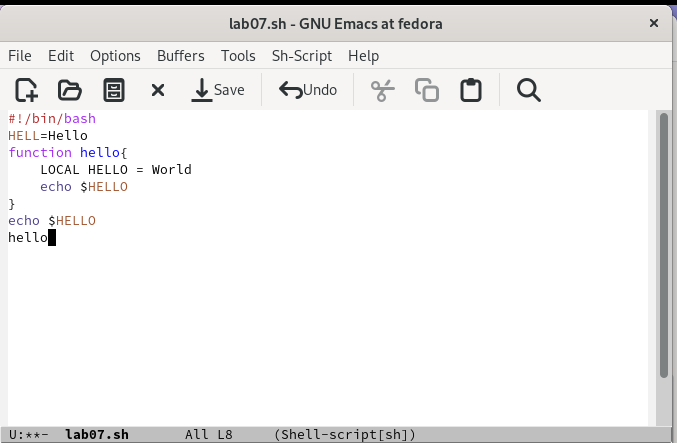{#fig:005 width=60%}

## Выделить область текста (C-space)

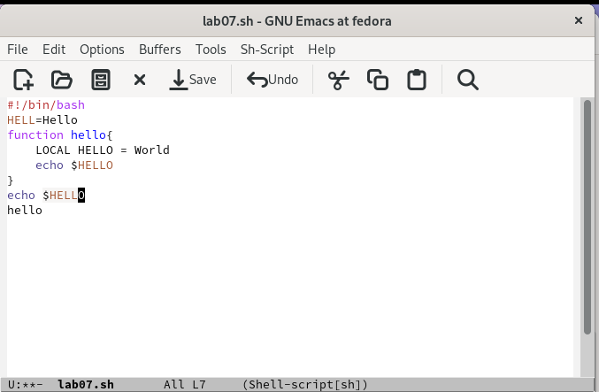{#fig:006 width=60%}

## Вставить область в конец файла

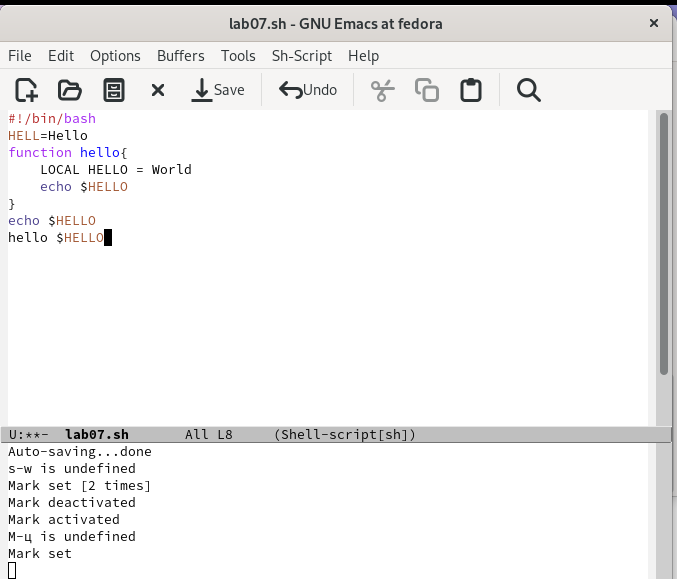{#fig:007 width=50%}

## Переместите курсор в начало строки (C-a)

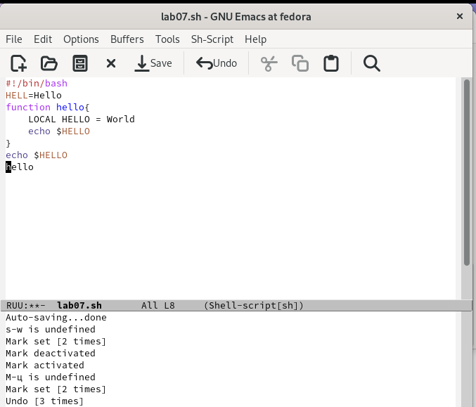{#fig:008 width=50%}

## Переместите курсор в конец строки (C-e)

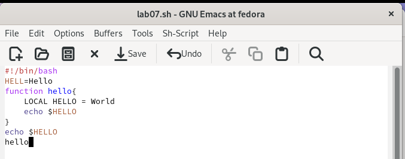{#fig:009 width=70%}

## Вывести список активных буферов на экран (C-x C-b)

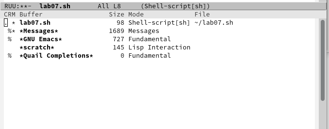{#fig:010 width=70%}

## Переместитесь во вновь открытое окно (C-x) o со списком открытых буферов и переключитесь на другой буфер

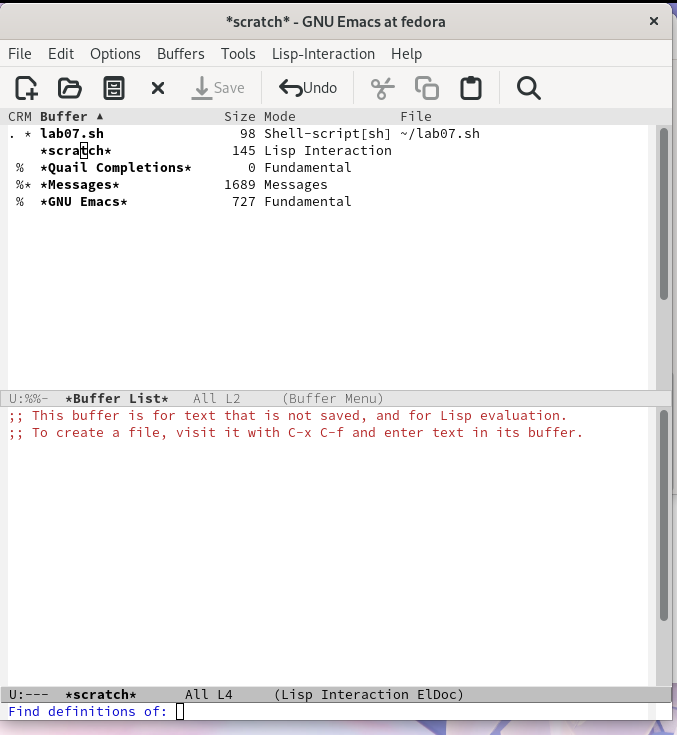{#fig:011 width=30%}

## Поделите фрейм на 4 части: разделите фрейм на два окна по вертикали (C-x 3), а затем каждое из этих окон на две части по горизонтали (C-x 2)

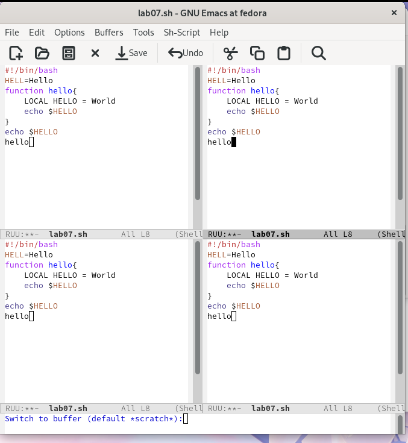{#fig:012 width=30%}

## Найти в тексте слово

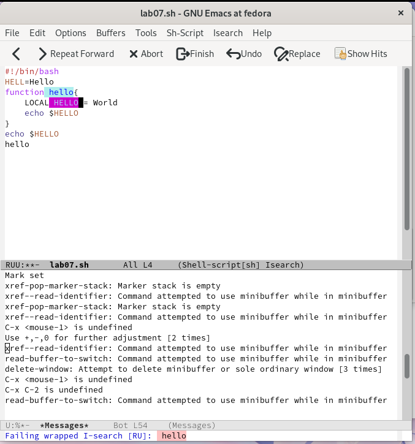{#fig:013 width=30%}

## Испробуйте другой режим поиска, нажав M-s o. Объясните, чем он отличается от обычного режима?

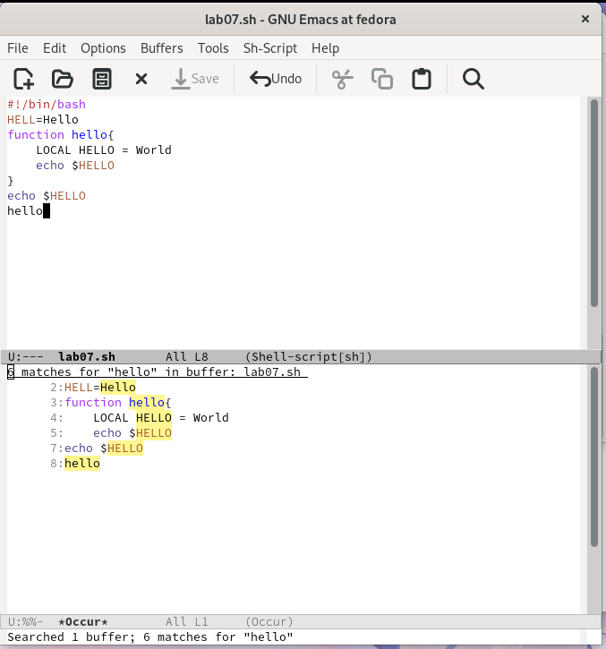{#fig:014 width=30%}

# Результаты

## Вывод:

В процессе выполнения лабораторной работы я получила практические навыки
работы в редакторе Emacs.
