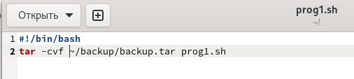
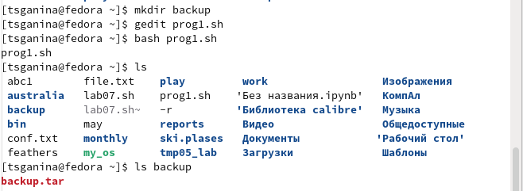
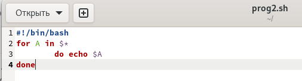
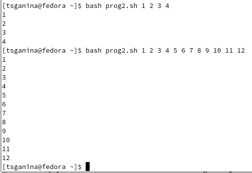
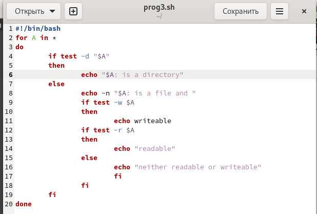
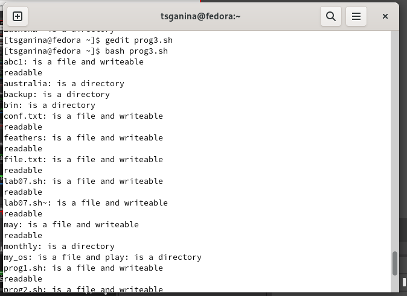
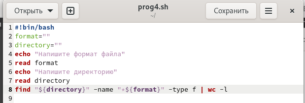
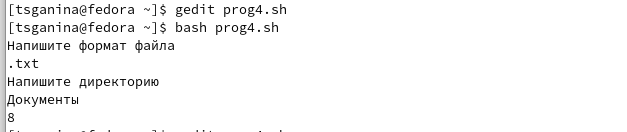

---
## Front matter
lang: ru-RU
title: "Отчёт по лабораторной работе №10. Программирование в командном процессоре ОС UNIX. Командные файлы"
subtitle: "Дисциплина: Операционные системы"
author:
  - Ганина Т. С.
institute:
  - Группа НКАбд-01-22
  - Российский университет дружбы народов, Москва, Россия
date: 12 апреля 2023

## i18n babel
babel-lang: russian
babel-otherlangs: english

## Formatting pdf
toc: false
toc-title: Содержание
slide_level: 2
aspectratio: 169
section-titles: true
theme: metropolis
header-includes:
 - \metroset{progressbar=frametitle,sectionpage=progressbar,numbering=fraction}
 - '\makeatletter'
 - '\beamer@ignorenonframefalse'
 - '\makeatother'
---

# Информация

## Докладчик

:::::::::::::: {.columns align=center}
::: {.column width="70%"}

  * Ганина Таисия Сергеевна
  * Студентка 1-го курса, группа НКАбд-01-22
  * Компьютерные и информационные науки
  * Российский университет дружбы народов
  * [Ссылка на репозиторий гитхаба tsganina](https://github.com/tsganina/study_2022-2023_os-intro)

:::
::: {.column width="30%"}

:::
::::::::::::::

# Вводная часть

## Актуальность

- Работа с программами позволит создать готовые скрипты для различных задач.

## Объект и предмет исследования

- Командный процессор ОС UNIX

## Цели и задачи

- Изучить основы программирования в оболочке ОС UNIX/Linux. Научиться
писать небольшие командные файлы.

# Выполнение заданий.

## Написать скрипт, который при запуске будет делать резервную копию самого себя (то есть файла, в котором содержится его исходный код) в другую директорию backup в вашем домашнем каталоге. При этом файл должен архивироваться одним из архиваторов на выбор zip, bzip2 или tar.

{#fig:001 width=70%}

##

{#fig:002 width=70%}

## Написать пример командного файла, обрабатывающего любое произвольное число аргументов командной строки, в том числе превышающее десять. Например, скрипт может последовательно распечатывать значения всех переданных аргументов

{#fig:003 width=70%}

##

{#fig:004 width=50%}

## Написать командный файл — аналог команды ls (без использования самой этой команды и команды dir). Требуется, чтобы он выдавал информацию о нужном каталоге и выводил информацию о возможностях доступа к файлам этого каталога

{#fig:005 width=50%}

##

{#fig:006 width=50%}

## Написать командный файл, который получает в качестве аргумента командной строки формат файла (.txt, .doc, .jpg, .pdf и т.д.) и вычисляет количество таких файлов в указанной директории. Путь к директории также передаётся в виде аргумента командной строки

{#fig:007 width=70%}

##

{#fig:008 width=70%}

# Результаты

## Вывод:

В процессе выполнения лабораторной работы я изучила основы программи-
рования в оболочке ОС UNIX/Linux. Научилась писать небольшие командные
файлы.
