---
## Front matter
lang: ru-RU
title: "Лабораторная работа №11. Программирование в командном процессоре ОС UNIX. Ветвления и циклы"
subtitle: "Дисциплина: Операционные системы"
author:
  - Ганина Т. С.
institute:
  - Группа НКАбд-01-22
  - Российский университет дружбы народов, Москва, Россия
date: 19 апреля 2023

## i18n babel
babel-lang: russian
babel-otherlangs: english

## Formatting pdf
toc: false
toc-title: Содержание
slide_level: 2
aspectratio: 169
section-titles: true
theme: metropolis
header-includes:
 - \metroset{progressbar=frametitle,sectionpage=progressbar,numbering=fraction}
 - '\makeatletter'
 - '\beamer@ignorenonframefalse'
 - '\makeatother'
---

# Информация

## Докладчик

:::::::::::::: {.columns align=center}
::: {.column width="70%"}

  * Ганина Таисия Сергеевна
  * Студентка 1-го курса, группа НКАбд-01-22
  * Компьютерные и информационные науки
  * Российский университет дружбы народов
  * [Ссылка на репозиторий гитхаба tsganina](https://github.com/tsganina/study_2022-2023_os-intro)

:::
::: {.column width="30%"}

:::
::::::::::::::

# Вводная часть

## Актуальность

- Работа с программами позволит создать готовые скрипты для различных задач.

## Объект и предмет исследования

- Командный процессор ОС UNIX

## Цели и задачи

- Изучить основы программирования в оболочке ОС UNIX. Научится писать
более сложные командные файлы с использованием логических управляющих
конструкций и циклов.

# Выполнение заданий.

## Используя команды getopts grep, написать командный файл, который анализирует командную строку с ключами: - -iinputfile — прочитать данные из указанного файла; - -ooutputfile — вывести данные в указанный файл; - -pшаблон — указать шаблон для поиска; - -C — различать большие и малые буквы; - -n — выдавать номера строк. а затем ищет в указанном файле нужные строки, определяемые ключом -p.

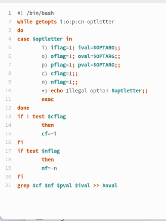{#fig:002 width=30%}

##

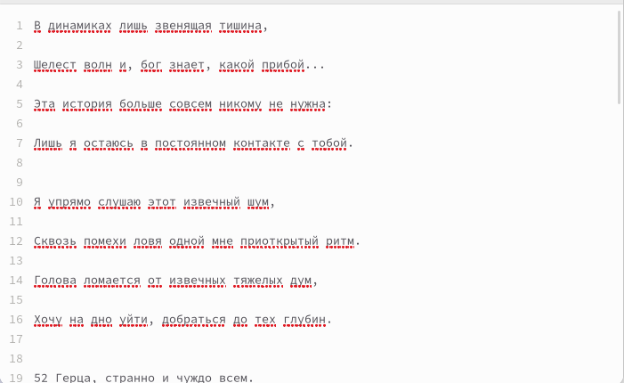{#fig:003 width=50%}

##

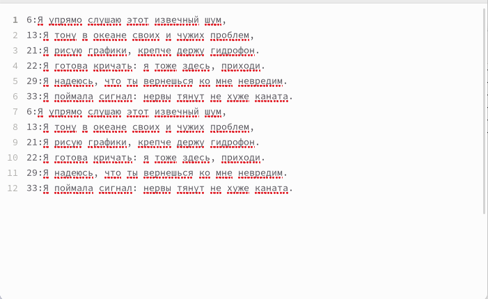{#fig:004 width=50%}

## Написать на языке Си программу, которая вводит число и определяет, является ли оно больше нуля, меньше нуля или равно нулю. Затем программа завершается с помощью функции exit(n), передавая информацию в о коде завершения в оболочку. Командный файл должен вызывать эту программу и, проанализировав с помощью команды $?, выдать сообщение о том, какое число было введено

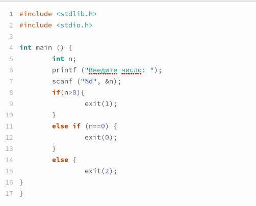{#fig:005 width=50%}

##

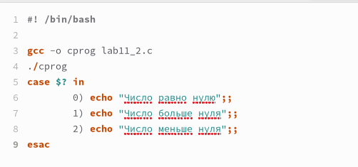{#fig:006 width=70%}

##

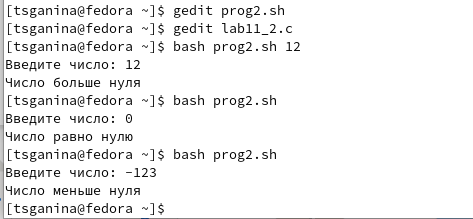{#fig:007 width=70%}

## Написать командный файл, создающий указанное число файлов, пронумерованных последовательно от 1 до N (например 1.tmp, 2.tmp, 3.tmp,4.tmp и т.д.). Число файлов, которые необходимо создать, передаётся в аргументы командной строки. Этот же командный файл должен уметь удалять все созданные им файлы (если они существуют)

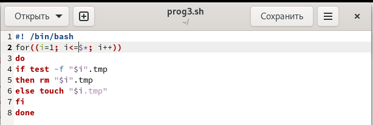{#fig:008 width=70%}

##

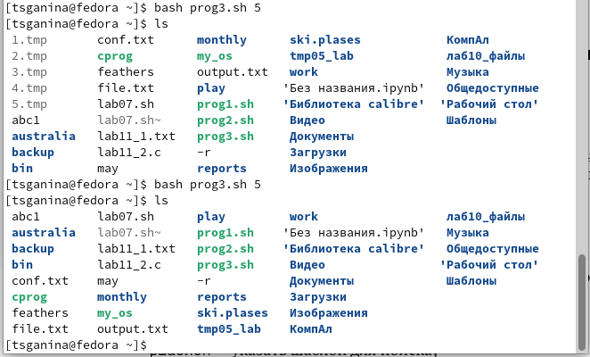{#fig:009 width=50%}

## Написать командный файл, который с помощью команды tar запаковывает в архив все файлы в указанной директории. Модифицировать его так, чтобы запаковывались только те файлы, которые были изменены менее недели тому назад (использовать команду find)

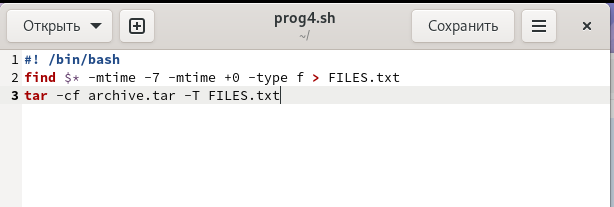{#fig:010 width=70%}

##

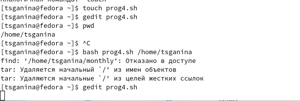{#fig:011 width=70%}

##

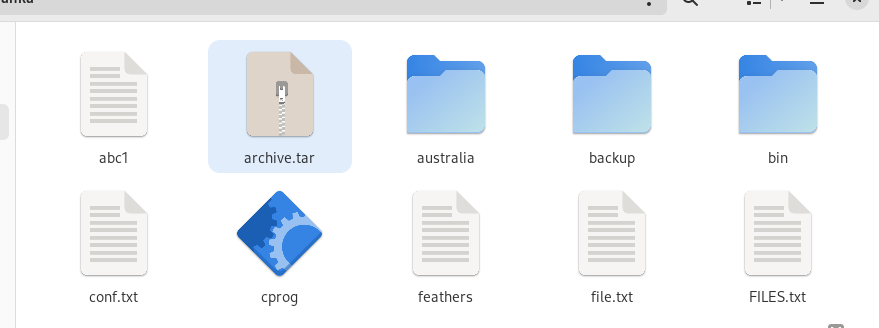{#fig:012 width=70%}

##

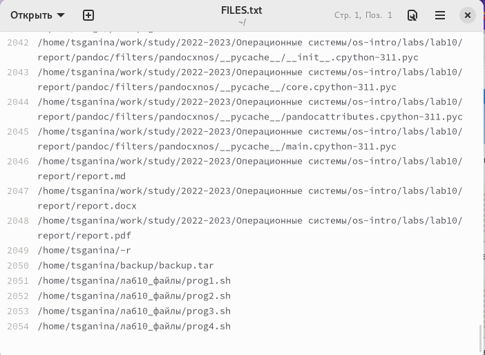{#fig:013 width=50%}

# Результаты

## Вывод:

В процессе выполнения данной лабораторной работы я изучила основы про-
граммирования в оболочке ОС UNIX. Научилась писать более сложные командные
файлы с использованием логических управляющих конструкций и циклов.
