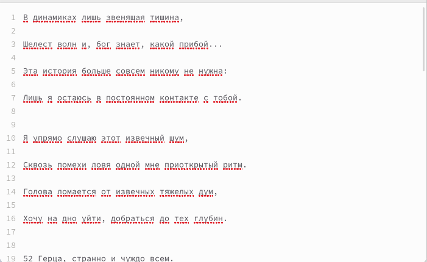
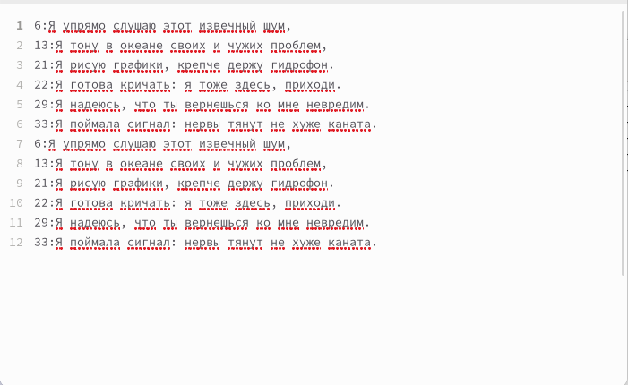
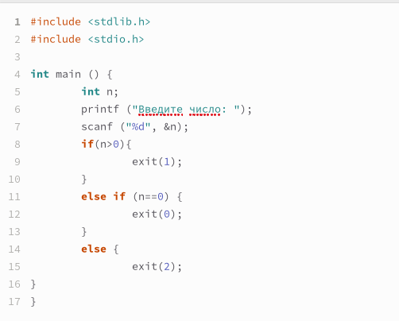
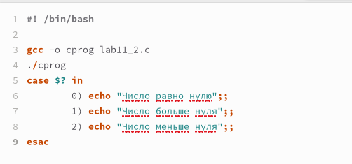
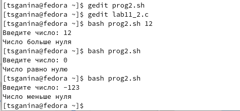
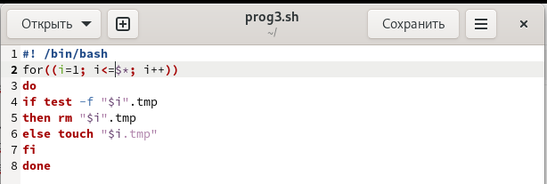
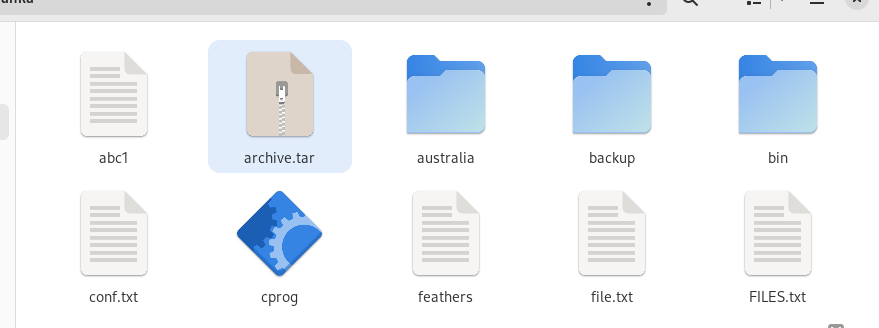
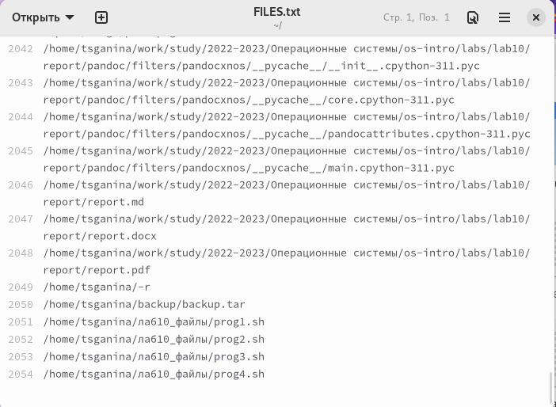

---
## Front matter
title: "Отчёт по лабораторной работе №11"
subtitle: "Программирование в командном процессоре ОС UNIX. Ветвления и циклы"
author: "Ганина Таисия Сергеевна, НКАбд-01-22"

## Generic otions
lang: ru-RU
toc-title: "Содержание"

## Bibliography
bibliography: bib/cite.bib
csl: pandoc/csl/gost-r-7-0-5-2008-numeric.csl

## Pdf output format
toc: true # Table of contents
toc-depth: 2
lof: true # List of figures
lot: true # List of tables
fontsize: 12pt
linestretch: 1.5
papersize: a4
documentclass: scrreprt
## I18n polyglossia
polyglossia-lang:
  name: russian
  options:
	- spelling=modern
	- babelshorthands=true
polyglossia-otherlangs:
  name: english
## I18n babel
babel-lang: russian
babel-otherlangs: english
## Fonts
mainfont: PT Serif
romanfont: PT Serif
sansfont: PT Sans
monofont: PT Mono
mainfontoptions: Ligatures=TeX
romanfontoptions: Ligatures=TeX
sansfontoptions: Ligatures=TeX,Scale=MatchLowercase
monofontoptions: Scale=MatchLowercase,Scale=0.9
## Biblatex
biblatex: true
biblio-style: "gost-numeric"
biblatexoptions:
  - parentracker=true
  - backend=biber
  - hyperref=auto
  - language=auto
  - autolang=other*
  - citestyle=gost-numeric
## Pandoc-crossref LaTeX customization
figureTitle: "Рис."
tableTitle: "Таблица"
listingTitle: "Листинг"
lofTitle: "Список иллюстраций"
lotTitle: "Список таблиц"
lolTitle: "Листинги"
## Misc options
indent: true
header-includes:
  - \usepackage{indentfirst}
  - \usepackage{float} # keep figures where there are in the text
  - \floatplacement{figure}{H} # keep figures where there are in the text
---

# Цель работы

Изучить основы программирования в оболочке ОС UNIX. Научится писать
более сложные командные файлы с использованием логических управляющих
конструкций и циклов.

# Задание

1. Используя команды getopts grep, написать командный файл, который анализирует командную строку с ключами:

    • -iinputfile — прочитать данные из указанного файла;
    • -ooutputfile — вывести данные в указанный файл;
    • -pшаблон — указать шаблон для поиска;
    • -C — различать большие и малые буквы;
    • -n — выдавать номера строк. а затем ищет в указанном файле нужные
    строки, определяемые ключом -p.
    
2. Написать на языке Си программу, которая вводит число и определяет, является ли оно больше нуля, меньше нуля или равно нулю. Затем программа завершается с помощью функции exit(n), передавая информацию в о коде завершения в оболочку. Командный файл должен вызывать эту программу и, проанализировав с помощью команды $?, выдать сообщение о том, какое число было введено.

3. Написать командный файл, создающий указанное число файлов, пронумерованных последовательно от 1 до N (например 1.tmp, 2.tmp, 3.tmp,4.tmp и
т.д.). Число файлов, которые необходимо создать, передаётся в аргументы
командной строки. Этот же командный файл должен уметь удалять все
созданные им файлы (если они существуют).

4. Написать командный файл, который с помощью команды tar запаковывает
в архив все файлы в указанной директории. Модифицировать его так, чтобы
запаковывались только те файлы, которые были изменены менее недели
тому назад (использовать команду find).

# Теоретическое введение

Командный процессор (командная оболочка, интерпретатор команд shell) —
это программа, позволяющая пользователю взаимодействовать с операционной
системой компьютера. В операционных системах типа UNIX/Linux наиболее часто
используются следующие реализации командных оболочек: - оболочка Борна
(Bourne shell или sh) — стандартная командная оболочка UNIX/Linux, содержащая
базовый, но при этом полный набор функций;

• С-оболочка (или csh) — надстройка на оболочкой Борна, использующая
С-подобный синтаксис команд с возможностью сохранения истории вы-
полнения команд;
• оболочка Корна (или ksh) — напоминает оболочку С, но операторы управле-
ния программой совместимы с операторами оболочки Борна;
• BASH — сокращение от Bourne Again Shell (опять оболочка Борна), в основе
своей совмещает свойства оболочек С и Корна (разработка компании Free
Software Foundation).

POSIX (Portable Operating System Interface for Computer Environments) — набор
стандартов описания интерфейсов взаимодействия операционной системы и
прикладных программ. Стандарты POSIX разработаны комитетом IEEE (Institute
of Electrical and Electronics Engineers) для обеспечения совместимости различ-
ных UNIX/Linux-подобных операционных систем и переносимости прикладных
программ на уровне исходного кода.

# Выполнение лабораторной работы

1. Используя команды getopts grep, написать командный файл, который анализирует командную строку с ключами:

    • -iinputfile — прочитать данные из указанного файла;
    • -ooutputfile — вывести данные в указанный файл;
    • -pшаблон — указать шаблон для поиска;
    • -C — различать большие и малые буквы;
    • -n — выдавать номера строк. а затем ищет в указанном файле нужные
    строки, определяемые ключом -p.

(рис. @fig:001, @fig:002, @fig:003, @fig:004)

{#fig:001 width=70%}

{#fig:002 width=70%}

{#fig:003 width=70%}

{#fig:004 width=70%}
    
2. Написать на языке Си программу, которая вводит число и определяет, является ли оно больше нуля, меньше нуля или равно нулю. Затем программа завершается с помощью функции exit(n), передавая информацию в о коде завершения в оболочку. Командный файл должен вызывать эту программу и, проанализировав с помощью команды $?, выдать сообщение о том, какое число было введено (рис. @fig:005, @fig:006, @fig:007). 

{#fig:005 width=70%}

{#fig:006 width=70%}

{#fig:007 width=70%}


3. Написать командный файл, создающий указанное число файлов, пронумерованных последовательно от 1 до N (например 1.tmp, 2.tmp, 3.tmp,4.tmp и
т.д.). Число файлов, которые необходимо создать, передаётся в аргументы
командной строки. Этот же командный файл должен уметь удалять все
созданные им файлы (если они существуют) (рис. @fig:008, @fig:009).

{#fig:008 width=70%}

{#fig:009 width=70%}

4. Написать командный файл, который с помощью команды tar запаковывает
в архив все файлы в указанной директории. Модифицировать его так, чтобы
запаковывались только те файлы, которые были изменены менее недели
тому назад (использовать команду find) (рис. @fig:010, @fig:011, @fig:012, @fig:013).

{#fig:010 width=70%}

{#fig:011 width=70%}

{#fig:012 width=70%}

{#fig:013 width=70%}

# Листинги

1. Программа 1

```

#! /bin/bash
while getopts i:o:p:cn optletter
do
case $optletter in
i) iflag=1; ival=$OPTARG;;
o) oflag=1; oval=$OPTARG;;
p) pflag=1; pval=$OPTARG;;
c) cflag=1;;
n) nflag=1;;
*) echo Illegal option $optletter;;
esac
done
if ! test $cflag
then
cf=-i
fi
if test $nflag
then
nf=-n
fi
grep $cf $nf $pval $ival >> $oval

```

2. Программа 2

```
#! /bin/bash

gcc -o cprog lab11_2.c
./cprog
case $? in
0) echo "Число равно нулю";;
1) echo "Число больше нуля";;
2) echo "Число меньше нуля";;
esac

```

3. Программа 3

```

#! /bin/bash
for((i=1; i<=$*; i++))
do
if test -f "$i".tmp
then rm "$i".tmp
else touch "$i.tmp"
fi
done

```

4. Программа 4
```

#! /bin/bash
find $* -mtime -7 -mtime +0 -type f > FILES.txt
tar -cf archive.tar -T FILES.txt

```

# Контрольные вопросы

1. Каково предназначение команды getopts?
Осуществляет синтаксический анализ командной строки, выделяя флаги, и ис-
пользуется для объявления переменных. Синтаксис команды следующий: getopts
option-string variable [arg ... ] Флаги – это опции командной строки, обычно помеченные знаком минус; Например, -F является флагом для команды ls -F. Иногда
эти флаги имеют аргументы, связанные с ними. Программы интерпретируют
эти флаги, соответствующим образом изменяя свое поведение. Строка опций
option-string — это список возможных букв и чисел соответствующего флага. Если
ожидается, что некоторый флаг будет сопровождаться некоторым аргументом, то
за этой буквой должно следовать двоеточие. Соответствующей переменной при-
сваивается буква данной опции. Если команда getopts может распознать аргумент,
она возвращает истину. Принято включать getopts в цикл while и анализировать
введенные данные с помощью оператора case.

2. Какое отношение метасимволы имеют к генерации имён файлов?
При перечислении имён файлов текущего каталога можно использовать сле-
дующие символы: − соответствует произвольной, в том числе и пустой строке;
? − соответствует любому одинарному символу; [c1-c2] − соответствует любому
символу, лексикографически находящемуся между символами с1 и с2. Например,
echo * − выведет имена всех файлов текущего каталога, что представляет собой
простейший аналог команды ls; ls .c − выведет все файлы с последними двумя
символами, совпадающими с .c. echo prog.? − выведет все файлы, состоящие из пяти или шести символов, первыми пятью символами которых являются prog.. [a-z] −
соответствует произвольному имени файла в текущем каталоге, начинающемуся
с любой строчной буквы латинского алфавита.

3. Какие операторы управления действиями вы знаете?
Часто бывает необходимо обеспечить проведение каких-либо действий цикли-
чески и управление дальнейшими действиями в зависимости отрезультатов про-
верки некоторого условия. Для решения подобных задач язык программирования
bash предоставляет возможность использовать такие управляющие конструкции,
как for, case, if и while. С точки зрения командного процессора эти управляю-
щие конструкции являются обычными командами и могут использоваться как
при создании командных файлов, так и при работе в интерактивном режиме.
Команды, реализующие подобные конструкции, по сути, являются операторами
языка программирования bash. Поэтому при описании языка программирова-
ния bash термин оператор будет использоваться наравне с термином команда.
Команды ОС UNIX возвращают код завершения, значение которого может быть
использовано для принятия решения о дальнейших действиях. Команда test,
например, создана специально для использования в командных файлах. Един-
ственная функция этой команды заключается в выработке кода завершения.

4. Какие операторы используются для прерывания цикла?
Два несложных способа позволяют вам прерывать циклы в оболочке bash. Ко-
манда break завершает выполнение цикла, а команда continue завершает данную
итерацию блока операторов. Команда break полезна для завершения цикла while
в ситуациях, когда условие перестаёт быть правильным. Команда continue исполь-
зуется в ситуациях, когда больше нет необходимости выполнять блок операторов,
но вы можете захотеть продолжить проверять данный блок на других условных
выражениях.

5. Для чего нужны команды false и true?
Следующие две команды ОС UNIX используются только совместно с управляю-
щими конструкциями языка программирования bash: это команда true, которая
всегда возвращает код завершения, равный нулю (т.е. истина), и команда false,
которая всегда возвращает код завершения, не равный нулю (т. е. ложь).

6. Что означает строка if test -f man𝑠/i.$s, встреченная в командном файле?
Строка if test -f mans/i.s, mans/i.s и является ли этот файл обычным файлом.
Если данный файл является каталогом, то команда вернет нулевое значение
(ложь).

7. Объясните различия между конструкциями while и until.
Выполнение оператора цикла while сводится к тому, что сначала выполня-
ется последовательность команд (операторов), которую задаёт список-команд
в строке, содержащей служебное слово while, а затем, если последняя выпол-
ненная команда из этой последовательности команд возвращает нулевой код
завершения (истина), выполняется последовательность команд (операторов),
которую задаёт список-команд в строке, содержащей служебное слово do, после
чего осуществляется безусловный переход на начало оператора цикла while. Вы-
ход из цикла будет осуществлён тогда, когда последняя выполненная команда
из последовательности команд (операторов), которую задаёт список-команд в
строке, содержащей служебное слово while, возвратит ненулевой код заверше-
ния (ложь). При замене в операторе цикла while служебного слова while на until
условие, при выполнении которого осуществляется выход из цикла, меняется
на противоположное. В остальном оператор цикла while и оператор цикла until
идентичны

# Выводы

В процессе выполнения данной лабораторной работы я изучила основы про-
граммирования в оболочке ОС UNIX. Научилась писать более сложные командные
файлы с использованием логических управляющих конструкций и циклов.

# Список литературы{.unnumbered}

[Руководство к лабораторной работе](https://esystem.rudn.ru/pluginfile.php/1975781/mod_resource/content/5/011-lab_shell_prog_2.pdf)

::: {#refs}
:::
