---
## Front matter
lang: ru-RU
title: "Лабораторная работа №13. Средства, применяемые при разработке программного обеспечения в ОС типа UNIX/Linux"
subtitle: "Дисциплина: Операционные системы"
author:
  - Ганина Т. С.
institute:
  - Группа НКАбд-01-22
  - Российский университет дружбы народов, Москва, Россия
date: 2 мая 2023

## i18n babel
babel-lang: russian
babel-otherlangs: english

## Formatting pdf
toc: false
toc-title: Содержание
slide_level: 2
aspectratio: 169
section-titles: true
theme: metropolis
header-includes:
 - \metroset{progressbar=frametitle,sectionpage=progressbar,numbering=fraction}
 - '\makeatletter'
 - '\beamer@ignorenonframefalse'
 - '\makeatother'
---

# Информация

## Докладчик

:::::::::::::: {.columns align=center}
::: {.column width="70%"}

  * Ганина Таисия Сергеевна
  * Студентка 1-го курса, группа НКАбд-01-22
  * Компьютерные и информационные науки
  * Российский университет дружбы народов
  * [Ссылка на репозиторий гитхаба tsganina](https://github.com/tsganina/study_2022-2023_os-intro)

:::
::: {.column width="30%"}

:::
::::::::::::::

# Вводная часть

## Актуальность

- Работа с программами позволит создать готовые скрипты для различных задач.

## Объект и предмет исследования

- Командный процессор ОС UNIX

## Цели и задачи

- Приобрести простейшие навыки разработки, анализа, тестирования и отладки приложений в ОС типа UNIX/Linux на примере создания на языке программирования С калькулятора с простейшими функциями.

# Выполнение заданий.

## В домашнем каталоге создайте подкаталог ~/work/os/lab_prog. Создайте в нём файлы: calculate.h, calculate.c, main.c

##

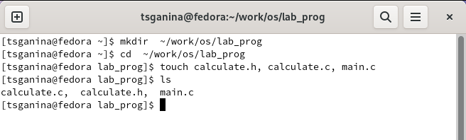{#fig:001 width=70%}

##

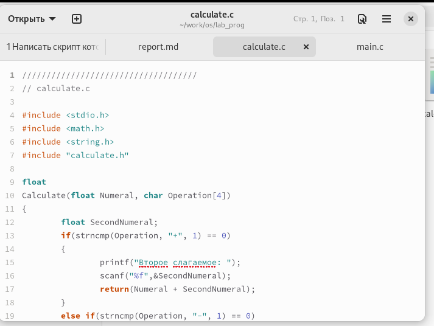{#fig:002 width=60%}

##

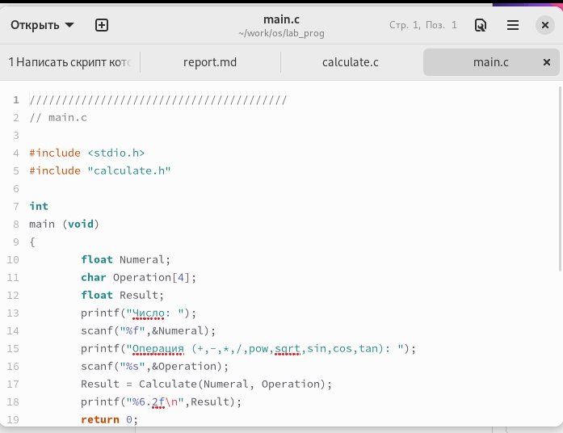{#fig:003 width=60%}

##

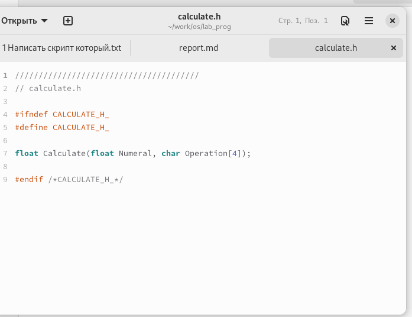{#fig:004 width=60%}

## Выполните компиляцию программы посредством gcc. При необходимости исправьте синтаксические ошибки

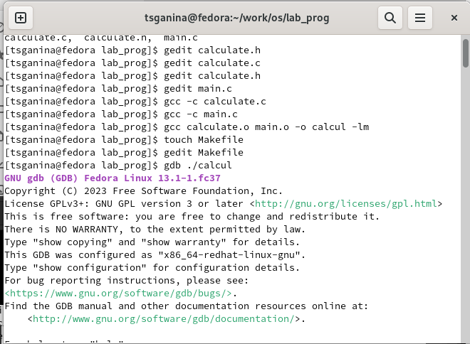{#fig:005 width=60%}

## Создайте Makefile

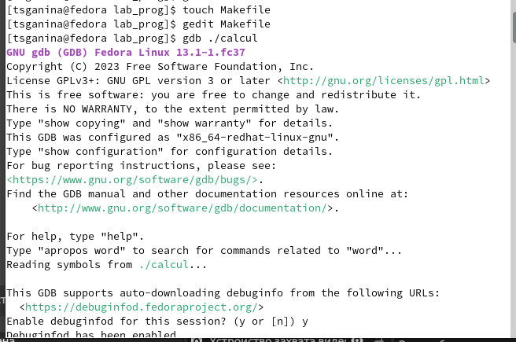{#fig:006 width=60%}

## С помощью gdb выполните отладку программы calcul (перед использованием gdb исправьте Makefile)

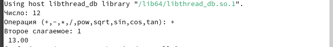{#fig:007 width=70%}

##

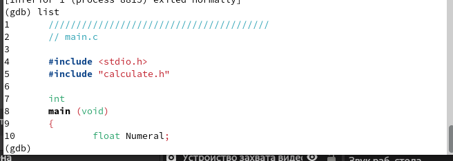{#fig:008 width=70%}

##

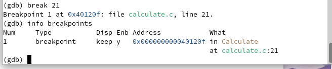{#fig:012 width=70%}

##

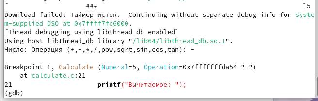{#fig:013 width=70%}

##

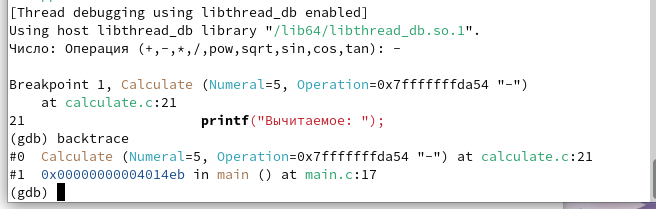{#fig:014 width=70%}

##

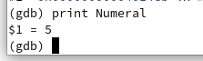{#fig:015 width=70%}

##

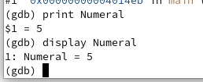{#fig:016 width=70%}

##

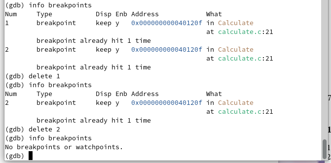{#fig:017 width=70%}

# Результаты

## Вывод:

При выполнениии данной лабораторной работы я приобрела простейшие навыки разработки, анализа, тестирования и отладки приложений в ОС типа UNIX/Linux на примере создания на языке программирования С калькулятора с простейшими функциями.
