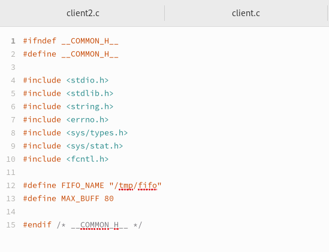
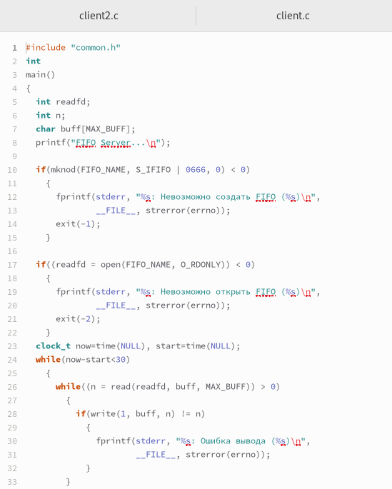
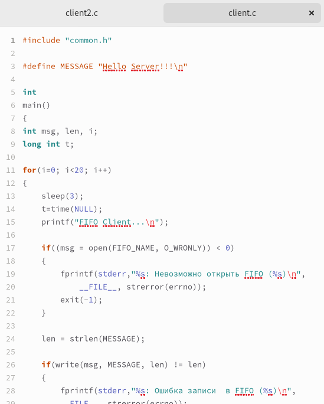
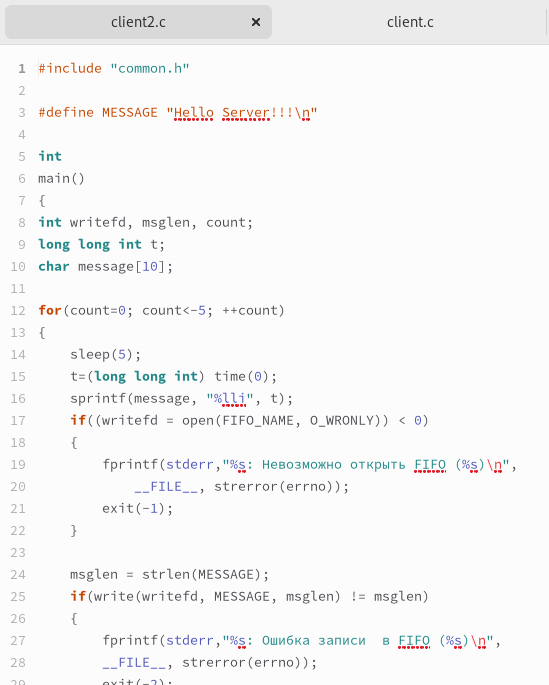
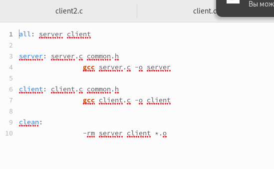
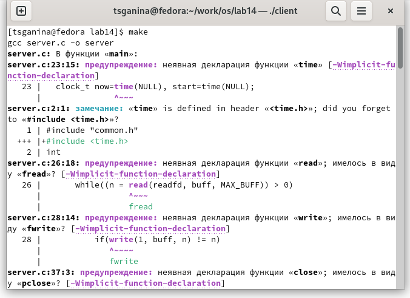
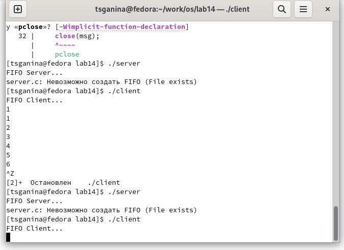

---
## Front matter
lang: ru-RU
title: "Лабораторная работа №14. Именованные каналы"
subtitle: "Дисциплина: Операционные системы"
author:
  - Ганина Т. С.
institute:
  - Группа НКАбд-01-22
  - Российский университет дружбы народов, Москва, Россия
date: 9 мая 2023

## i18n babel
babel-lang: russian
babel-otherlangs: english

## Formatting pdf
toc: false
toc-title: Содержание
slide_level: 2
aspectratio: 169
section-titles: true
theme: metropolis
header-includes:
 - \metroset{progressbar=frametitle,sectionpage=progressbar,numbering=fraction}
 - '\makeatletter'
 - '\beamer@ignorenonframefalse'
 - '\makeatother'
---

# Информация

## Докладчик

:::::::::::::: {.columns align=center}
::: {.column width="70%"}

  * Ганина Таисия Сергеевна
  * Студентка 1-го курса, группа НКАбд-01-22
  * Компьютерные и информационные науки
  * Российский университет дружбы народов
  * [Ссылка на репозиторий гитхаба tsganina](https://github.com/tsganina/study_2022-2023_os-intro)

:::
::: {.column width="30%"}

:::
::::::::::::::

# Вводная часть

## Цели и задачи

- Приобретение практических навыков работы с именованными каналами.

# Выполнение заданий.

## Я создала файлы *common.h*, *server.c*, *client.c*, *client2.c*. Скопировала основной код из теоретической части лабораторной работы и немного подкорректировала его.

{#fig:001 width=70%}

##
{#fig:002 width=70%}

##
{#fig:003 width=70%}

##
{#fig:004 width=70%}

## Создала *makefile*.

{#fig:005 width=70%}

## Запустила *makefile*. Затем запустила *server*.

{#fig:006 width=70%}

##
{#fig:007 width=70%}

## Запустила client.

{ #fig:008 width=70% }

# Результаты

## Вывод:

Мы научились пользоваться именованными каналами.
