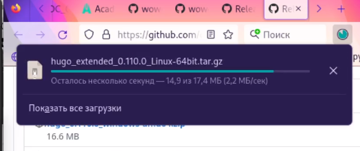
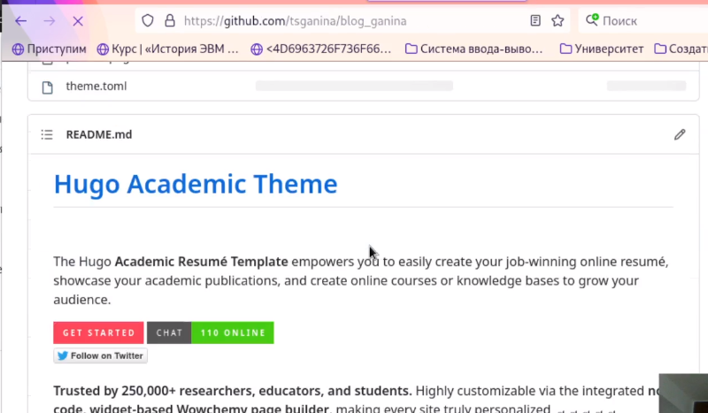
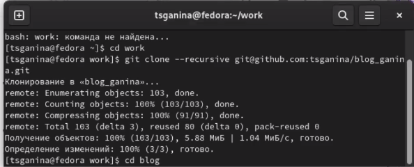
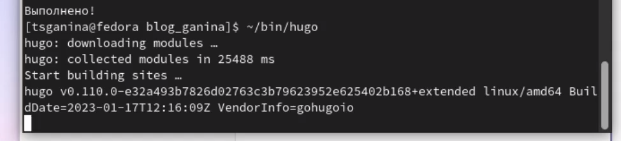
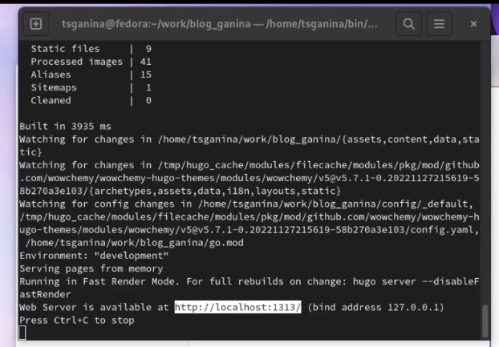
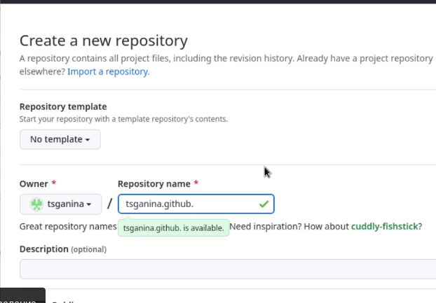
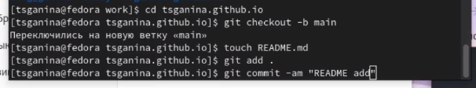
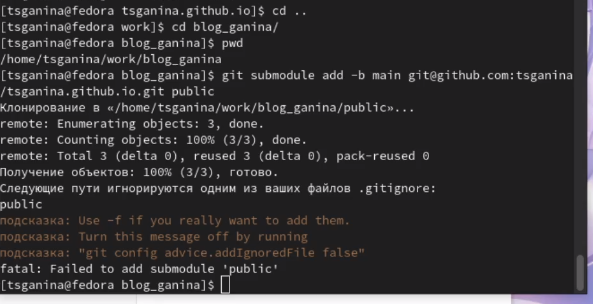
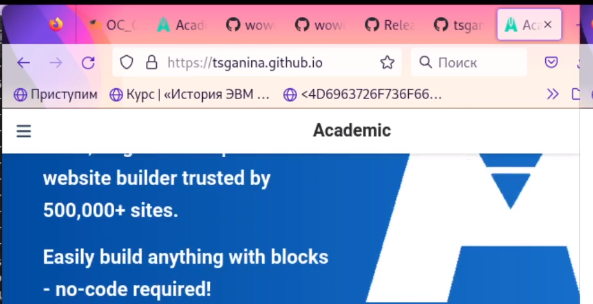

---
## Front matter
lang: ru-RU
title: "Первый этап персонального проекта. Размещение на Github pages заготовки для персонального сайта"
subtitle: "Дисциплина: Операционные системы"
author:
  - Ганина Т. С.
institute:
  - Группа НКАбд-01-22
  - Российский университет дружбы народов, Москва, Россия
date: 23 февраля 2023

## i18n babel
babel-lang: russian
babel-otherlangs: english

## Formatting pdf
toc: false
toc-title: Содержание
slide_level: 2
aspectratio: 169
section-titles: true
theme: metropolis
header-includes:
 - \metroset{progressbar=frametitle,sectionpage=progressbar,numbering=fraction}
 - '\makeatletter'
 - '\beamer@ignorenonframefalse'
 - '\makeatother'
---

# Информация

## Докладчик

:::::::::::::: {.columns align=center}
::: {.column width="70%"}

  * Ганина Таисия Сергеевна
  * Студентка 1го курса, группа НКАбд-01-22
  * Компьютерные и информационные науки
  * Российский университет дружбы народов
  * [Ссылка на репозиторий гитхаба tsganina](https://github.com/tsganina/blog_ganina)

:::
::: {.column width="30%"}

:::
::::::::::::::

# Вводная часть

## Актуальность

- Умение подключить URL для сайта при помощи Github позволяет практиковаться и создавать сайты, при этом не покупая домен. Также это отличная возможность начать обучение web-дизайну. А сам сайт - это резюме и визитная карточка любого профессионала.

## Объект и предмет исследования

- Hugo-шаблон, github.

## Цели и задачи

- Создать репозиторий для дальнейшей работы с проектом. Создать URL для сайта и оформить шаблон.

# Первый этап проекта.

## Подключение шаблона

{#fig:001 width=70%}

## Подключение шаблона

{#fig:005 width=70%}

## Подключение шаблона

{#fig:006 width=70%}

## Размещение на хостинге git

{#fig:008 width=70%}

## Размещение на хостинге git

{#fig:011 width=70%}

##Установить параметр для URLs сайта

{#fig:012 width=70%}

##Установить параметр для URLs сайта

{#fig:014 width=70%}

##Установить параметр для URLs сайта

{#fig:015 width=70%}

##Установить параметр для URLs сайта

{#fig:018 width=70%}

# Результаты

## Вывод:

В ходе этого этапа я создала URL и подключила шаблон, по которому буду создавать далее сайт научного работника.

