---
## Front matter
lang: ru-RU
title: "Второй этап персонального проекта. Добавить к сайту данные о себе"
subtitle: "Дисциплина: Операционные системы"
author:
  - Ганина Т. С.
institute:
  - Группа НКАбд-01-22
  - Российский университет дружбы народов, Москва, Россия
date: 18 марта 2023

## i18n babel
babel-lang: russian
babel-otherlangs: english

## Formatting pdf
toc: false
toc-title: Содержание
slide_level: 2
aspectratio: 169
section-titles: true
theme: metropolis
header-includes:
 - \metroset{progressbar=frametitle,sectionpage=progressbar,numbering=fraction}
 - '\makeatletter'
 - '\beamer@ignorenonframefalse'
 - '\makeatother'
---

# Информация

## Докладчик

:::::::::::::: {.columns align=center}
::: {.column width="70%"}

  * Ганина Таисия Сергеевна
  * Студентка 1го курса, группа НКАбд-01-22
  * Компьютерные и информационные науки
  * Российский университет дружбы народов
  * [Ссылка на репозиторий гитхаба tsganina](https://github.com/tsganina/blog_ganina)

:::
::: {.column width="30%"}

:::
::::::::::::::

# Вводная часть

## Актуальность

- Умение работать с блоками сайта, писать тексты для личного блога и публиковать это - отличный навык для любого человека. Это первый шаг в веб-дизайне, который является очень интересной отраслью IT.

## Объект и предмет исследования

- Hugo-шаблон.

## Цели и задачи

- Персонализировать сайт и разместить информацию о себе. 
- Научиться базовой работе с шаблоном Hugo Academic.

# Второй этап проекта.

## Разместить фотографию владельца сайта, краткое описание владельца сайта, добавить информацию об интересах, добавить информацию от образовании

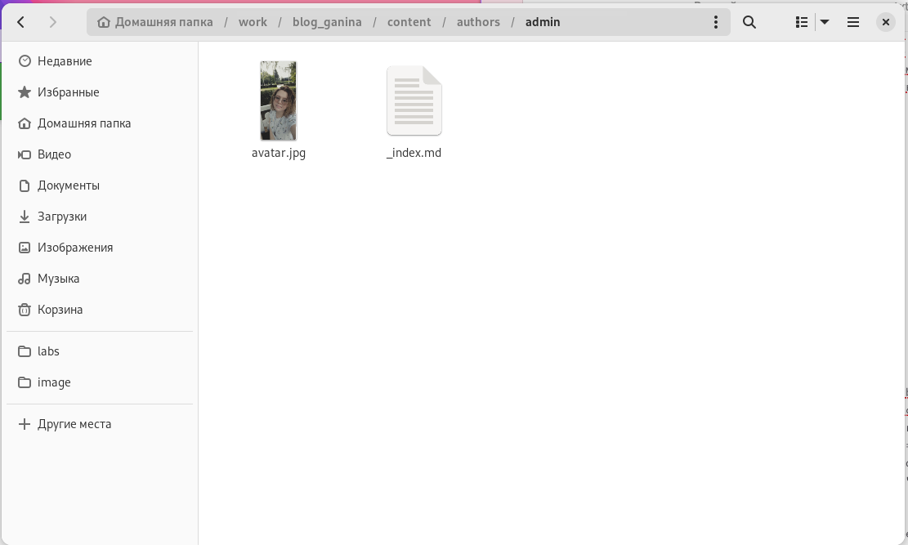{#fig:001 width=70%}

## Разместить фотографию владельца сайта, краткое описание владельца сайта, добавить информацию об интересах, добавить информацию от образовании

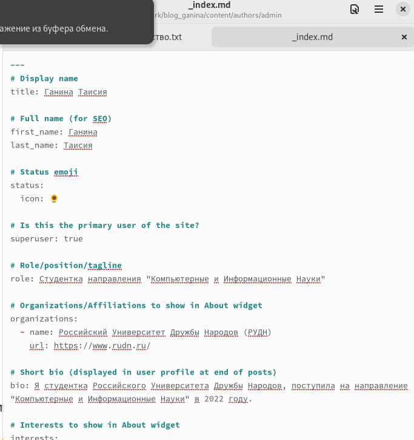{#fig:002 width=30%}

## Разместить фотографию владельца сайта, краткое описание владельца сайта, добавить информацию об интересах, добавить информацию от образовании

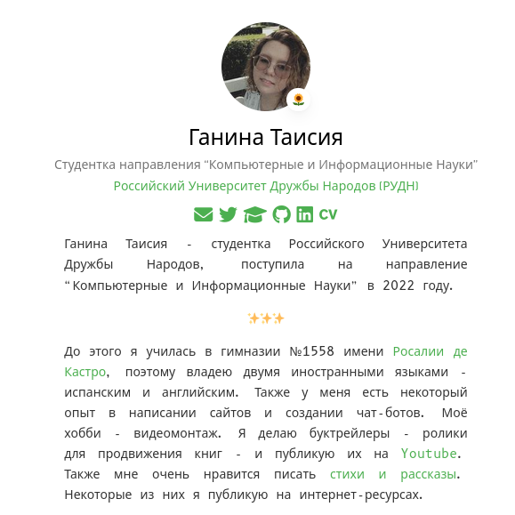{#fig:003 width=30%}

## Сделать пост по прошедшей неделе

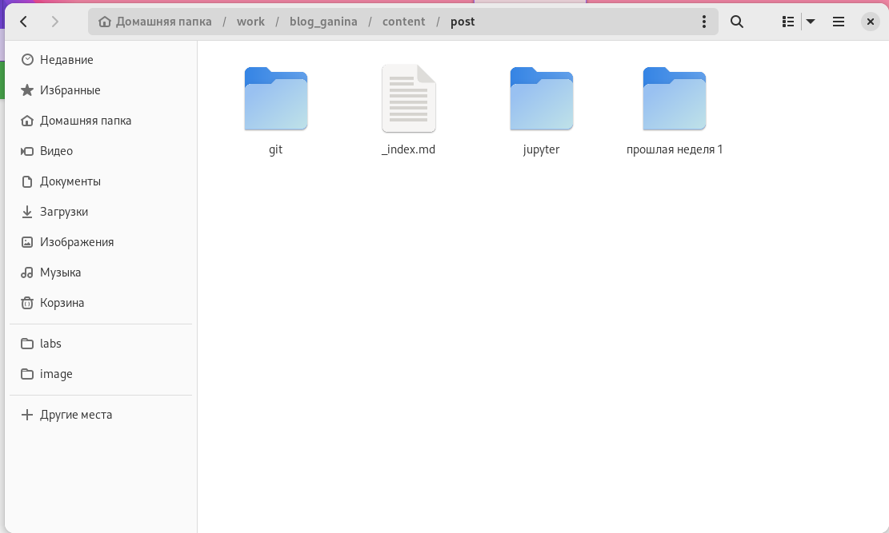{#fig:004 width=70%}

## Сделать пост по прошедшей неделе

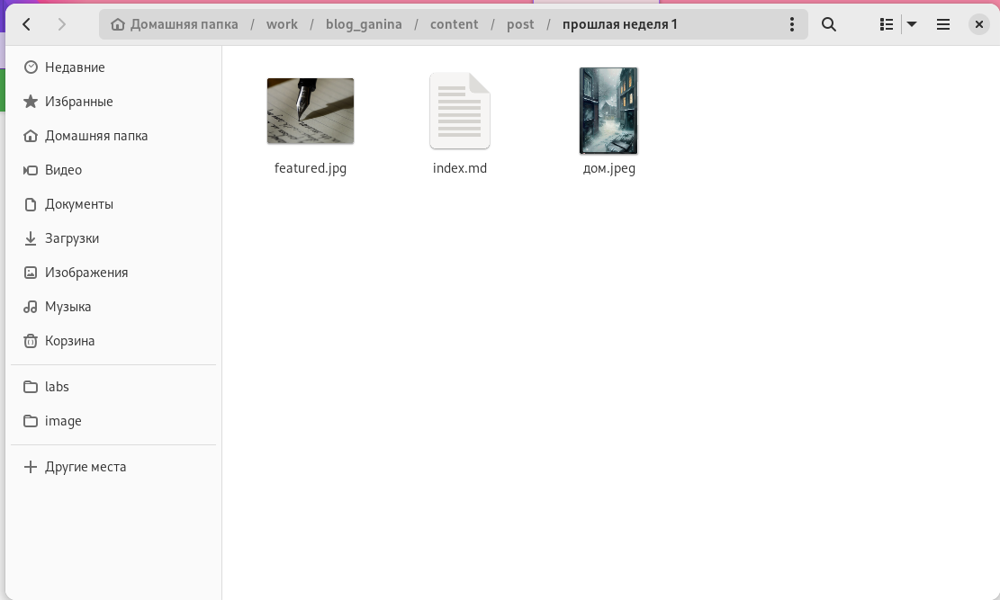{#fig:005 width=70%}

## Сделать пост по прошедшей неделе

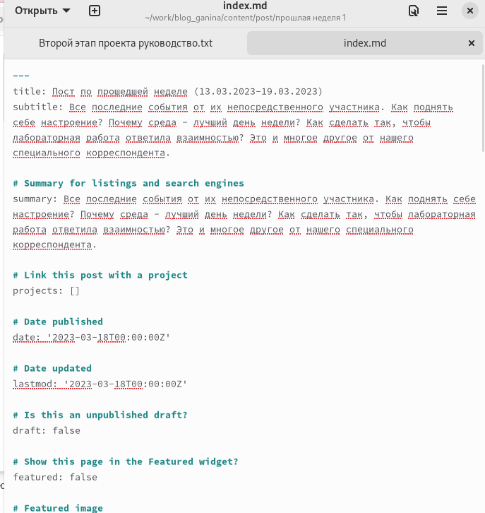{#fig:006 width=30%}

## Добавить пост на тему "Управление версиями. Git"

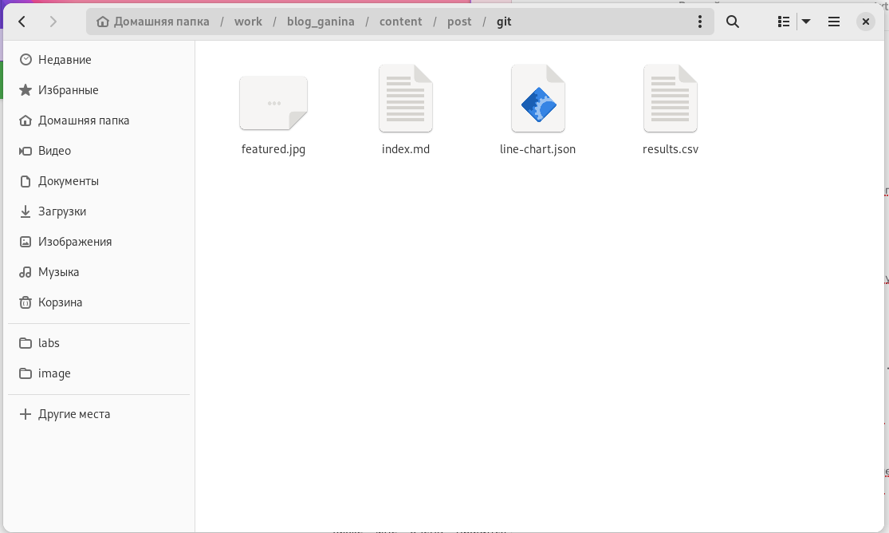{#fig:007 width=70%}

## Добавить пост на тему "Управление версиями. Git"

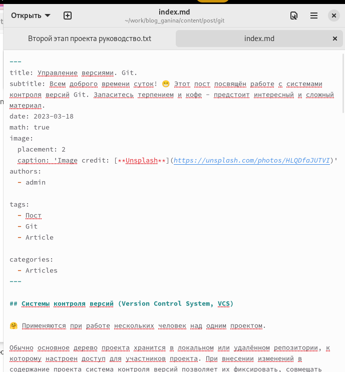{#fig:008 width=30%}

## Добавить пост на тему "Управление версиями. Git"

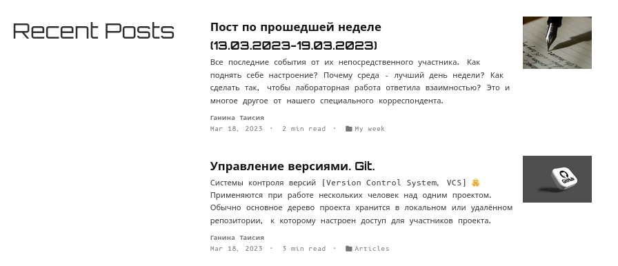{#fig:009 width=70%}

## Отправить и обновить информацию

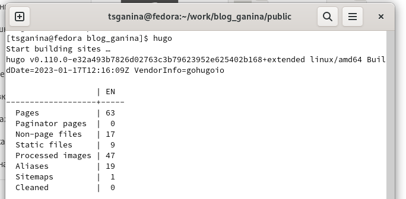{#fig:010 width=70%}

## Отправить и обновить информацию

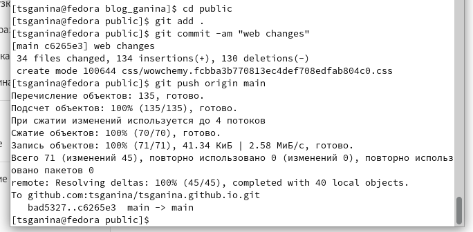{#fig:011 width=70%}

# Результаты

## Вывод:

Я поняла как писать посты, улучшила навыки работы с разметкой markdown, и узнала много интересного про работу с hugo.

