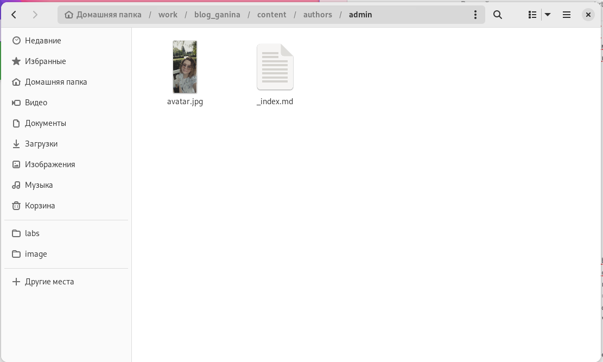
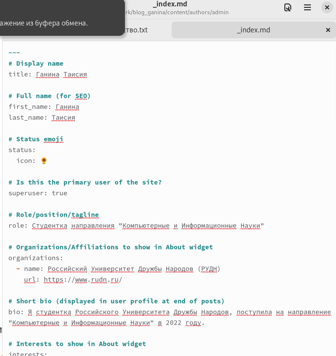
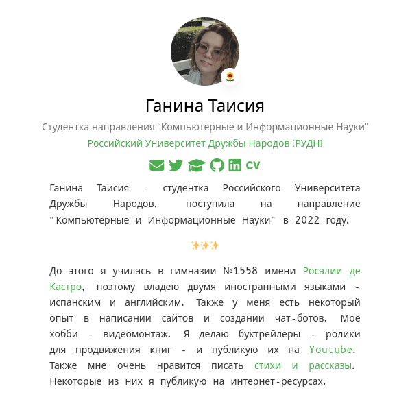
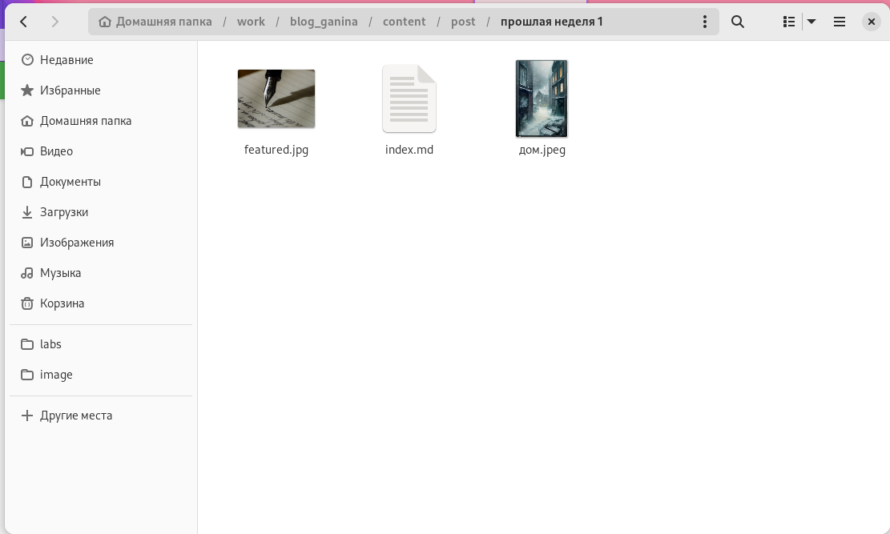
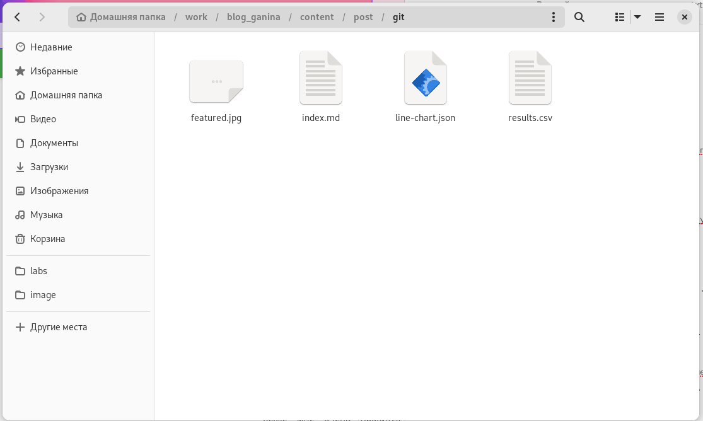

---
## Front matter
title: "Второй этап персонального проекта. Добавить к сайту данные о себе."
subtitle: "Операционные системы"
author: "Ганина Таисия Сергеевна, НКАбд-01-22"

## Generic otions
lang: ru-RU
toc-title: "Содержание"

## Bibliography
bibliography: bib/cite.bib
csl: pandoc/csl/gost-r-7-0-5-2008-numeric.csl

## Pdf output format
toc: true # Table of contents
toc-depth: 2
lof: true # List of figures
lot: true # List of tables
fontsize: 12pt
linestretch: 1.5
papersize: a4
documentclass: scrreprt
## I18n polyglossia
polyglossia-lang:
  name: russian
  options:
	- spelling=modern
	- babelshorthands=true
polyglossia-otherlangs:
  name: english
## I18n babel
babel-lang: russian
babel-otherlangs: english
## Fonts
mainfont: PT Serif
romanfont: PT Serif
sansfont: PT Sans
monofont: PT Mono
mainfontoptions: Ligatures=TeX
romanfontoptions: Ligatures=TeX
sansfontoptions: Ligatures=TeX,Scale=MatchLowercase
monofontoptions: Scale=MatchLowercase,Scale=0.9
## Biblatex
biblatex: true
biblio-style: "gost-numeric"
biblatexoptions:
  - parentracker=true
  - backend=biber
  - hyperref=auto
  - language=auto
  - autolang=other*
  - citestyle=gost-numeric
## Pandoc-crossref LaTeX customization
figureTitle: "Рис."
tableTitle: "Таблица"
listingTitle: "Листинг"
lofTitle: "Список иллюстраций"
lotTitle: "Список таблиц"
lolTitle: "Листинги"
## Misc options
indent: true
header-includes:
  - \usepackage{indentfirst}
  - \usepackage{float} # keep figures where there are in the text
  - \floatplacement{figure}{H} # keep figures where there are in the text
---

# Цель работы

Персонализировать сайт и разместить информацию о себе. Научиться базовой работе с шаблоном Hugo Academic.

# Задание

1. Разместить фотографию владельца сайта, Разместить фотографию владельца сайта, краткое описание владельца сайта, добавить информацию об интересах, добавить информацию от образовании
2. Сделать пост по прошедшей неделе.
3. Добавить пост на тему по выбору:
	- Управление версиями. Git.
	- Непрерывная интеграция и непрерывное развертывание (CI/CD).
	
# Теоретическое введение

**Заголовок веб-страницы**

Как правило большая полоса сверху с большим заголовком и / или логотипом. Именно здесь обычно размещаетсябазовая информация о веб-сайте.

**Панель навигации сайта - хедер**

Ссылки на разделы сайта: обычно представлены кнопками меню, ссылками или вкладками. Как и заголовок, этот контент обычно остается неизменнымпри переходе с одной веб-страницы на другую - несогласованная навигация на вашем веб-сайте просто приведет к растерянности и разочарованию пользователей. Многие веб-дизайнеры считают панель навигации частью заголовка, а не отдельным компонентом, но это не является обязательным требованием; на самом деле некоторые также утверждают, что реализация этих двух составляющих по отдельности лучше для доступности, так как программы чтения с экрана лучше читают две функции, если они разделены.

**Основное содержание веб-страницы**

Большая область в центре, которая содержит большую часть уникального контента данной веб-страницы, например, видео, которое вы хотите посмотреть, или рассказ, который вы читаете, или карту, которую вы хотите просмотреть, заголовки новостей и т. д. Это та часть сайта, которая определенно будет меняться от страницы к странице!

**Боковая панель страницы**

Тут размещается периферийная информация, ссылки, цитаты, реклама и т. д. Обычно это контекстно к тому, что содержится в основном контенте (например, на странице новостной статьи, боковая панель может содержать биографию автора или ссылки на связанные статьи), но есть также случаи, когда можно найти повторяющиеся элементы, такие как вторичная навигационная система.

**Нижний колонтитул - футер**

Полоса в нижней части страницы, которая зачастую содержит мелкий шрифт, уведомления об авторских правах или контактную информацию. Это место для размещения общей информации, но как правило эта информация не является критичной по отношению к самому сайту. Нижний колонтитул также иногда используется в целях SEO, предоставляя ссылки для быстрого доступа к популярному контенту.

# Выполнение лабораторной работы

1. Разместить фотографию владельца сайта, краткое описание владельца сайта, добавить информацию об интересах, добавить информацию от образовании (рис. @fig:001, @fig:002, @fig:003).

В начале я зашла в папку blog_ganina/content/authors/admin. Там я нашла картинку, которую заменила на свою, и текстовый файл на языке разметки, в котором тоже было необходимо произвести изменения. Я изменила данные на свои и написала небольшой абзац о своих достижениях и интересах.

{#fig:001 width=70%}

{#fig:002 width=70%}

{#fig:003 width=70%}

2. Сделать пост по прошедшей неделе (рис. @fig:004, @fig:005, @fig:006).

Теперь неоюходимо было зайти в папку blog_ganina/content/post - там было несколько папок. Две из них я поменяла на свои и произвела редактуру внутренних данных. Заменила картинки, переписала данные в текстовом файле index.md. Папка с первым постом - "прошлая неделя 1".

{#fig:004 width=70%}

{#fig:005 width=70%}

{#fig:006 width=70%}

3. Добавить пост на тему по выбору:
	- Управление версиями. Git.
	- Непрерывная интеграция и непрерывное развертывание (CI/CD) (рис. @fig:007, @fig:008, @fig:009).

Я выбрала тему про управление версиями, таже изменила текстовый файл, добавив некоторые данные - теги и папку - из файла по прошедшей неделе.

{#fig:007 width=70%}

{#fig:008 width=70%}

{#fig:009 width=70%}

Потом я использовала команды для "строения" сайта и отправила сайт на сервер гитхаба. Через некоторое время результаты отобразились на сайте (рис. @fig:010, @fig:011).

{#fig:010 width=70%}

{#fig:011 width=70%}

# Выводы

Я поняла как писать посты, улучшила навыки работы с разметкой markdown, и узнала много интересного про работу с hugo.

# Список литературы{.unnumbered}

1. [Создание сайта](https://создание-сайта.net/news-new/structura-web-stranicy.html)
2. [Hugo docs](https://wowchemy.com/docs/)

::: {#refs}
:::
