---
## Front matter
title: "Четвертый этап персонального проекта. Добавить к сайту ссылки на научные и библиометрические ресурсы"
subtitle: "Операционные системы"
author: "Ганина Таисия Сергеевна, НКАбд-01-22"

## Generic otions
lang: ru-RU
toc-title: "Содержание"

## Bibliography
bibliography: bib/cite.bib
csl: pandoc/csl/gost-r-7-0-5-2008-numeric.csl

## Pdf output format
toc: true # Table of contents
toc-depth: 2
lof: true # List of figures
lot: true # List of tables
fontsize: 12pt
linestretch: 1.5
papersize: a4
documentclass: scrreprt
## I18n polyglossia
polyglossia-lang:
  name: russian
  options:
	- spelling=modern
	- babelshorthands=true
polyglossia-otherlangs:
  name: english
## I18n babel
babel-lang: russian
babel-otherlangs: english
## Fonts
mainfont: PT Serif
romanfont: PT Serif
sansfont: PT Sans
monofont: PT Mono
mainfontoptions: Ligatures=TeX
romanfontoptions: Ligatures=TeX
sansfontoptions: Ligatures=TeX,Scale=MatchLowercase
monofontoptions: Scale=MatchLowercase,Scale=0.9
## Biblatex
biblatex: true
biblio-style: "gost-numeric"
biblatexoptions:
  - parentracker=true
  - backend=biber
  - hyperref=auto
  - language=auto
  - autolang=other*
  - citestyle=gost-numeric
## Pandoc-crossref LaTeX customization
figureTitle: "Рис."
tableTitle: "Таблица"
listingTitle: "Листинг"
lofTitle: "Список иллюстраций"
lotTitle: "Список таблиц"
lolTitle: "Листинги"
## Misc options
indent: true
header-includes:
  - \usepackage{indentfirst}
  - \usepackage{float} # keep figures where there are in the text
  - \floatplacement{figure}{H} # keep figures where there are in the text
---

# Цель работы

Персонализировать сайт и разместить информацию о библиометрических ресурсах. Создать два поста.

# Задание

Добавить к сайту ссылки на научные и библиометрические ресурсы.

1. Зарегистрироваться на соответствующих ресурсах и разместить на них ссылки на сайте:
- eLibrary : https://elibrary.ru/;
- Google Scholar : https://scholar.google.com/;
- ORCID : https://orcid.org/;
- Mendeley : https://www.mendeley.com/;
- ResearchGate : https://www.researchgate.net/;
- Academia.edu : https://www.academia.edu/;
- arXiv : https://arxiv.org/;
- github : https://github.com/.

2. Сделать пост по прошедшей неделе.
3. Добавить пост на тему по выбору:
- Оформление отчёта.
- Создание презентаций.
- Работа с библиографией.

	
# Теоретическое введение

**Заголовок веб-страницы**

Как правило большая полоса сверху с большим заголовком и / или логотипом. Именно здесь обычно размещаетсябазовая информация о веб-сайте.

**Панель навигации сайта - хедер**

Ссылки на разделы сайта: обычно представлены кнопками меню, ссылками или вкладками. Как и заголовок, этот контент обычно остается неизменнымпри переходе с одной веб-страницы на другую - несогласованная навигация на вашем веб-сайте просто приведет к растерянности и разочарованию пользователей. Многие веб-дизайнеры считают панель навигации частью заголовка, а не отдельным компонентом, но это не является обязательным требованием; на самом деле некоторые также утверждают, что реализация этих двух составляющих по отдельности лучше для доступности, так как программы чтения с экрана лучше читают две функции, если они разделены.

**Основное содержание веб-страницы**

Большая область в центре, которая содержит большую часть уникального контента данной веб-страницы, например, видео, которое вы хотите посмотреть, или рассказ, который вы читаете, или карту, которую вы хотите просмотреть, заголовки новостей и т. д. Это та часть сайта, которая определенно будет меняться от страницы к странице!

**Боковая панель страницы**

Тут размещается периферийная информация, ссылки, цитаты, реклама и т. д. Обычно это контекстно к тому, что содержится в основном контенте (например, на странице новостной статьи, боковая панель может содержать биографию автора или ссылки на связанные статьи), но есть также случаи, когда можно найти повторяющиеся элементы, такие как вторичная навигационная система.

**Нижний колонтитул - футер**

Полоса в нижней части страницы, которая зачастую содержит мелкий шрифт, уведомления об авторских правах или контактную информацию. Это место для размещения общей информации, но как правило эта информация не является критичной по отношению к самому сайту. Нижний колонтитул также иногда используется в целях SEO, предоставляя ссылки для быстрого доступа к популярному контенту.

# Выполнение лабораторной работы

1. Зарегистрироваться на соответствующих ресурсах:
- eLibrary : https://elibrary.ru/;
- Google Scholar : https://scholar.google.com/;
- ORCID : https://orcid.org/;
- Mendeley : https://www.mendeley.com/;
- ResearchGate : https://www.researchgate.net/;
- Academia.edu : https://www.academia.edu/;
- arXiv : https://arxiv.org/;
- github : https://github.com/.

(рис. @fig:001, @fig:002, @fig:003, @fig:004, @fig:005, @fig:006, @fig:007)

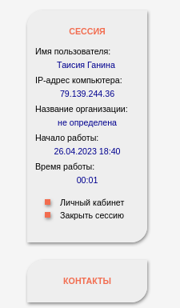{#fig:001 width=70%}

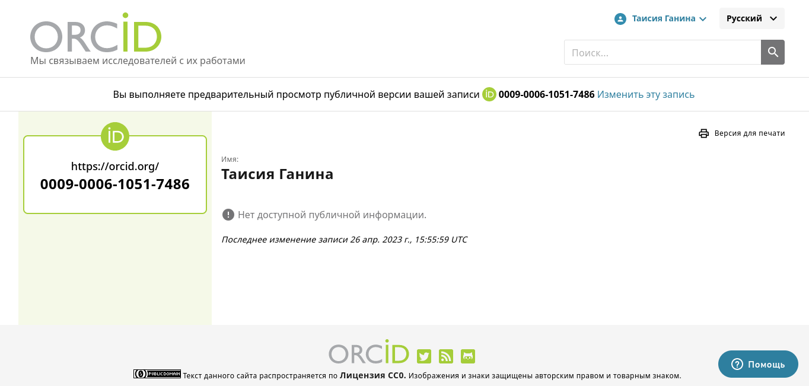{#fig:002 width=70%}

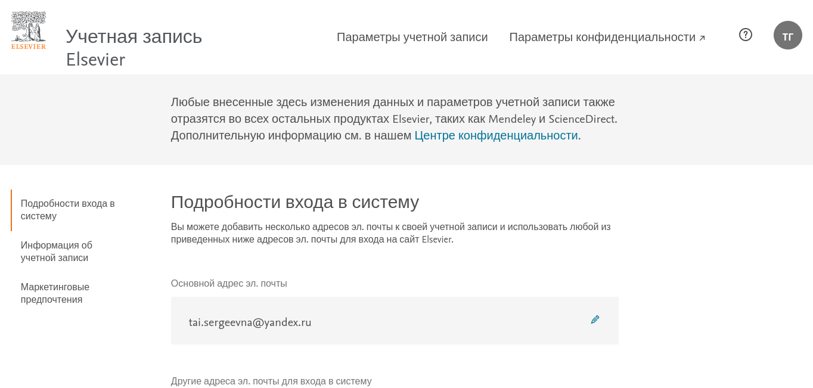{#fig:003 width=70%}

{#fig:004 width=70%}

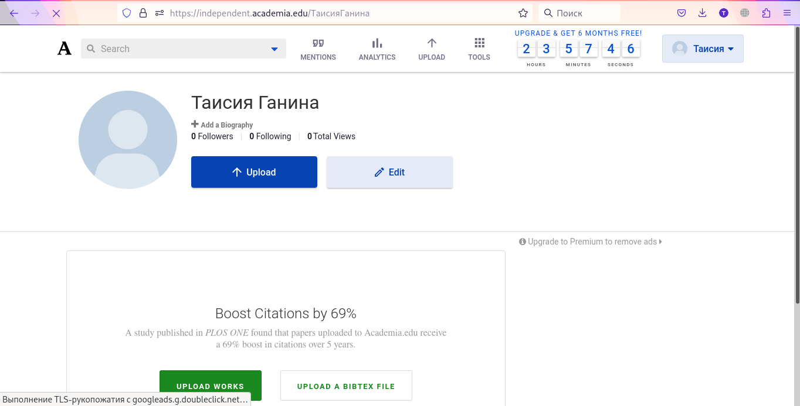{#fig:005 width=70%}

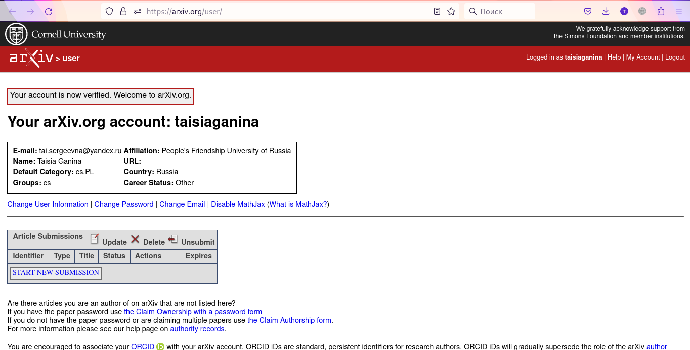{#fig:006 width=70%}

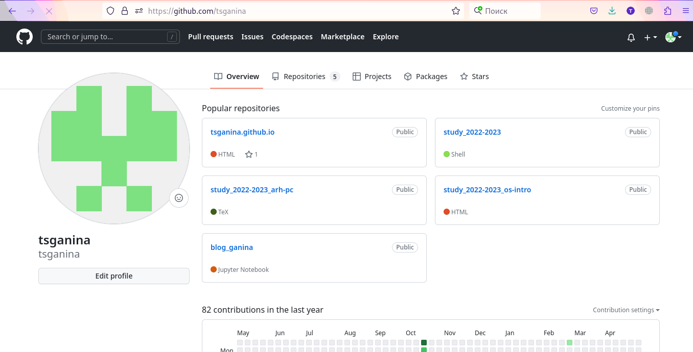{#fig:007 width=70%}

2. Разместить ссылки на сайте (рис. @fig:008, @fig:009).

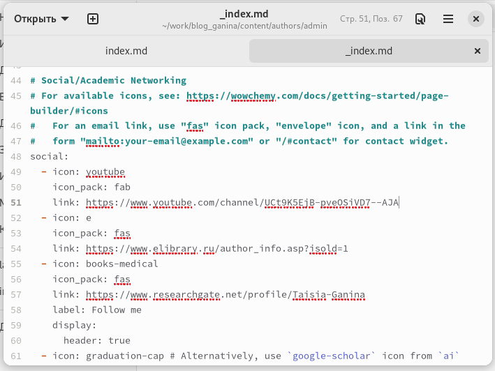{#fig:008 width=70%}

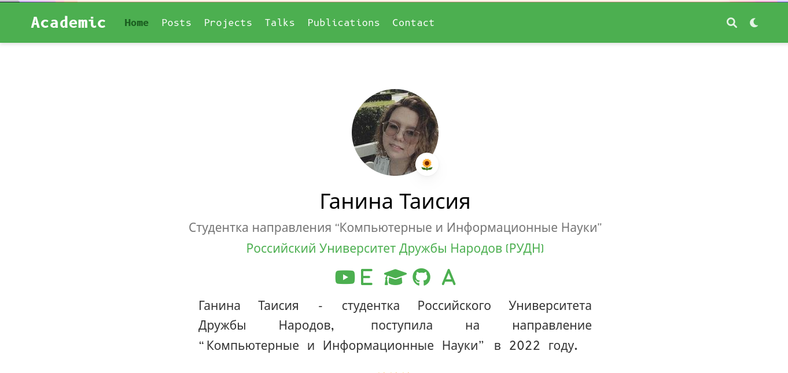{#fig:009 width=70%}

3. Сделать пост по прошедшей неделе (рис. @fig:010, @fig:011).

Теперь необходимо было зайти в папку blog_ganina/content/post. 

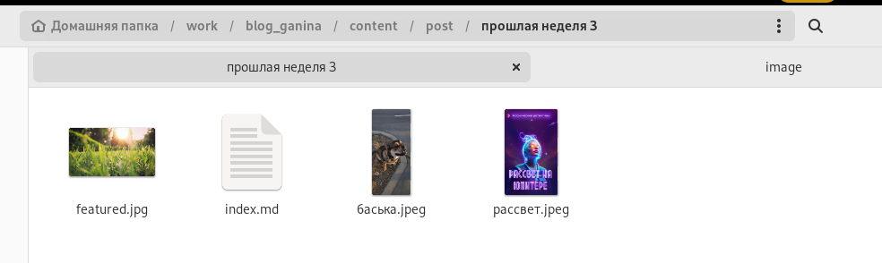{#fig:010 width=70%}

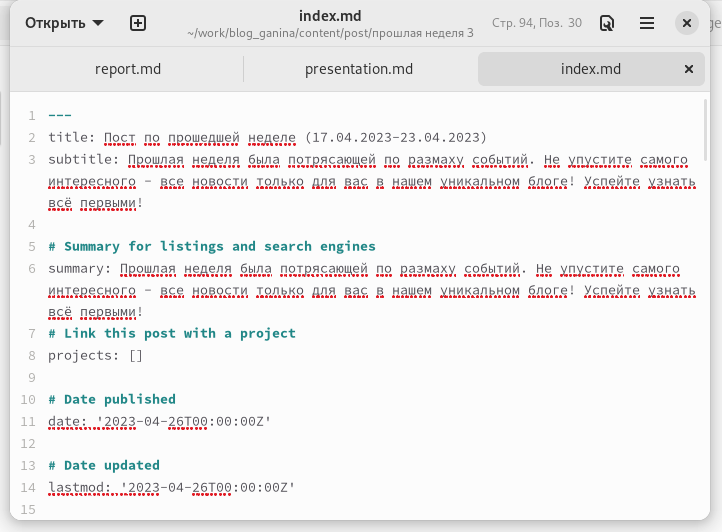{#fig:011 width=70%}

4. Добавить пост на тему по выбору (рис. @fig:012, @fig:013, @fig:014)

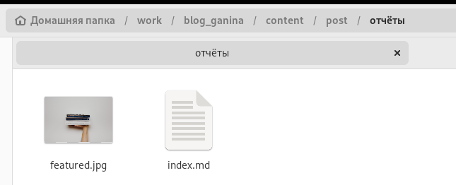{#fig:012 width=70%}

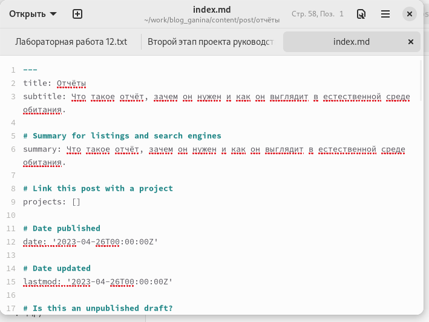{#fig:013 width=70%}

{#fig:014 width=70%}

4. Потом я использовала команды для "строения" сайта и отправила сайт на сервер гитхаба. Через некоторое время результаты отобразились на сайте (рис. @fig:015, @fig:016).

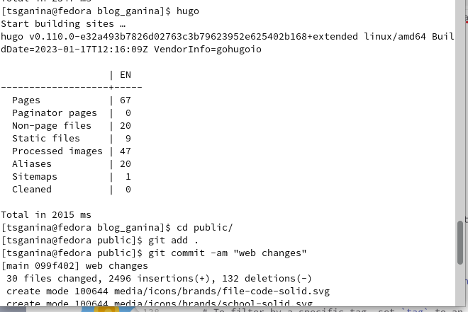{#fig:015 width=70%}

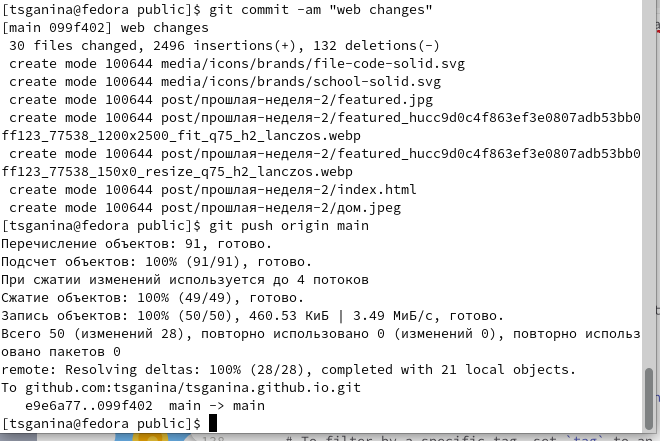{#fig:016 width=70%}

# Выводы

Я разобралась как работать с блоками на сайте и усовершенствовала свои навыки в написании постов.

# Список литературы{.unnumbered}

1. [Создание сайта](https://создание-сайта.net/news-new/structura-web-stranicy.html)
2. [Hugo docs](https://wowchemy.com/docs/)

::: {#refs}
:::
