---
## Front matter
lang: ru-RU
title: "Пятый этап персонального проекта. Добавить с сайту все остальные элементы."
subtitle: "Дисциплина: Операционные системы"
author:
  - Ганина Т. С.
institute:
  - Группа НКАбд-01-22
  - Российский университет дружбы народов, Москва, Россия
date: 9 мая 2023

## i18n babel
babel-lang: russian
babel-otherlangs: english

## Formatting pdf
toc: false
toc-title: Содержание
slide_level: 2
aspectratio: 169
section-titles: true
theme: metropolis
header-includes:
 - \metroset{progressbar=frametitle,sectionpage=progressbar,numbering=fraction}
 - '\makeatletter'
 - '\beamer@ignorenonframefalse'
 - '\makeatother'
---

# Информация

## Докладчик

:::::::::::::: {.columns align=center}
::: {.column width="70%"}

  * Ганина Таисия Сергеевна
  * Студентка 1го курса, группа НКАбд-01-22
  * Компьютерные и информационные науки
  * Российский университет дружбы народов
  * [Ссылка на репозиторий гитхаба tsganina](https://github.com/tsganina/blog_ganina)
  * [Ссылка на сайт](https://tsganina.github.io/)

:::
::: {.column width="30%"}

:::
::::::::::::::

# Вводная часть

## Актуальность

- Умение работать с блоками сайта, писать тексты для личного блога и публиковать это - отличный навык для любого человека. Это первый шаг в веб-дизайне, который является очень интересной отраслью IT.

## Объект и предмет исследования

- Hugo-шаблон.

## Цели и задачи

- Добавить к сайту все остальные элементы.
- Создать два поста.

# Пятый этап проекта.

## Сделать записи для персональных проектов

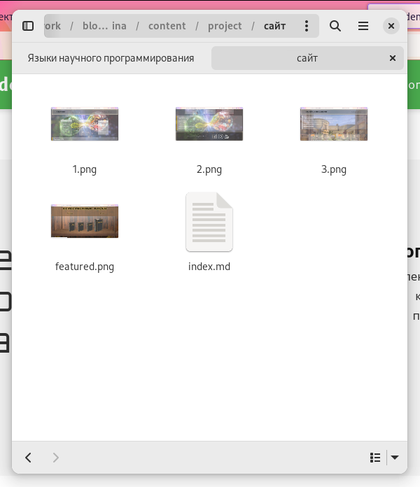{#fig:001 width=70%}

##

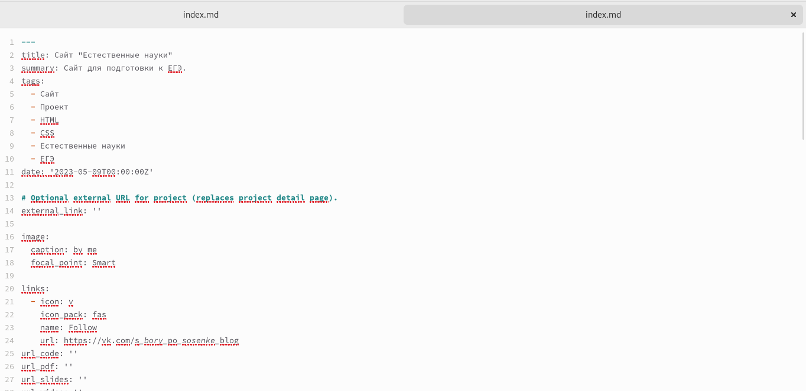{#fig:002 width=70%}

##

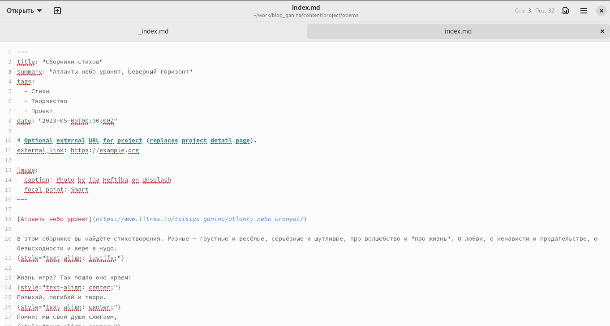{#fig:003 width=70%}

## Сделать пост по прошедшей неделе

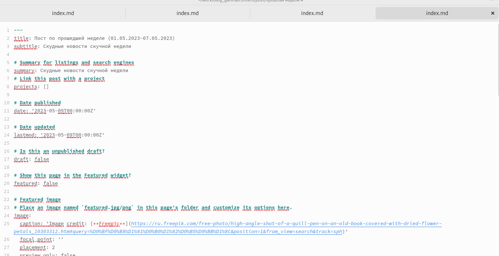{#fig:004 width=70%}

## Добавить пост на тему по выбору. Языки научного программирования

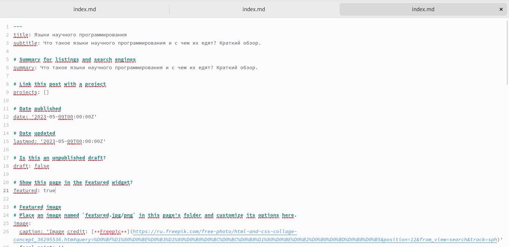{#fig:005 width=70%}

## Добавить с сайту все остальные элементы

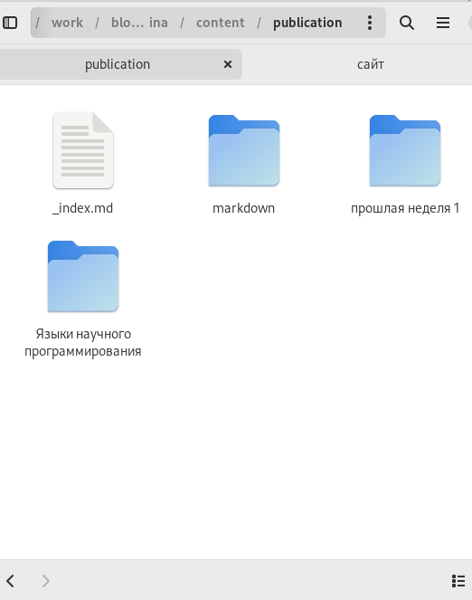{#fig:006 width=70%}

##

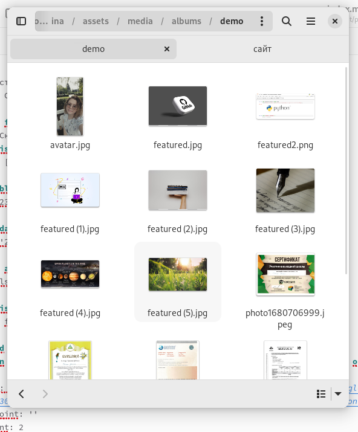{#fig:007 width=70%}

## Результаты

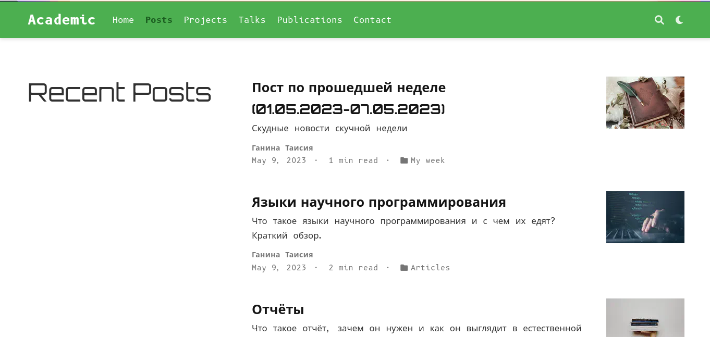{#fig:008 width=70%}

##

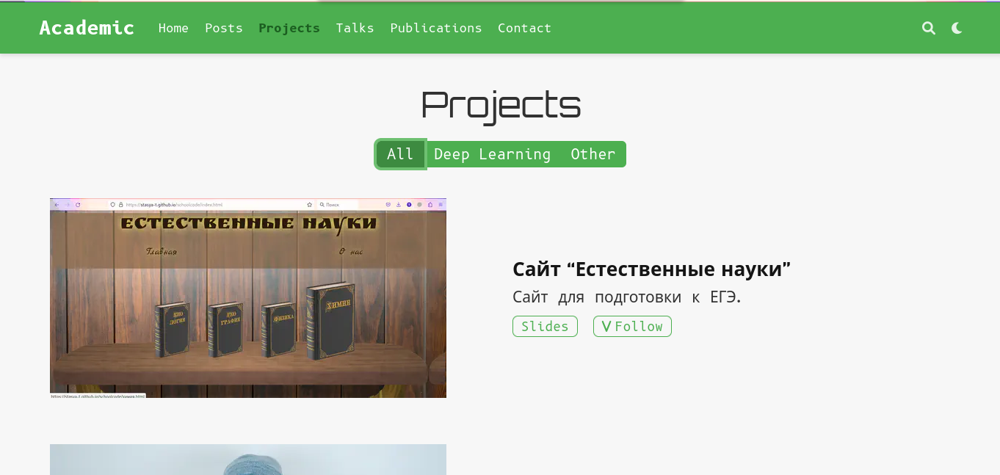{#fig:009 width=70%}

##

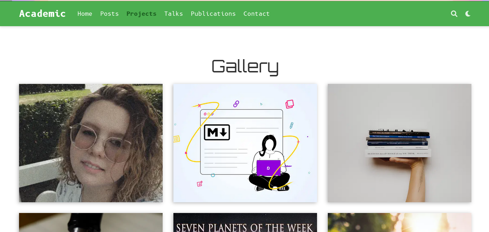{#fig:010 width=70%}

##

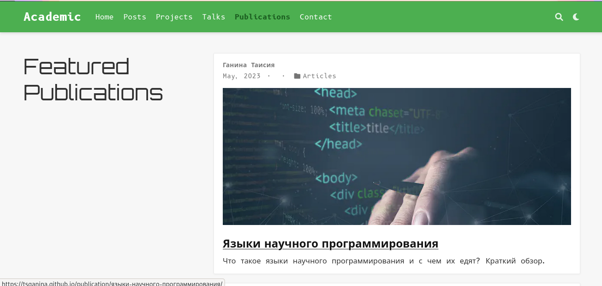{#fig:011 width=70%}

##

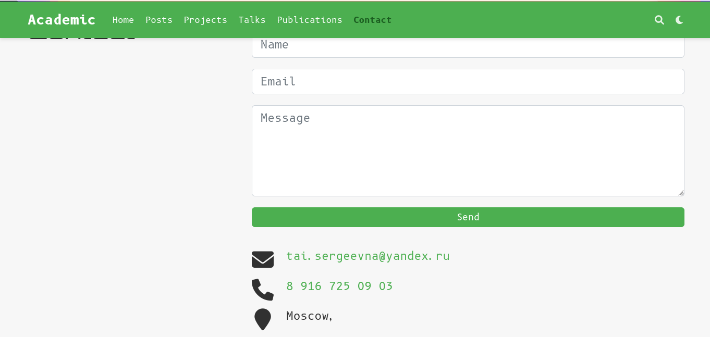{#fig:012 width=70%}

##

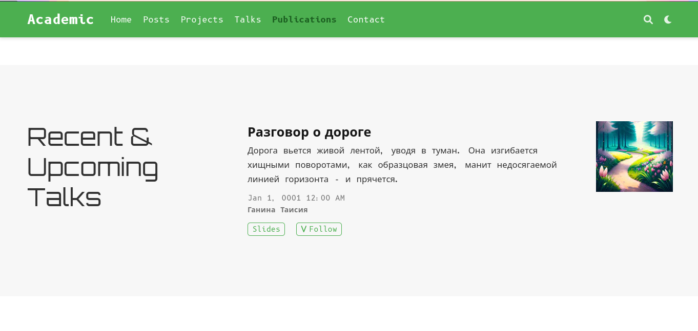{#fig:013 width=70%}

# Результаты

## Вывод:

Я разобралась как работать с блоками на сайте и усовершенствовала свои навыки в написании постов.
